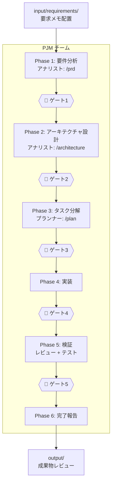
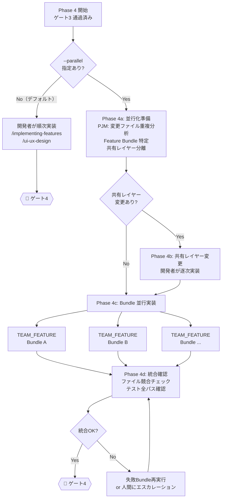

# チームテンプレート利用ガイド

## 概要

プロジェクトの活動フェーズに応じた6つの専門チームテンプレートを提供する。
各チームは`.claude/skills/`配下のスキルにマッピングされている。

### 公式 Agent Teams 機能との関係

`TEAM_*.md` は**プロンプトレベルのオーケストレーション定義**であり、
Claude Code 公式の Agent Teams 機能とは別レイヤーにある。両者は組み合わせて使う。

| | `TEAM_*.md`（本テンプレート） | 公式 Agent Teams |
| --- | --- | --- |
| 実体 | Markdown のロール定義・フェーズ手順 | 複数の Claude Code インスタンス |
| 起動 | ファイルパスを渡して読ませる | 自然言語で teammate を依頼する |
| コンテキスト | メインセッション + subagent | teammate ごとに独立 |
| 有効化 | 不要（常に使える） | `CLAUDE_CODE_EXPERIMENTAL_AGENT_TEAMS=1` が必要 |
| コスト | 低〜中 | 高（teammate ごとに別インスタンス） |

- **既定は `TEAM_*.md` 単独**で足りる。逐次フェーズや同一ファイルの編集が多い作業では
  むしろ公式 Agent Teams より効率が良い
- **並行探索の価値が高い作業**（競合仮説のデバッグ、レイヤー横断の同時実装、
  複数観点の同時レビュー）でのみ公式 Agent Teams を併用する
- 併用時は `settings.local.json` の `teammateMode` で teammate の**表示先**を選ぶ
  （`in-process` / `auto` / `tmux` / `iterm2`）。`worktree` は teammateMode の値ではない
- 公式 Agent Teams 有効時は、Claude が名前を付けた subagent が teammate として起動する。
  意図せずチームが形成されることがある点に注意
- 品質ゲートを teammate にも効かせたい場合は `TeammateIdle` / `TaskCompleted` フックを使う
- 数十〜数百の subagent を並列に回す作業(コードベース全体の監査、大量ファイルの一括移行)には
  公式の **dynamic workflows**(プロンプトに `ultracode` を含める / `/batch`)が向く。計画をスクリプトに
  移すので中間結果がコンテキストに載らない。`TEAM_*.md` は人間ゲート付きのライフサイクル運用に使い分ける
- 同梱の saved workflow `/review-sweep`(`.claude/workflows/review-sweep.js`、full プロファイルのみ)は、差分を 4 観点で並列レビューし、
  MUST 指摘を 3 票の反証で検証してから 1 本のレポートにまとめる。TEAM_QA のレビュー工程を、実装者の文脈を持たない agent で自動化したもの
- `/skill-eval skill=<名>`(同ディレクトリ)は skill の `evals/evals.json` を skill あり / なしで回し、pass rate を比べる

## クイックスタート

**全部おまかせ（推奨）:**

```text
.claude/teams/TEAM_PJM.md input/requirements/REQ_001.md
```

**特定フェーズのみ:**

```text
.claude/teams/TEAM_FEATURE.md output/tasks/TASK_auth.md
```

## チーム一覧(topology 付き)

`topology` は `claude-flow` のオーケストレーション分類にならった並列性メタデータ:

- **hierarchical**: PL → メンバーの 1 方向(逐次・調整重視)
- **mesh**: メンバー間が相互レビュー(並列・合議重視)
- **star**: 中央 1 名がハブで放射状(分散指示)

| テンプレート | 用途 | メンバー | スキル数 | topology |
| --- | --- | --- | --- | -------- |
| **`TEAM_PJM.md`** | **フルライフサイクル管理** | **6名** | **13 (チーム経路の全スキル)** | hierarchical |
| `TEAM_FEATURE.md` | 機能開発・バグ修正 | 5名 | 5 | hierarchical |
| `TEAM_QA.md` | 品質保証・監査 | 5名 | 5 | mesh |
| `TEAM_PLANNING.md` | 設計フェーズ | 4名 | 4 | mesh |
| `TEAM_DESIGN.md` | デザインシステム | 4名 | 3 | star |
| `TEAM_REFACTOR.md` | リファクタリング | 4名 | 5 | star |

### チーム選定ガイド

| やりたいこと | 推奨チーム |
| --- | --- |
| 要求メモから全部やってほしい | **`TEAM_PJM.md`** |
| 新機能を実装したい | `TEAM_FEATURE.md` |
| バグを修正したい | `TEAM_FEATURE.md` |
| PRD・設計書を作りたい | `TEAM_PLANNING.md` |
| PR前に品質チェックしたい | `TEAM_QA.md` |
| セキュリティ・法務監査をしたい | `TEAM_QA.md` |
| デザインシステムを整備したい | `TEAM_DESIGN.md` |
| UI横断の整合性を監査したい | `TEAM_DESIGN.md` |
| コードの構造を改善したい | `TEAM_REFACTOR.md` |

## ワークフロー全体像（PJMチーム）

```text
人間                        AI（PJMチーム）                  人間
────                        ────────────                    ────

input/ に                   Phase 1: 要件分析
要求メモ配置  ─────────────▶  アナリスト: /prd
                              ▶ output/prd/             ───▶ レビュー
                            🚏 ゲート1                  ◀── 承認

                            Phase 2: アーキテクチャ設計
                              アナリスト: /architecture
                              ▶ output/design/           ───▶ レビュー
                            🚏 ゲート2                  ◀── 承認

                            Phase 3: タスク分解
                              プランナー: /plan
                              ▶ output/tasks/            ───▶ レビュー
                            🚏 ゲート3                  ◀── 承認

                            Phase 4: 実装
                              逐次: 開発者が順次実装
                                開発者: /implementing-features
                                        /ui-ux-design
                              並行(--parallel): TEAM_FEATURE × N
                                PJM: Bundle特定 → 共有レイヤー逐次実装
                                    → TEAM_FEATURE 並行起動 → 統合確認
                            🚏 ゲート4（テスト・カバレッジ）

                            Phase 5: 検証（並行）
                              レビュアー: /code-review
                                          /security-scan
                                          /legal-check
                              テスター:   /e2e-testing
                                          /performance
                              ▶ output/reports/          ───▶ レビュー
                            🚏 ゲート5                  ◀── 承認

                            Phase 6: 完了 ──────────────▶ 完了報告
```

### ワークフロー図（mermaid）



### Phase 4 詳細: 逐次モード vs 並行モード



## インプット/アウトプット構造

```text
project-root/
├── input/                         人間が作成（AIは読み取り専用）
│   ├── README.md                  使い方ガイド
│   └── requirements/              要求メモ
│       ├── REQ_001_xxx.md
│       └── REQ_002_xxx.md
│
├── output/                        AIが生成（人間がレビュー）
│   ├── README.md                  成果物の説明
│   ├── prd/                       PRD（Phase 1）
│   ├── design/                    アーキテクチャ設計書（Phase 2）
│   ├── tasks/                     タスク分解（Phase 3）
│   └── reports/                   品質レポート（Phase 5）
│       ├── review/                  コードレビュー
│       ├── test/                    テスト結果
│       ├── security/                セキュリティスキャン
│       └── legal/                   法務チェック
│
├── project-config.md              人間が記入する設定ファイル
├── .claude/teams/                 チーム定義
└── .claude/skills/                スキル定義
```

### 各ディレクトリの役割

| ディレクトリ | 誰が書くか | 誰が読むか | 内容 |
| --- | --- | --- | --- |
| `input/requirements/` | 人間 | AI | 要求メモ・要件メモ |
| `output/prd/` | AI | 人間 | PRD |
| `output/design/` | AI | 人間 | アーキテクチャ設計書 |
| `output/tasks/` | AI | 人間+AI | タスク分解・実装指示書 |
| `output/reports/review/` | AI | 人間 | コードレビューレポート |
| `output/reports/test/` | AI | 人間 | テスト結果レポート |
| `output/reports/security/` | AI | 人間 | セキュリティスキャンレポート |
| `output/reports/legal/` | AI | 人間 | 法務チェックレポート |
| `project-config.md` | 人間+AI | AI | プロジェクト設定 |

## スキルカバレッジ

チームに紐付くスキルのマッピング:

| スキル | PJM | Feature | QA | Planning | Design | Refactor |
| --- | :---: | :---: | :---: | :---: | :---: | :---: |
| `brainstorm` | Analyst (条件付) | — | — | Analyst (条件付) | — | — |
| `plan` | Planner | PL | — | Planner | — | PL |
| `implementing-features` | Developer | Developer | — | — | — | Refactorer |
| `ui-ux-design` | Developer | UI/UX | — | — | UI/UX | — |
| `hig-compliance` | Reviewer | — | — | — | — | — |
| `design-system-audit` | — | — | — | — | DS Eng | — |
| `code-review` | Reviewer | Reviewer | Reviewer | — | Reviewer | Reviewer |
| `e2e-testing` | Tester | Tester | Tester | — | — | Tester |
| `performance` | Tester | — | Perf Eng | — | — | — |
| `refactoring` | Developer | — | — | — | — | Refactorer |
| `security-scan` | Reviewer | — | Security | — | — | — |
| `legal-check` | Reviewer | — | Security | — | — | — |
| `prd` | Analyst | — | — | Analyst | — | — |
| `architecture` | Analyst | — | — | Architect | — | — |

### 補助スキル（チームに紐付けない）

以下のスキルはチーム外で単体呼び出しを想定する:

- **`/adr`**: 設計判断の記録。判断タイミングでオンデマンド呼び出し
- **`/review-fix`**: 指定 PR の CodeRabbit / Copilot レビュー指摘を自動修正

## サブエージェント dispatch ガイド

チーム内のメンバーは、必要に応じて以下の subagent に単発委譲できる(`.claude/agents/README.md` 参照)。

| Agent | PJM | Feature | QA | Planning | Design | Refactor |
| ----- | :---: | :---: | :---: | :---: | :---: | :---: |
| `explorer` | Analyst/Planner | PL | Reviewer | Planner | UI/UX | Refactorer |
| `researcher` | Analyst | Developer (新規依存時) | Security | Architect | DS Eng | — |
| `planner` | Planner | — | — | Planner | — | — |
| `security-reviewer` | Reviewer | — | Security | — | — | — |
| `performance-analyst` | Tester | — | Perf Eng | — | — | — |
| `doc-synchronizer` | Developer | Developer | — | — | — | Refactorer |
| `doc-writer` | Analyst/Reviewer | — | Reviewer | Analyst | — | — |
| `test-writer` | Developer/Tester | Developer | Tester | — | — | Tester |

### 典型 dispatch 例

- **PJM Phase 2(アーキテクチャ設計)**: Analyst が `researcher` を呼んで対象ライブラリの最新仕様を確認 → `/architecture` 実行
- **PJM Phase 5(検証)**: Reviewer が `doc-writer` を呼んで `output/reports/` の集約サマリーレポート(複数 skill 結果の集約)を起こす
- **TEAM_FEATURE 実装中**: Developer が未知の依存を触る前に `researcher` で公式仕様を確認(車輪の再発明防止)
- **TEAM_QA**: Security 役が `security-reviewer` agent + `researcher`(CVE 最新情報)を組み合わせて監査
- **TEAM_PLANNING**: Architect が `researcher` で複数候補フレームワークの比較情報を収集 → 設計判断の根拠に

agent と team は層が異なる(三層分離原則)。team 内のメンバーが必要時に単発で呼び出す形を取り、agent から team を起動するような循環は禁止。

## 起動パターン

全チーム共通: 引数（ファイルパス or 指示）は省略可能。省略時はPLが対話的に対象を特定する。

### PJMチーム

```text
.claude/teams/TEAM_PJM.md input/requirements/REQ_001.md
.claude/teams/TEAM_PJM.md input/requirements/REQ_001.md --auto
.claude/teams/TEAM_PJM.md input/requirements/REQ_001.md --parallel
.claude/teams/TEAM_PJM.md input/requirements/REQ_001.md --auto --parallel
.claude/teams/TEAM_PJM.md Phase 3から開始。PRDと設計書はoutput/に作成済み
.claude/teams/TEAM_PJM.md 実装済み。Phase 5のみ実行 --auto
```

`--auto`: 自律モード。ゲート承認をPJMに委任し、最終報告のみ人間に提示する。
`--parallel`: 並行実装モード。Phase 4 で独立タスク群を Feature Bundle に分離し、複数の TEAM_FEATURE を並行起動する。

### 機能開発チーム

```text
.claude/teams/TEAM_FEATURE.md output/tasks/TASK_auth.md
```

### 設計チーム

```text
.claude/teams/TEAM_PLANNING.md input/requirements/REQ_001.md
```

### 品質保証チーム

```text
.claude/teams/TEAM_QA.md src/features/assignment/
```

### デザインシステムチーム

```text
.claude/teams/TEAM_DESIGN.md システム全体のデザイン整合性を監査・修正
.claude/teams/TEAM_DESIGN.md src/features/touring/ のUIをデザインシステムに準拠させる
```

### リファクタリングチーム

```text
.claude/teams/TEAM_REFACTOR.md src/features/assignment/
```

## カスタマイズ

チームテンプレートを直接編集するか、コピーして別名で保存する。

- 役割の追加・削除: チーム構成テーブルと各役割の責務セクションを編集
- スキルの変更: 各役割の使用スキルを変更（`.claude/skills/`配下のスキル名を指定）
- ワークフロー変更: ワークフローと依存関係ルールを編集
- ゲートの追加・削除: フェーズワークフローのゲートポイントを編集
