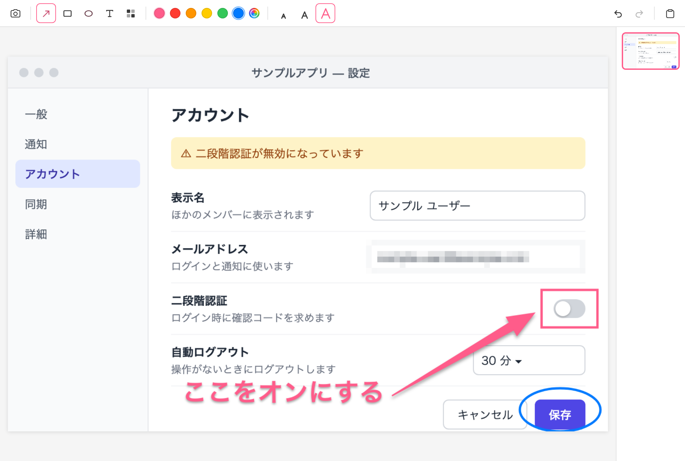
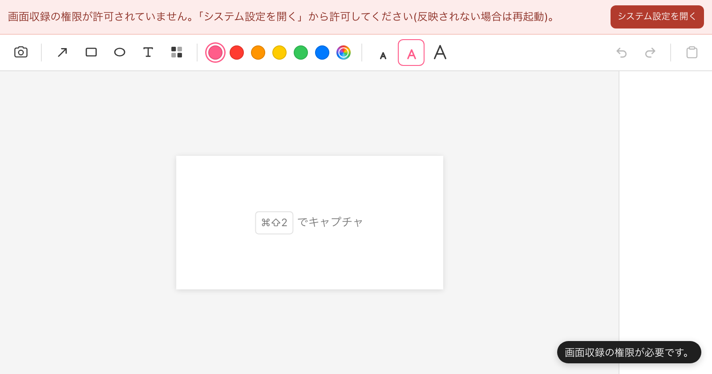
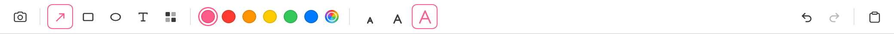

# Tadcap


撮る → 描き込む → 貼る を最短で。macOS 専用の、キャプチャを主役にした軽量なスクリーンショット注釈ツールです。

> tadpole（オタマジャクシ）+ capture

- 紹介ページ: <https://froggugugugu.github.io/tadcap/>
- 動作環境: macOS 14（Sonoma）以降



## できること

- **どこからでもキャプチャ**: `⌘⇧2` で範囲選択を開始（macOS 標準の `screencapture -i` を使用）。範囲選択中にスペースキーでウィンドウ選択に切り替え
- **描き込み**: テーパー矢印・矩形・円・テキスト（小・中・大）・モザイク
- **直前の図形を調整**: 描いた直後の矢印・矩形・円はハンドルでリサイズ、内側ドラッグで移動。`Enter` で確定、`Esc` で取り消し。`Shift` で正方形・正円
- **色**: 6 色のプリセット（ピンク・赤・橙・黄・緑・青）とカラーピッカー（モザイク以外に適用）
- **取り消し・やり直し**: `⌘Z` / `⌘⇧Z`
- **クリップボードへコピー**: `⌘C` で描き込んだ画像をコピーし、そのまま他のアプリへ貼り付け
- **セッション内の履歴**: 起動中に撮った画像をサムネイルで一覧し、描き込んだ状態で呼び戻せる
- **メニューバー常駐**: Dock には表示しない。メニューから「キャプチャ」「エディタを開く」「終了」
- **何も残さない**: 画像はディスクに保存しない。履歴はメモリのみで終了時に破棄、一時ファイルは起動時・終了時に自動削除。外部との通信なし

## インストール

配布版は Apple silicon の Mac（macOS 14 以降）向けです。Intel の Mac では[ソースからビルド](#ソースからビルド)してください。

### コマンドで入れる（おすすめ）

```bash
curl -fsSL https://froggugugugu.github.io/tadcap/install.sh | bash
```

最新版を [Releases](https://github.com/froggugugugu/tadcap/releases) から取得し、公開時のチェックサム（sha256）と照合してから「アプリケーション」フォルダ（書き込めなければ `~/Applications`）に入れて起動します。この方法なら、公証していないアプリでも初回の警告が出ずに開けます。更新も同じコマンドで、起動中の Tadcap は終了してから置き換えます。

環境変数で動きを変えられます（例: `curl -fsSL ... | TADCAP_NO_OPEN=1 bash`）。

| 変数 | 意味 |
| ---- | ---- |
| `TADCAP_VERSION=0.1.0` | 最新版の代わりにこの版を入れる |
| `TADCAP_APP_DIR=DIR` | `DIR` に入れる |
| `TADCAP_ZIP=FILE` | ダウンロード済みの `Tadcap-<版>-arm64.zip` から入れる |
| `TADCAP_NO_OPEN=1` | 入れたあと起動しない |

### DMG をダウンロードする

1. [最新のリリース](https://github.com/froggugugugu/tadcap/releases/latest)から `Tadcap-<版>-arm64.dmg` をダウンロードして開き、`Tadcap.app` を「アプリケーション」フォルダへドラッグします
2. 公証していないアプリのため、ブラウザでダウンロードした場合は初回に開けないことがあります。macOS 14 では Finder で `Tadcap.app` を右クリック（Control＋クリック）して「開く」を選びます。macOS 15 以降は、一度開こうとしたあと「システム設定」→「プライバシーとセキュリティ」の「このまま開く」を押します
3. 「壊れているため開けません」と出るときは、ターミナルで次を実行してから開き直します

```bash
xattr -dr com.apple.quarantine /Applications/Tadcap.app
```

### ソースからビルド

必要なもの:

- macOS 14 以降
- Xcode Command Line Tools（`xcode-select --install`）
- Rust（stable。[rustup](https://rustup.rs/) で導入）
- Node.js 20 以降と npm

```bash
git clone https://github.com/froggugugugu/tadcap.git && cd tadcap
npm install
npm run tauri build -- --bundles app
```

できあがった `src-tauri/target/release/bundle/macos/Tadcap.app` を「アプリケーション」フォルダへ移します。

## 初回セットアップ（画面収録の許可）

画面を撮るには macOS の「画面収録」の許可が必要です。

1. 許可がないままキャプチャしようとすると、Tadcap は範囲選択を始めずに案内を表示します
2. 「システム設定を開く」を押し、「プライバシーとセキュリティ」→「画面収録」で Tadcap をオンにします
3. 反映されないときは、メニューバーのアイコンから「終了」を選び、Tadcap を起動し直してください



## 使い方

1. `⌘⇧2` を押して範囲をドラッグ（スペースキーでウィンドウ選択、`Esc` で中止）
2. 開いたエディタのツールバーで、ツールと色（テキストは文字サイズも）を選ぶ
3. 画像の上をドラッグして描く。テキストはクリックした位置に入力して `Enter`
4. `⌘C` でクリップボードにコピー
5. 貼り付けたい場所で `⌘V`



### ショートカット

| キー | 動作 | 使える場面 |
| ---- | ---- | ---------- |
| `⌘⇧2` | キャプチャを始める | どのアプリを使っていても |
| `Space` | 範囲選択とウィンドウ選択を切り替える | 範囲選択中 |
| `⌘C` | 描き込んだ画像をクリップボードにコピー | エディタ |
| `⌘Z` | 取り消し | エディタ（テキスト入力中は入力欄の取り消し） |
| `⌘⇧Z` | やり直し | エディタ（テキスト入力中は入力欄のやり直し） |
| `Enter` | 描いた図形・入力したテキストを確定 | 図形の調整中・テキスト入力中 |
| `Esc` | 描いた図形・入力中のテキストを取り消す | 図形の調整中・テキスト入力中 |
| `Shift`＋ドラッグ | 正方形・正円にする | 矩形・円を描く／大きさを変えるとき |

## よくある質問

**撮った画像が真っ黒、または壁紙しか写らない**
画面収録が許可されていません。[初回セットアップ](#初回セットアップ画面収録の許可)の手順で許可し、必要なら再起動してください。

**更新したら撮れなくなった**
配布版は Apple の公証を受けていない（アドホック署名の）ため、更新すると macOS が別のアプリとみなし、画面収録の許可が外れることがあります。「システム設定」→「プライバシーとセキュリティ」→「画面収録」で Tadcap を一度オフにしてオンにし直すか、一覧から削除して追加し直し、Tadcap を起動し直してください。

**`⌘⇧2` を押しても何も起きない**
ほかのアプリが同じショートカットを使っている可能性があります。そのアプリ側のショートカットを変えるか、メニューバーのアイコンから「キャプチャ」を選んでください（Tadcap 側のキー変更機能は現在ありません）。

**撮った画像はどこに保存される？**
保存しません。履歴は起動中のメモリだけに持ち、終了すると消えます。撮影時の一時ファイルは起動時と終了時に自動で削除します。

**終了するには？**
Dock には出ないので、メニューバーのアイコンから「終了」を選びます。エディタのウィンドウを閉じても常駐は続きます。

## 開発

```bash
npm install
npm run tauri dev     # 開発起動
npm run build         # フロントエンドの型チェックとビルド
npm run test:run      # ユニットテスト(Vitest)
npm run e2e           # E2E テスト(Playwright。Tauri IPC はモック)
npm run dist:mac      # 配布物(release/Tadcap-<版>-arm64.dmg / .zip)を作る
```

リリースの手順: `package.json`・`src-tauri/tauri.conf.json`・`src-tauri/Cargo.toml` の `version` を揃えて上げ、`cargo check --manifest-path src-tauri/Cargo.toml` で `Cargo.lock` も更新してからコミットして push したあと、`git tag v<版>` → `git push origin v<版>` します。タグの push で `.github/workflows/release.yml` が動き、テスト・ビルド・署名の検証を通った DMG と zip を GitHub Releases に公開します。タグと 3 ファイルの版が食い違うと失敗します。

| ディレクトリ | 内容 |
| ------------ | ---- |
| `src/` | フロントエンド(TypeScript + Vite、フレームワークなし): エディタ UI・Canvas 描画・履歴 |
| `src-tauri/` | バックエンド(Rust + Tauri v2): キャプチャ・グローバルショートカット・メニューバー・クリップボード |
| `e2e/` | Playwright の E2E テスト(`e2e/screenshots/` は画像撮影用) |
| `docs/media/` | README と紹介ページで使う画像 |
| `.github/pages/` | 紹介ページ(GitHub Pages) |
| `scripts/` | 配布物の作成(`package-mac.sh`)・インストーラー(`install.sh`) |

紹介ページと README の画像は `npx playwright test --config=e2e/screenshots/playwright.config.ts landing` で撮り直せます（写っている画面は架空のものです）。

## ライセンス

[MIT](LICENSE)。配布アプリには `LICENSE` と `THIRD_PARTY_NOTICES.md` を同梱しています（`Tadcap.app/Contents/Resources/licenses/`）。紹介ページで使っているサードパーティのスクリプトなどは [THIRD_PARTY_NOTICES.md](THIRD_PARTY_NOTICES.md) を参照してください。

macOS は Apple Inc. の商標です。
