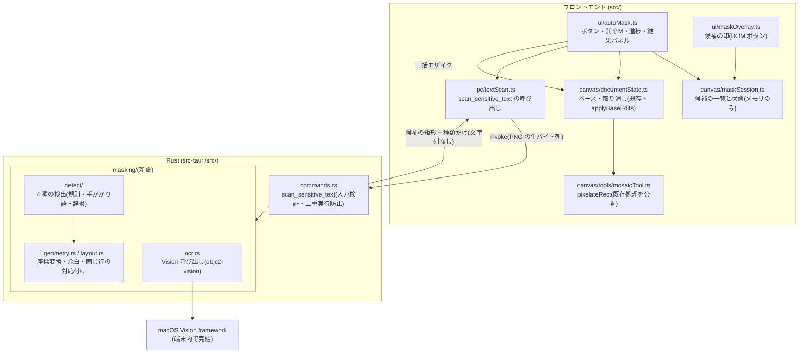

# アーキテクチャ: 機密情報の自動マスキング

> 生成元: `output/prd/PRD_auto-masking.md`(Approved 2026-10-09)
> 生成日: 2026-10-09
> ステータス: Approved(2026-10-09 ゲート 2 通過。§15 の要確認 7 件はすべて推奨案で人間が決定)
> 関連: `output/design/ARCH_tadcap_mvp.md`(既存アーキテクチャ。本書は**差分**で、記載のない部分は既存のまま)。
> FR / NFR の番号は本 PRD のもの。既存 PRD の番号は「MVP FR-008」のように書く

## 1. アーキテクチャ概要

### 1.1 設計方針

- 既存の構成(Tauri v2 + Vanilla TS + Canvas、`ui/ → canvas/ → ipc/` と `commands.rs` 集約)の上に、**Rust の新モジュール 1 つ(`src-tauri/src/masking/`)と IPC コマンド 1 つ**を足す。新しいレイヤー・プラグイン・権限は足さない
- 文字の読み取り(OS の文字認識 Vision)と機密候補の検出は、どちらも Rust 側で 1 回の IPC コマンドの中で終える。webview に返すのは**候補の矩形(画像のピクセル座標)と 4 分類の種類だけ**で、読み取った文字列は IPC を通らない(NFR-002。PRD §5【仮定】をそのまま採用できる)
- 読み取る対象はドキュメントの**ベース**(`documentState` が持つ元画像。矢印・矩形・円・テキストのオブジェクトは含まない。FR-002)。既存の `exportDocumentBase()` で PNG を取り出し、そのまま生のバイト列で渡す
- 一括モザイクは既存のモザイク(`pixelateImageData()` / `mosaicBlockSize()`)と既存の取り消しコマンド(`pixels` を束ねた `group`)をそのまま使う。**新しいコマンドの種類は追加しない**(PRD §5 の「新しい種類を追加するか」への回答)
- 候補の印は Canvas のピクセルに描かず、Canvas に重ねた DOM のボタンで表示する。コピー・履歴は Canvas を読むため、コード変更なしで印が写らない(FR-009・FR-012)
- 撮った直後・履歴切替・起動時には動かない。動くのはボタンとショートカット(FR-014)からだけ(FR-001)
- 過剰設計を避ける: 処理の中断(Vision のキャンセル)、候補の種類の細分の UI、利用者による語の登録は作らない(§16)

### 1.2 システム構成図



### 1.3 主要な設計判断

| # | 判断事項 | 決定内容 | 理由 |
| - | -------- | -------- | ---- |
| 1 | 文字の読み取りの実装方式 | **推奨: Rust から `objc2-vision` で Vision を直接呼ぶ**(§15 #1 で決定待ち) | 既存の `objc2` 0.6.4 / `objc2-foundation` 0.3.2 と同じ版系列で、新たに入るクレートは `objc2-vision` 1 つだけ。補助プロセスが不要なので、ビルド・署名・公証の手順(`scripts/package-mac.sh`・`release.yml`)が変わらない。試作でフル HD を 0.16〜0.8 秒で読めることを確認済み(§1.4) |
| 2 | 検出処理の置き場所 | **推奨: Rust(`masking/detect/`)**(§15 #2 で決定待ち) | 文字列が IPC を通らず NFR-002 を構造で守れる。文字の部分範囲の領域(`boundingBoxForRange`)は Vision の結果オブジェクトが生きている間しか取れないため、検出と同じ側にある方が素直。評価(§10.3)も Rust だけで回せる |
| 3 | 日本語の固有名詞の判定 | **推奨: 手がかり語 + 小さな辞書(姓・都道府県)の規則**(§15 #3 で決定待ち) | 試作で OS の固有表現抽出(NLTagger)は日本語の人名・会社名・住所を 1 件も判定しなかった(§1.4)。PRD §7.2 の A 案は日本語では成り立たない |
| 4 | IPC で渡す画像 | ベースの PNG を生のバイト列(`InvokeBody::Raw`)で渡す | ベースを変えていなければ読み込み時の PNG をそのまま使え、再エンコードが不要(既存 `documentSurface.ts` の revision 管理)。Vision は PNG の `NSData` を直接受け取れるため、Rust 側で画像を展開しない。RGBA で渡すと 5K で約 56MB の IPC になる |
| 5 | 返す座標 | Rust が**余白込み・画像範囲に収めた整数のピクセル矩形**を返す | 画像の幅・高さは PNG の IHDR から読める。余白の計算を 1 か所(Rust)に置くと、印の枠 = モザイクをかける範囲 = 評価で判定する範囲が一致する(FR-011 の余白・§10 #10 の判定基準) |
| 6 | 候補の印の実装 | Canvas に重ねた DOM レイヤーに、候補ごとの `<button>` を % 指定で置く | 表示サイズが変わっても位置が比率で追従する(FR-009 のずれ防止)。クリックの当たり判定を自前で書かずに済み、キーボード操作・`aria-pressed` で外す/戻すの状態を伝えられる。既存の `.shape-overlay` と同じ配置方法(`offsetLeft`/`clientWidth` + `ResizeObserver`) |
| 7 | 一括モザイクの取り消し単位 | 候補ごとの `pixels` コマンドを 1 つの `group` に入れる | 既存の `group` は逆順に取り消し、順にやり直すので、候補が重なっていても正しく戻る(§7.1 手順 9)。退避時のバイト数計算(`commandPixelBytes()`)も `group` に対応済み |
| 8 | 処理中の画像の切替 | 開始時に `token` と表示中の画像(`CanvasImage` の参照)を記録し、結果を受け取った時点で両方が一致しなければ捨てる | 既存のキャプチャ競合対策(`isSameCanvasImage()`、`e2e/capture-race.spec.ts`)と同じ考え方(PRD §7.1) |

### 1.4 試作による確認(2026-10-09、リポジトリ外の使い捨てコード)

設計判断 #1〜#3 の根拠として、スクラッチ領域に `objc2-vision` 0.3.2 / `objc2-natural-language` 0.3.2 を使う最小のプログラムを書き、架空データの画面(顧客詳細の表・URL・ターミナル風の暗い領域。Playwright で描画)を読ませた。リポジトリには何も加えていない。

- 環境: Apple M5 / macOS 26.5.2。対応 OS の下限(macOS 14)と、より遅い機種は**未確認**(NFR-001・NFR-004 の実測は実装フェーズで行う)
- 読み取りの設定: 精度優先(`Accurate`)、言語 `ja-JP` + `en-US`

| 確認したこと | 結果 | 設計への反映 |
| ------------ | ---- | ------------ |
| Rust から Vision を呼べるか | 呼べた。必要な API(`VNImageRequestHandler::initWithData_options`、`VNRecognizeTextRequest`、`topCandidates`、`boundingBox`、部分範囲の `boundingBoxForRange_error`)がすべてバインディングにある | #1 は A 案で成立する |
| 処理時間(1920×1080) | 言語補正あり: 初回 0.45〜0.8 秒、2 回目以降 0.28〜0.33 秒 / 言語補正なし: 初回 0.25 秒、2 回目以降 0.16 秒 | NFR-001(3 秒以内)に余裕がある。言語補正は既定でオフにし、評価で決める(§5.3) |
| 処理時間(3840×2160) | 初回 0.28〜0.45 秒、2 回目以降 0.18〜0.37 秒 | 大きい画像も同程度 |
| 日本語の読み取り | 漢字・かな・〒・¥・全角の記号を読めた。ただし語の間の空白は消えたり残ったりする(「山田 太郎 様」→「山田太郎様」) | 空白の有無に依存しない規則にする |
| 英数字の誤読 | フル HD の小さい等幅文字で `0`→`Q`、`01`→`ol`、`Tr0ub4dor`→`Troub4dor`、トークンの途中に余計な空白 | トークンの判定は文字の種類を厳密に見ない。カード番号のチェックディジットは誤読 1 字で外れる(§15 #6) |
| 表のラベルと値 | 「社員番号」と「EMP-004521」、「口座番号」と「普通 1234567」は**別の行(観測)**として返る | 手がかり語の値を、同じ行の右隣の観測から探す処理(`layout.rs`)が必要 |
| 日本語の固有表現抽出(NLTagger の nameType) | 日本語の文(人名・住所・会社名を含む)でも、すべての語が `Other`。英語は文の中の人名・地名だけ判定でき、名前だけの行(「Hanako Suzuki」)は言語の判定自体を誤った | #3 は規則 + 辞書。NLTagger は最初の版で使わない |

## 2. 技術スタック

既存(ARCH_tadcap_mvp §2)からの追加・変更のみ記す。

| カテゴリ | 技術 | バージョン | 選定理由 |
| -------- | ---- | ---------- | -------- |
| 文字の読み取り | macOS Vision.framework(`VNRecognizeTextRequest`) | OS 標準(macOS 13 以降で日本語に対応) | 端末内で完結し、モデルの同梱が要らない(PRD §7.2【前提】)。追加の権限・エンタイトルメントも要らない |
| Vision のバインディング | `objc2-vision`(新規) | 0.3(試作は 0.3.2) | 既存の `objc2` 0.6 系と同じ作者・同じ版系列。ライセンスは Zlib / Apache-2.0 / MIT の選択。`default-features = false` で `std`, `VNRequest`, `VNRecognizeTextRequest`, `VNRequestHandler`, `VNObservation`, `VNTypes`, `objc2-core-foundation` だけ有効にする(既存 `objc2-app-kit` と同じ絞り方) |
| Foundation のバインディング | `objc2-foundation`(直接依存に昇格) | 0.3(既に `Cargo.lock` に 0.3.2 がある) | `NSData`・`NSArray`・`NSString`・`NSRange`・`NSError` を使うため。新しいクレートは増えない |
| CGRect 型 | `objc2-core-foundation`(直接依存に昇格) | 0.3(既に `Cargo.lock` に 0.3.2 がある) | `boundingBox()` が返す `CGRect` のため(`CFCGTypes` 機能)。新しいクレートは増えない |
| 正規表現 | `regex`(直接依存に昇格) | 1(既に `Cargo.lock` に 1.13.1 がある。`tauri-utils` が実行時に使用) | メール・電話・URL・金額などの規則。新しいクレートは増えない |
| 辞書(姓・都道府県など) | `include_str!` で埋め込むテキスト | — | 外部ファイルを読まない。出典・ライセンスは `/legal-check` で確認(§15 #3) |
| 評価用画像の生成 | Playwright(既存の devDependency) | 既存 | 架空画面の HTML を撮影し、正解の領域を DOM から自動で取る(§10.3、§15 #7) |
| テスト | `cargo test` / Vitest / Playwright(いずれも既存) | 既存 | 追加のテストツールなし |

- **採用しないもの**: Swift の補助プロセス・Swift のライブラリ(§15 #1 で A 案の場合)、`objc2-natural-language`(§1.4 で日本語に効かなかった)、`unicode-normalization`(全角→半角は 1 対 1 の置換表で足り、文字位置もずれない。§5.3)、`zeroize`(§12 で理由を記す)
- `tauri.conf.json`(CSP・`minimumSystemVersion`)と `capabilities/default.json` は**変更しない**(NFR-002・NFR-004)

## 3. レイヤー構成

### 3.1 レイヤー定義

既存のレイヤー表(ARCH_tadcap_mvp §3.1)に次を加える。

| レイヤー | 責務 | 依存可能な対象 |
| -------- | ---- | -------------- |
| Rust masking 層(`src-tauri/src/masking/`)【新設】 | PNG を受け取り、文字の読み取り → 候補の検出 → 矩形の確定までを行い、`Vec<MaskCandidate>` を返す | 標準ライブラリ、`regex`、`objc2` 系(`ocr.rs` だけ) |
| └ 検出(`masking/detect/`・`text.rs`・`layout.rs`・`geometry.rs`) | 文字列と行の位置だけから候補を決める純粋な処理 | 標準ライブラリ、`regex`(Vision に依存しない。`RecognizedPage` トレイト越しに受け取る) |
| └ 読み取り(`masking/ocr.rs`) | Vision を呼び、`RecognizedPage` を実装する | `objc2`・`objc2-foundation`・`objc2-core-foundation`・`objc2-vision` |
| Rust コマンド層(`commands.rs`)【改訂】 | `scan_sensitive_text` を追加(入力検証・二重実行防止・`spawn_blocking`・エラー変換) | 既存 + masking 層 |
| フロントエンド Canvas 層(`src/canvas/`)【改訂】 | `maskSession.ts`(候補の状態)を追加。`documentState.ts` に `applyBaseEdits()`、`mosaicTool.ts` に `pixelateRect()` を追加 | 既存どおり(`maskSession.ts` は `ipc/`・`ui/` に依存しない) |
| フロントエンド IPC 層(`src/ipc/`)【改訂】 | `textScan.ts` を追加(呼び出しと応答の形の検証) | Tauri API のみ |
| フロントエンド UI 層(`src/ui/`)【改訂】 | `autoMask.ts`(ボタン・ショートカット・進捗・結果パネル・処理の組み立て)、`maskOverlay.ts`(候補の印)を追加 | 既存どおり |

### 3.2 依存方向ルール

既存のルール(ARCH_tadcap_mvp §3.2)はすべて維持する。追加分:

- `masking/` → `capture/`・`clipboard/`・`tray.rs`・`shortcuts.rs`・`settings.rs`・`tauri::AppHandle`: **禁止**。呼び出し口は `commands.rs` だけ
- `masking/detect/`・`text.rs`・`layout.rs`・`geometry.rs` → `masking/ocr.rs`・`objc2` 系: **禁止**(検出を macOS の実機なしで `cargo test` できるようにする。Vision の結果は `RecognizedPage` トレイトで受け取る。既存の `CaptureProvider` トレイトと同じ作法)
- `#[tauri::command]` は `commands.rs` にだけ置く(既存ルールのまま)
- `src/canvas/maskSession.ts` → `src/ipc/`・`src/ui/`: **禁止**(候補の種類の型 `MaskKind` は `maskSession.ts` で定義する)
- `src/ipc/textScan.ts` → `src/canvas/`・`src/ui/`: **禁止**(応答の型は `ipc/` 側で独立に定義し、`ui/autoMask.ts` が `maskSession` の型へ詰め替える)
- `src/canvas/` → `src/ui/`: 禁止(既存)。一括モザイクの実行は `ui/autoMask.ts` が `documentState.applyBaseEdits()` と `mosaicTool.pixelateRect()` を呼んで組み立てる
- 循環依存: 禁止

### 3.3 検証方法

- 依存方向の検出コマンドは未導入(`project-config.md` §4.4 未記入)のため、既存どおりコードレビュー(`/code-review`)で確認する
- Rust はモジュールの可視性で強制する: `masking` は `pub(crate)`、外へ出すのは `masking::scan()` と `MaskCandidate` / `MaskKind` / `ScanError` だけ。`ocr.rs` の型は `masking` の外から見えない
- `masking/detect/` 以下が Vision に依存していないことは、`RecognizedPage` の偽物だけで検出のテストが通ることで確かめる(§10)
- 文字列を出力しないことの確認コマンドは §12 に記す

## 4. ディレクトリ構成

既存(ARCH_tadcap_mvp §4)からの差分。`【新設】`・`【改訂】` の付いていないものは変更なし。

```text
tadcap/
├── src/
│   ├── main.ts                    # 【改訂】initAutoMask() の呼び出し、画像の切替・消去の直前に discardMaskSession()
│   ├── ipc/
│   │   └── textScan.ts            # 【新設】scan_sensitive_text の invoke(PNG を生のバイト列で送る)と応答の形の検証
│   ├── canvas/
│   │   ├── maskSession.ts         # 【新設】候補の一覧・処理の状態・token。純粋関数 + 薄いストア(メモリのみ)
│   │   ├── documentState.ts       # 【改訂】applyBaseEdits(rects, draw): 複数矩形のベース加工を 1 つの group で積む
│   │   └── tools/
│   │       └── mosaicTool.ts      # 【改訂】既存の applyMosaic() を pixelateRect() として公開(処理は変えない)
│   ├── ui/
│   │   ├── autoMask.ts            # 【新設】ボタン・⌘⇧M・処理中表示・結果パネル(件数・まとめてモザイク・やめる)と処理の組み立て
│   │   ├── maskOverlay.ts         # 【新設】Canvas に重ねる候補の印(DOM のボタン)。クリックで外す/戻す
│   │   └── toolbar.ts             # 【改訂】確認中(§15 #4 が A 案の場合)はツールボタンを無効にする
│   └── styles.css                 # 【改訂】.mask-overlay・.mask-mark・結果パネルのスタイル
├── src-tauri/
│   ├── Cargo.toml                 # 【改訂】objc2-vision を追加。objc2-foundation・objc2-core-foundation・regex を直接依存に
│   └── src/
│       ├── lib.rs                 # 【改訂】invoke_handler に commands::scan_sensitive_text を追加
│       ├── commands.rs            # 【改訂】scan_sensitive_text・TEXT_SCAN_IN_PROGRESS(二重実行防止)
│       ├── error.rs               # 【改訂】TextScanBusy("text_scan_busy")・TextScanFailed("text_scan_failed")
│       └── masking/               # 【新設】文字の読み取りと機密候補の検出(端末内・メモリのみ)
│           ├── mod.rs             # scan(png) の入口、MaskCandidate / MaskKind / ScanError、RecognizedPage トレイト
│           ├── png.rs             # PNG の署名と IHDR(幅・高さ)の検証。画像は展開しない
│           ├── ocr.rs             # Vision の呼び出し(objc2-vision)。autoreleasepool の中で完結させる
│           ├── text.rs            # SensitiveText(Debug を伏せ字にする)、全角→半角の 1 対 1 正規化、UTF-16 位置の対応
│           ├── layout.rs          # 行の幾何: 同じ行の右隣・直下の行を探す(表のラベルと値の対応付け)
│           ├── geometry.rs        # Vision の正規化座標(左下原点)→ ピクセル(左上原点)、余白、画像範囲への収め、重複の除去
│           ├── detect/            # 4 種の検出器。入力は行の文字列と位置だけ
│           │   ├── mod.rs         # 全検出器を回して Match(行・UTF-16 範囲・種類・細分)を集める
│           │   ├── contact.rs     # ①連絡先: メール・電話番号・住所(FR-003・FR-007)
│           │   ├── credential.rs  # ②認証情報: 接頭辞付きトークン・長いランダム列・手がかり語の値・URL のクエリ(FR-004)
│           │   ├── identifier.rs  # ③識別子: 手がかり語付きの番号・人名・会社名(FR-005・FR-007)
│           │   ├── financial.rs   # ④金額・口座: カード番号・口座番号・通貨付きの金額(FR-006)
│           │   └── lexicon.rs     # 手がかり語・接頭辞・敬称・会社の種類などの定数と辞書の読み込み
│           ├── lexicon/           # include_str! で埋め込む辞書(姓・都道府県。§15 #3)
│           └── eval.rs            # #[cfg(test)] #[ignore] の評価ハーネス(実機の Vision を通して検出率を測る)
├── eval/
│   └── masking/                   # 【新設】評価用画像セット(架空データのみ。リポジトリに含める)
│       ├── pages/                 # 架空画面の HTML(社内システム・メール・設定・請求・ターミナル風など)
│       ├── images/                # 生成した PNG(フル HD・Retina 相当 × 明るい/暗い)
│       └── truth.json             # 正解: 画像・矩形・種類・細分(HTML の data 属性から自動生成)
├── scripts/
│   └── mask-eval-fixtures.mjs     # 【新設】pages/*.html を Playwright で撮影し images/ と truth.json を作る
├── e2e/
│   ├── auto-mask.spec.ts          # 【新設】IPC をモックした一連の流れ・コピー・競合・0 件(§10.2)
│   ├── fixtures/tauriMock.ts      # 【改訂】scan_sensitive_text のモック(固定の候補・遅延・失敗)
│   └── screenshots/autoMask.visual.ts  # 【新設】候補の印の見た目
├── testreport/masking/            # 評価・計測の生データ(ツール出力)
└── output/reports/masking/        # 評価・計測のまとめ(人間向け)
```

## 5. モジュール設計

### 5.1 機能モジュール一覧

| モジュール | 責務 | 主要コンポーネント | 依存ストア |
| ---------- | ---- | ------------------ | ---------- |
| `src-tauri/src/commands.rs`(改訂) | `scan_sensitive_text`: 本文が生のバイト列であることの確認 → 二重実行防止 → `spawn_blocking(masking::scan)` → エラーを固定文字列へ変換 → 経過時間を記録(§12 の制約付き) | `scan_sensitive_text(request)`, `TEXT_SCAN_IN_PROGRESS: AtomicBool` | — |
| `masking/mod.rs` | 入口。`png::validate` → `ocr::recognize`(`RecognizedPage` を返す)→ `detect::run` → `geometry` で矩形を確定 → 重複除去。全体を 1 つの `autoreleasepool` に入れ、戻り値に文字列を含めない | `scan(png: &[u8]) -> Result<Vec<MaskCandidate>, ScanError>`, `trait RecognizedPage` | — |
| `masking/png.rs` | PNG の署名・IHDR の幅/高さ・上限サイズの検証 | `validate(bytes) -> Result<ImageSize, ScanError>` | — |
| `masking/ocr.rs` | Vision の設定(精度優先・`ja-JP`/`en-US`・言語補正)と実行。行ごとに `VNRecognizedText` を保持し、`range_box()` で部分範囲の領域を返す | `VisionPage: RecognizedPage`, `recognize(bytes) -> Result<VisionPage, ScanError>` | — |
| `masking/text.rs` | `SensitiveText`(`Debug`・`Display` を実装しない/伏せ字)、全角英数・記号・空白・各種ハイフンの 1 対 1 正規化、正規化後の位置 → UTF-16 位置の対応 | `SensitiveText`, `normalize()`, `Utf16Map` | — |
| `masking/layout.rs` | 行の位置関係: 同じ行(縦の中心が重なる)で右側の最も近い行、直下の行 | `right_neighbor()`, `next_line_below()` | — |
| `masking/geometry.rs` | 正規化座標 → ピクセル、外側への丸め、余白(行の高さに比例、§5.3)、画像範囲への収め、包含・ほぼ同一の矩形の除去 | `to_pixel_rect()`, `pad_and_clip()`, `dedupe()` | — |
| `masking/detect/*` | 4 種の検出規則(§5.3) | `detect::run(page) -> Vec<Match>` | — |
| `masking/eval.rs` | 評価ハーネス(テスト時のみ。§10.3) | `#[ignore] fn masking_eval()` | — |
| `src/ipc/textScan.ts` | `invoke("scan_sensitive_text", pngBytes)`、応答の形の検証(配列・整数・既知の種類のみ。形が違えば例外) | `scanSensitiveText(png: Blob): Promise<ScannedCandidate[]>` | — |
| `src/canvas/maskSession.ts` | 処理の状態遷移・候補の外す/戻す・残っている矩形の取り出し・token による古い結果の破棄。状態の変更を購読できる | `beginScan()`, `acceptScanResult()`, `failScan()`, `toggleCandidate()`, `activeRects()`, `discardMaskSession()`, `subscribeMaskSession()` | maskSession |
| `src/canvas/documentState.ts`(改訂) | 複数矩形のベース加工を 1 手に: 矩形ごとに「直前のピクセルを読む → 加工」を**順番に**行い、`pixels` を集めて `group` で積む。矩形が 0 件なら何もしない | `applyBaseEdits(rects, draw)` | documentState, undoStack |
| `src/canvas/tools/mosaicTool.ts`(改訂) | 既存の `applyMosaic()`(矩形の `getImageData` → `pixelateImageData` → `putImageData`、ブロックサイズは画像全体の対角線で決まる)を公開するだけ | `pixelateRect(ctx, rect, w, h)` | — |
| `src/ui/autoMask.ts` | ボタン・⌘⇧M の結線、実行の組み立て(§7.1)、処理中の表示、結果パネル(件数・まとめてモザイク・やめる・0 件の文言)、失敗時のトースト、Esc でやめる | `initAutoMask(mount, deps)` | maskSession, canvasState, documentState |
| `src/ui/maskOverlay.ts` | Canvas の表示位置に重ねたレイヤーへ候補ごとの `<button>` を % 指定で配置し、クリックで `toggleCandidate()`。外した候補は見た目を変え `aria-pressed` で伝える | `initMaskOverlay(canvas)` | maskSession |
| `src/main.ts`(改訂) | `initAutoMask()` の呼び出し。新規キャプチャ(`handleCaptureCompleted`)・履歴切替(`reloadHistoryItemIntoCanvas`)・消去(`clearEditor`)の**画像を差し替える前**に `discardMaskSession()` | — | maskSession |

### 5.2 モジュール間連携

- **Rust の 1 回の呼び出しで完結**: `commands::scan_sensitive_text` → `masking::scan()`。Vision の結果オブジェクト(`VNRecognizedText`)は `scan()` の中だけで生き、部分範囲の領域を取り終えたら `autoreleasepool` を抜けて解放される。webview へ返るのは `MaskCandidate { x, y, width, height, kind }`(整数のピクセル、`kind` は `"contact" | "credential" | "identifier" | "financial"`)の配列だけ
- **検出と読み取りの境界**: `detect::run()` は `&dyn RecognizedPage` から「行の文字列(`SensitiveText`)・行の領域」を読み、`Match { line, range(UTF-16), kind, detail }` を返す。`mod.rs` が `page.range_box(line, range)` で領域に変換する。テストでは文字幅を等分した偽物の `RecognizedPage` を使う
- **細分(`detail`)は Rust の中だけ**: メール・電話・住所・トークン・手がかり語の値・URL のクエリ・番号・人名・会社名・カード・口座・金額の細分は、評価(§10.3)とテストでだけ使い、IPC には載せない(画面の印は 4 分類で足りる。FR-009)
- **フロントの組み立ては `ui/autoMask.ts`**: `canvas/` は `ipc/` を呼ばず、`ipc/` は `canvas/` を知らない。`ui/autoMask.ts` が `exportDocumentBase()` → `scanSensitiveText()` → `acceptScanResult()` をつなぐ(既存の `main.ts` の組み立てと同じ置き方)
- **画像の切替は `main.ts` が知らせる**: 既存の差し替え経路 3 つで `discardMaskSession()` を呼ぶ。これに加えて、結果を受け取る時点の `token` と画像の照合でも古い結果を捨てる(二重の防御。FR-001・FR-012)

### 5.3 検出の設計(`masking/detect/`)

| 種類 | 細分 | 規則(要点) | 対応 FR |
| ---- | ---- | ------------ | ------- |
| ①連絡先 | メール | `local@domain.tld`。`@` と `.` の前後に読み取りで入った空白を許す | FR-003 |
| ①連絡先 | 電話番号 | 日本の固定・携帯・IP 電話・フリーダイヤル。ハイフン有無・括弧・`+81` 表記。全角数字・各種ハイフンは正規化してから判定 | FR-003 |
| ①連絡先 | 住所 | 「〒」+ 郵便番号、郵便番号単独(`NNN-NNNN`)、都道府県名で始まる行の残り。複数行の住所は行ごとに判定する(2 行目の建物名は手がかりが無ければ拾えない。評価で確認) | FR-007 |
| ②認証情報 | 接頭辞付きトークン | 広く使われるサービスの固有の接頭辞 + 英数字列(接頭辞の一覧は `lexicon.rs` に定数で持ち、文書には製品名を書かない) | FR-004 |
| ②認証情報 | 長いランダム列 | 20 文字以上の英数字(`-`・`_` を含む)で、英字と数字が混在するもの。誤読(`0`→`Q` 等)や途中の空白を許すため、文字の種類の比率で判定し、厳密な文字集合を求めない | FR-004 |
| ②認証情報 | 手がかり語の値 | 「パスワード」「暗証番号」「password」「pass」「pwd」「secret」「token」「api key」などの後の区切り(`:` `=` `：` 空白)以降、または同じ行の右隣の観測(`layout.rs`)。`KEY=VALUE` 形式でキー名に手がかり語を含むものも | FR-004 |
| ②認証情報 | URL のクエリ | `http(s)://` で始まる URL の `?` 以降、空白または行末まで(**`?` 以降だけ**。PRD §10 #3) | FR-004 |
| ③識別子 | 手がかり語付きの番号 | 「社員番号」「社員ID」「顧客番号」「顧客ID」「会員番号」「お客様番号」「ID」「User ID」などの値(同じ行の残り、または右隣の観測) | FR-005 |
| ③識別子 | 人名 | (a) 敬称「様」「さん」「氏」「殿」の直前のかな漢字列 (b) 「氏名」「名前」「担当」「宛名」「差出人」「Name」などのラベルの値 (c) **手がかり語なし**: 姓の辞書に一致し、後ろにかな漢字 1〜3 字が続く列 (d) 英字: ローマ字の姓・名の辞書を含む大文字始まりの 2〜3 語、または「Mr.」「Ms.」「Dear」の後 | FR-007 |
| ③識別子 | 会社名 | 「株式会社」「(株)」「㈱」「有限会社」「合同会社」「Inc.」「Co., Ltd.」などと、その前後に続く名前の列 | FR-007 |
| ④金額・口座 | カード番号 | 13〜19 桁(空白・ハイフンの区切り有無)でチェックディジット(Luhn)が正しいもの。誤読時の扱いは §15 #6 | FR-006 |
| ④金額・口座 | 口座番号 | 「口座番号」「口座」「普通」「当座」の後の 6〜8 桁(同じ行の残り、または右隣の観測) | FR-006 |
| ④金額・口座 | 金額 | 「¥」「￥」「$」「円」「USD」「JPY」などの通貨記号・単位が付いた数値だけ(PRD §10 #1)。桁区切り・小数を含む | FR-006 |

- **正規化**: 全角英数字・全角記号・全角空白・各種ハイフン(`－` `ー` `‐` `−` `–` `—`)を、1 文字 → 1 文字で半角へ置き換えてから規則を当てる。1 対 1 なので正規化前後で文字の位置が変わらず、Vision へ渡す UTF-16 の範囲へそのまま戻せる
- **位置の単位**: Rust の `String` はバイト単位、Vision の `NSRange` は UTF-16 単位。`text.rs` の `Utf16Map` で必ず変換する(取り違えると日本語の行で領域がずれる。`project-config.md` §11 へ落とし穴として追記を提案)
- **同じ行の対応付け**: 手がかり語だけの観測(ラベル)を見つけたら、`layout.rs` で「縦の中心がラベルの高さの範囲に入り、右側にある、最も近い観測」を値として扱う。見つからなければ直下の行(左端が近いもの)を値とする(§1.4 の試作で表のラベルと値が別の観測になったため)
- **読み取りの設定**: 精度優先、言語 `ja-JP` → `en-US` の順、**言語補正は既定でオフ**(英数字の記号列を辞書の語へ寄せる補正を避ける。速い)。評価セットで補正あり/なしの両方を測り、検出率の高い方を採る(実装パラメータとして `ocr.rs` の定数に置く)
- **余白**: 候補の矩形の上下左右に `max(2px, 行の高さ × 0.2)` を足し、画像範囲に収める【仮定】。係数は評価(§10.3、正解の領域を 100% 覆うか)で調整する。Vision の部分範囲の領域は「UI 用で厳密ではない」とされているため、余白で吸収する
- **重複の除去**: ある候補の矩形が別の候補に完全に含まれるなら小さい方を捨てる。ほぼ同じ矩形(重なり 90% 以上)は 1 つにまとめ、種類は「認証情報 > 金額・口座 > 連絡先 > 識別子」の順で残す。見逃しを避ける方針(PRD §1.1)のため、それ以外の重なりは両方残す
- **辞書**: 姓(上位の数百〜千件程度)・ローマ字の姓名・都道府県 47 件をテキストで埋め込む。出典とライセンスは `/legal-check` で確認してから入れる(§15 #3)

### 5.4 IPC コマンド

| コマンド | 引数 | 戻り値 | エラー | 備考 |
| -------- | ---- | ------ | ------ | ---- |
| `scan_sensitive_text`【新設】 | 本文: ベースの PNG の生バイト列(`InvokeBody::Raw`)。ヘッダーなし(幅・高さは IHDR から読む) | `MaskCandidate[]`。`{ x: number, y: number, width: number, height: number, kind: "contact" \| "credential" \| "identifier" \| "financial" }`。座標は画像の実ピクセル(整数・左上原点・余白込み・画像範囲内) | `"text_scan_busy"`(別の読み取りが実行中)/ `"text_scan_failed"`(PNG でない・大きすぎる・Vision の失敗)。いずれも固定文字列で、原因の詳細(`NSError` の説明文など)は含めない | `async` + `spawn_blocking`(既存の作法)。イベントは使わない(利用者の操作起点のため。ARCH_tadcap_mvp §1.3 #4) |

### 5.5 要件との対応

| 要件 | 実現箇所 |
| ---- | -------- |
| FR-001 実行ボタン | `ui/autoMask.ts`(押せる条件 = 画像あり・処理中でない)、`maskSession.ts`(状態)、`commands.rs`(`TEXT_SCAN_IN_PROGRESS`)、token と画像の照合 |
| FR-002 端末内の読み取り | `masking/ocr.rs`(Vision)、ベースの PNG を読む(§7.1 手順 2) |
| FR-003〜FR-007 検出 | `masking/detect/*`(§5.3) |
| FR-008 進捗表示 | `ui/autoMask.ts`(処理中の表示。Rust 側は `spawn_blocking` で webview を止めない) |
| FR-009 候補の印 | `ui/maskOverlay.ts`(DOM のため焼き込まれない)、件数・0 件の文言は `ui/autoMask.ts` |
| FR-010 個別に外す | `maskOverlay.ts` のクリック → `toggleCandidate()` |
| FR-011 一括モザイク | `documentState.applyBaseEdits()` + `mosaicTool.pixelateRect()`、余白は Rust 側(`geometry.rs`) |
| FR-012 候補を出したままの操作 | ⌘C は既存のまま(印は Canvas に無い)、やめる / Esc、画像の切替で `discardMaskSession()` |
| FR-013 種類ごとの表示/非表示 | 後の版(§16)。`MaskCandidate.kind` を持つので追加しやすい |
| FR-014 ショートカット | `ui/autoMask.ts` の `keydown`(既存の `shortcutGuards.isEditableTarget()` を使う)。キーは §15 #5 |
| NFR-001 処理時間 | §1.4 の試作、§10.4 の計測 |
| NFR-002 端末内・非保存 | §12 |
| NFR-003 検出率 | §10.3 の評価ハーネス |
| NFR-004 対応 OS | 依存の追加のみで `minimumSystemVersion` は変えない。macOS 14 の実機確認(§10.4) |
| NFR-005 保証しない表現 | §9.4 の文言方針 |

## 6. 状態管理設計

### 6.1 ストア一覧

既存のストア(ARCH_tadcap_mvp §6.1)に 1 つ加える。

| ストア | 責務 | 永続化 | ストレージキー |
| ------ | ---- | ------ | -------------- |
| `maskSession`(`src/canvas/maskSession.ts`)【新設】 | 処理の状態・token・対象の画像(`CanvasImage` の参照)・候補の一覧(`{ id, rect, kind, excluded }`) | なし(メモリのみ。NFR-002) | — |

状態の形:

| 状態 | 持つもの | 次の状態 |
| ---- | -------- | -------- |
| `idle` | — | `scanning`(ボタン・⌘⇧M) |
| `scanning` | `token`、`image` | `review`(結果を受け取り、token と画像が一致)/ `idle`(失敗・破棄・古い結果) |
| `review` | `token`、`image`、`candidates[]` | `idle`(一括モザイク・やめる・Esc・画像の切替) |

- 「失敗」は状態として残さず、トーストで伝えて `idle` に戻す(PRD §5 の「失敗」状態は一時的な表示として扱う)
- 候補は**文字列を持たない**(PRD §5【仮定】を採用。印のラベルは種類だけで足りる)

### 6.2 永続化方針

- 永続化は一切しない(ファイル・設定・ブラウザストレージ・履歴の退避のいずれにも入れない)。履歴の退避(`documentArchive`)は画像の切替の**前に** `discardMaskSession()` が走るため、候補が退避に紛れ込む経路はない
- 一括モザイクの結果は既存のモザイクと同じくベースのピクセルになり、取り消しのピクセル(`group` 内の `pixels`)は既存の上限(`ARCHIVED_UNDO_BYTES_LIMIT` = 1 項目 8MB)の対象になる。候補が多く 1 手で 8MB を超えた場合は、履歴へ切り替えた時点でその手は取り消せなくなる(既存の焼き込みと同じ扱い)

### 6.3 ストア間の参照ルール

- `maskSession` は `canvasState` の `CanvasImage` を**参照として記録するだけ**で、`canvasState` を書き換えない
- `maskSession` を書き換えるのは `ui/autoMask.ts`(開始・結果・やめる・一括モザイク後)、`ui/maskOverlay.ts`(外す/戻す)、`main.ts`(画像の切替前の破棄)だけ
- 一括モザイクで `documentState` を変えるのは `ui/autoMask.ts` だけ(`documentState.applyBaseEdits()` 経由)
- `history/` は `maskSession` を参照しない

## 7. データフロー

### 7.1 データの流れ

1. 利用者がボタンを押す、または ⌘⇧M(§15 #5)→ `ui/autoMask.ts`。画像が無い・`scanning` 中・`review` 中なら何もしない(FR-001 の二重実行防止)
2. 入力中のテキストを確定(既存 `commitPendingText()`)→ `beginScan(image)` で `token` を発行し `scanning` へ。処理中の表示を出す(FR-008)→ `exportDocumentBase()` でベースの PNG を得る(ベースが読み込み時のままなら再エンコードしない)
3. `ipc/textScan.ts` が PNG のバイト列で `invoke("scan_sensitive_text")`。前の画像の読み取りがまだ Rust で走っている場合(画像を切り替えてすぐ押した場合)は、その完了を待ってから送る(`ui/autoMask.ts` が実行中の Promise を 1 つ持つ)。これにより Rust の `text_scan_busy` は通常は起きない
4. Rust `commands::scan_sensitive_text`: `TEXT_SCAN_IN_PROGRESS` を立てる(立っていれば `text_scan_busy`)→ `spawn_blocking` で `masking::scan()`
5. `masking::scan()`(1 つの `autoreleasepool` の中): `png::validate`(署名・IHDR・上限)→ `ocr::recognize`(Vision。行ごとに文字列・領域・`VNRecognizedText` を保持)→ `detect::run`(正規化・規則・同じ行の対応付け)→ 各 `Match` を `range_box()` で領域へ → ピクセル化・余白・画像範囲へ収める → 重複の除去 → `Vec<MaskCandidate>`。ここで文字列と Vision のオブジェクトはすべて破棄される
6. `TEXT_SCAN_IN_PROGRESS` を下ろし、経過時間だけを記録して(§12)、候補の配列を返す
7. `ipc/textScan.ts` が応答の形を検証 → `ui/autoMask.ts` が `acceptScanResult(token, 現在の画像, 候補)`。token が古い、または表示中の画像が開始時と違えば**捨てる**(FR-001)。一致すれば `review` へ。処理中の表示を消し、結果パネル(件数 / 0 件の文言)と印を出す(FR-009)
8. 印をクリック → `toggleCandidate(id)` で外す/戻す(FR-010)。外した候補は見た目を変える
9. 「まとめてモザイク」(残りが 0 件なら押せない)→ `documentState.applyBaseEdits(activeRects(), (ctx, rect) => pixelateRect(ctx, rect, w, h))`。矩形ごとに「その時点のピクセルを読む → モザイク」を順に行い、`pixels` を 1 つの `group` で積む → 再合成 → `discardMaskSession()` で印を消す(FR-011)。⌘Z は `group` を逆順に戻すので、候補が重なっていても全候補分が元に戻る。⇧⌘Z で再びかかる
10. 「やめる」・Esc → `discardMaskSession()`(FR-012)。⌘C は既存のまま(Canvas に印は無いので、印を含まない画像がコピーされる)
11. 新規キャプチャ・履歴切替・消去 → `main.ts` が画像を差し替える前に `discardMaskSession()`(PRD §10 #4)
12. 失敗(`text_scan_failed`・形の不正・通信の例外)→ 処理中の表示を消し、エラーのトースト(既存 `showToast(…, "error")`)→ `idle`。画像は変えない(FR-002)

### 7.2 バリデーション戦略

- **Rust の入力**: 本文が生のバイト列であること、PNG の署名、IHDR の幅・高さが 1 以上かつ上限以内(例: 各辺 16384px 以下)、本文のサイズ上限(例: 128MB)【仮定】。満たさなければ `text_scan_failed`
- **Rust の出力**: 矩形は整数で、`0 <= x`、`x + width <= 画像の幅`(y も同様)、幅・高さが 1 以上のものだけを返す
- **フロントの受信**: `ipc/textScan.ts` が配列であること・各値が有限の整数であること・`kind` が 4 種のどれかであることを確かめる。1 件でも不正なら全体を失敗として扱う(部分的に印を出さない)
- **フロントの照合**: 受け取った矩形を表示中のベースの幅・高さで再度クランプしてから使う(既存の `clipRectToCanvas()`)
- **競合**: token と画像の照合(§7.1 手順 7)、画像の切替前の破棄(手順 11)

## 8. ルーティング設計

| パス | ページ | 機能 |
| ---- | ------ | ---- |
| `/`(`index.html` 単一) | メインエディタ画面 | 既存の機能に、自動マスキングのボタン・候補の印・結果パネルを追加する。新しい画面は作らない(PRD §6) |

## 9. UI設計方針

### 9.1 コンポーネント設計

- 既存の規約(ARCH_tadcap_mvp §9.1、DOM を作る関数とストアをつなぐ関数を分けて export)に従う。例: `maskOverlay.ts` は `renderMaskMarks(container, candidates, size)`(DOM 生成のみ)と `initMaskOverlay()`(購読・クリック)を分ける
- **ボタン**: ツールバーの、ツール切替(矢印〜モザイク)と**区切り線で分けた位置**に置く。押すと処理が走る「操作」であり、選んでドラッグする「ツール」ではないことを、トグル表示(`aria-pressed`)を持たない普通のボタンにすることで区別する。正確な位置・アイコンは `/ui-ux-design` で決める
- **結果パネル**: 確認中だけ Canvas の上部(またはツールバー直下)に出す帯。件数・「まとめてモザイク」・「やめる」を並べる
- **候補の印**: `.mask-overlay`(Canvas と同じ位置・大きさ。既存 `.shape-overlay` と同じ合わせ方)の中に、候補ごとの `<button class="mask-mark">` を `left/top/width/height` の % で置く。枠と種類のラベルを持ち、外した候補は枠を破線・薄くする【仮定。見た目は `/ui-ux-design` で決める】
- **確認中の Canvas 操作**(§15 #4 が A 案の場合): `.mask-overlay` 全体がポインタを受け、印以外のクリックは何もしない。ツールボタン・取り消し/やり直しボタンは無効にし、⌘Z・⇧⌘Z・⌘⇧F・⌘⇧B・Delete は効かない。⌘C は効く(FR-012)。Esc は「やめる」

### 9.2 スタイリング方針

- 既存の `src/styles.css` に機能別のセクションとして追加する(CSS フレームワークは入れない)
- 印の色は種類ごとに 4 色を CSS カスタムプロパティで定義する(`--mask-contact` など)。明るい画面・暗い画面どちらのキャプチャの上でも見えるよう、枠は色の線 + 白または黒の縁取りの 2 重にする【仮定】(PRD §6)
- 印は Canvas のピクセルではないため、色や太さを変えてもコピー・履歴に影響しない

### 9.3 ダークモード対応

- 既存どおりライトテーマ固定(`src/styles.css` 冒頭、MVP PRD §6)。OS の設定には追従しない

### 9.4 文言方針(NFR-005)

- 0 件のとき: 「候補は見つかりませんでした」+「貼る前に目で確認してください」の趣旨。「安全」「すべて隠しました」「機密はありません」などの保証の表現は使わない
- ボタンのツールチップ・`aria-label`: 「機密らしい箇所を探す」の趣旨(「自動で隠す」と書かない)
- 失敗時: 「文字を読み取れませんでした。画像は変更していません」の趣旨
- 正確な文言は `/ui-ux-design` で決め、README・紹介ページの記述と合わせて実装フェーズでレビューする

### 9.5 アクセシビリティ

- ボタン・印・パネルのボタンはすべて `<button>`。印は `aria-label`(例: 「連絡先の候補」)と `aria-pressed`(外したかどうか)を持ち、Tab で移動して Space/Enter で外す/戻すができる
- 処理中・結果の件数は `role="status"` の領域で読み上げる

## 10. テスト戦略

### 10.1 テスト構成

| 種別 | ツール | 対象 | 配置 |
| ---- | ------ | ---- | ---- |
| ユニット(Rust) | `cargo test` | 4 種の検出規則の境界値(区切り文字の有無・全角/半角・桁数の上下限・Luhn・隣接文字との境界・誤読の許容)、手がかり語と右隣の観測の対応付け、正規化と UTF-16 位置の対応(日本語・絵文字を含む行)、座標変換・余白・画像範囲への収め・重複の除去、PNG の検証、`SensitiveText` の `Debug` が伏せ字であること。Vision は使わず偽物の `RecognizedPage` で行う | `src-tauri/src/masking/**/*.rs` 内の `#[cfg(test)] mod tests` |
| ユニット(Rust・実機) | `cargo test -- --ignored` | Vision の最小の通し確認(架空画像 1 枚で候補が返ること)と評価ハーネス(§10.3) | `masking/ocr.rs`・`masking/eval.rs`(`#[ignore]`) |
| ユニット(TS) | Vitest | `maskSession` の状態遷移(未実行 → 処理中 → 確認中 → 破棄、古い token・別の画像の結果を捨てる)、外す/戻す、`activeRects()`、`applyBaseEdits()` が 1 手の `group` になり取り消し・やり直しで全候補分が戻る/かかること(既存の `PixelStore` の偽物。重なる矩形を含む)、`textScan.ts` の応答の検証 | `src/**/*.test.ts`(コロケーション) |
| 結合(E2E) | Playwright(既存の IPC モック) | §10.2 | `e2e/auto-mask.spec.ts` |
| 見た目 | Playwright(既存の `*.visual.ts` の作法) | 印の表示(明るい画像・暗い画像)、外した印、結果パネル、0 件 | `e2e/screenshots/autoMask.visual.ts` |
| 手動確認 | 実機 macOS | §10.4 | `testreport/masking/` に記録 |

### 10.2 E2E(IPC モック)のシナリオ

- `tauriMock.ts` に `scan_sensitive_text` を追加し、固定の候補・遅延・失敗を返せるようにする(OS の文字認識そのものは対象外。既存方針)
- 印の表示 → 1 件外す → まとめてモザイク → 外した候補の領域は変わらず、残りの領域は変わる → ⌘Z で全候補分が戻る → ⇧⌘Z で再びかかる
- 印を出したまま ⌘C → コピーされる画像に印が含まれない(既存のクリップボードのモックで画素を確かめる)
- 処理中(モックの遅延中)に新規キャプチャ・履歴切替 → 古い結果の印が出ない(`capture-race.spec.ts` と同じ作り)
- 処理中にもう一度ボタン・⌘⇧M → `scan_sensitive_text` が 1 回しか呼ばれない
- 0 件 → 0 件の文言が出て、保証の表現を含まない
- 失敗 → エラーのトーストが出て、画像が変わらない
- 画像が無いとき → ボタンが押せない
- ウィンドウの大きさを変える → 印が候補の領域からずれない(印の矩形と、画像上の領域を表示倍率で変換した矩形を比べる)

### 10.3 評価用画像セットと検出率の計測(NFR-003)

- **画像の作り方(§15 #7 が A 案の場合)**: `eval/masking/pages/*.html` に架空の画面(社内システム・メール・設定画面・請求画面・ターミナル風など 20 枚以上)を書き、正解にしたい文字を `<span data-mask="contact/phone">` のように囲む。`scripts/mask-eval-fixtures.mjs` が Playwright でフル HD(`deviceScaleFactor: 1`)と Retina 相当(`2`)× 明るい/暗いテーマで撮影し、各 `span` の表示領域をピクセルに換算して `truth.json`(画像・矩形・種類・細分)を書く。正解の件数は PRD §8.3 の規模(形が決まっているものは細分ごと 40 件以上、日本語の固有名詞は種類ごと 30 件以上)を満たすまで HTML を足す
- **実行**: 実機の macOS で `cargo test --manifest-path src-tauri/Cargo.toml masking::eval -- --ignored --nocapture`。`masking::scan()` と同じ処理(余白込み)を全画像に通す
- **判定**: 正解の矩形が、いずれかの候補の矩形に **100% 覆われたら検出**(PRD §10 #10)。細分ごとに検出率を出し、形が決まっているもの 95% / 日本語の固有名詞・手がかり語付きの番号・英字の人名 70% と比べる。誤検出(どの正解とも重ならない候補)の件数は参考値として記録する
- **出力**: 生データ `testreport/masking/eval-<日付>.json`(画像ごと・正解ごとの検出の有無と候補の矩形・種類。**読み取った文字列は含めない**)、まとめ `output/reports/masking/eval-<日付>.md`(細分ごとの検出率・目標との比較・誤検出数・環境)
- CI では回さない(PRD §8.3)。`release.yml` の `cargo test` は `#[ignore]` を実行しないため影響しない
- 言語補正のオン/オフ・余白の係数・辞書の件数はこの評価で決める

### 10.4 手動確認

| 項目 | 方法 | 記録先 |
| ---- | ---- | ------ |
| NFR-001 処理時間 | 実機でフル HD の評価画像を表示し、ボタン押下 → 印の表示を 10 回。Rust の経過時間ログ(§12)と、画面上の体感の両方を記録。対応する最も遅い想定の機種で中央値・最大値 | `testreport/masking/latency-<日付>.md` |
| NFR-002 通信しないこと | 処理中に `nettop -p <アプリのPID>` で、アプリのプロセスに通信が発生しないことを確認 | 同上 |
| NFR-004 macOS 14 | macOS 14 の実機または仮想環境で、日本語を含む評価画像の読み取りと候補の表示 | 同上 |
| 実クリップボード | 印を出したまま ⌘C → 他のアプリへ貼り付け、印が写っていないこと | 同上 |

## 11. エントリーポイントとプロバイダー構成

**Rust 側(`src-tauri/src/lib.rs`)**

- `invoke_handler` に `commands::scan_sensitive_text` を加える(既存のコマンド一覧の末尾)
- プラグイン・`setup` の処理は変えない。Vision は最初の呼び出しまで読み込まれない(起動時間に影響しない)

**フロントエンド側(`src/main.ts`)**

1. 既存の `init*()`(ツールバー・サイドバー等)の後に `initAutoMask(toolbarMount, { exportBase, getImage })` と `initMaskOverlay(canvasEl)` を呼ぶ
2. 既存の差し替え経路(`handleCaptureCompleted`・`reloadHistoryItemIntoCanvas`・`clearEditor`)の、画像を差し替える**前**に `discardMaskSession()` を呼ぶ
3. ⌘⇧M の `keydown` は `ui/autoMask.ts` が `window` に登録する(既存の ⌘C・⌘Z と同じ。`isEditableTarget()` で入力欄にフォーカスがある間は奪わない)

## 12. セキュリティ設計

NFR-002(端末内での完結・非保存)を中心に、仕組みで守る順に記す。

- **外部と通信しない**: Vision は端末内で動く。新しいプラグイン・権限(`capabilities/default.json`)・CSP の `connect-src` は追加しない。辞書もバイナリに埋め込み、実行時に何も取得しない。確認は §10.4(`nettop`)【仮定: OS が自身のプロセスで行う言語資源の更新はアプリの通信に含めない】
- **文字列が webview に渡らない**: IPC の戻り値は矩形と種類だけ(§5.4)。webview の開発者ツール・コンソールに文字列が出る経路が無い
- **ログに出さない**:
  - `masking/` では `println!`・`eprintln!`・`dbg!`・ログ用マクロを使わない。経過時間の記録は `commands.rs` で行い、内容は**経過ミリ秒と画像の幅・高さだけ**(候補の件数・種類も出さない)。形式は既存の `[tadcap:latency]` に合わせ、例えば `[tadcap:latency] origin=mask scan_ms=<ms> size=<w>x<h>`(`scripts/latency-summary.mjs` を `scan_ms` に対応させる)
  - 読み取った文字列は `SensitiveText` 型で包み、`Debug` は `SensitiveText(<redacted>)` を返し、`Display` は実装しない。`format!` で文字列を組み立てる箇所はレビューで確認する
  - エラーは固定文字列(`text_scan_failed` 等)だけを返し、`NSError` の説明文・入力の一部を含めない。`panic!`・`expect()` のメッセージにも文字列を入れない(リリースビルドは `panic = "abort"` で、パニックの文言が標準エラーに出るため)
  - 確認コマンド(レビュー時): `rg -n 'println!|eprintln!|dbg!|log::' src-tauri/src/masking` が 0 件、`rg -n 'console\.' src/ipc/textScan.ts src/ui/autoMask.ts src/ui/maskOverlay.ts src/canvas/maskSession.ts` で出力が候補の中身を含まないこと
- **保存しない**: 候補は `maskSession` のメモリだけ(§6.2)。ファイル・設定・ブラウザストレージ・履歴の退避に書かない。Rust 側は `scan()` の終了時に文字列・Vision のオブジェクトをすべて破棄し、`autoreleasepool` で Objective-C 側の一時オブジェクトもその場で解放する
- **メモリの消去(`zeroize`)はしない**: 文字列の複製は Vision・Foundation の内部にもあり、Rust 側だけ上書きしても保証にならないため。「処理後に保持しない」(PRD NFR-002)は、参照を残さないこと(状態・キャッシュ・ログに入れない)で満たす
- **入力の検証**: §7.2。PNG の署名・IHDR・サイズ上限を Vision へ渡す前に確かめる
- **二重実行の防止**: フロントの状態(`scanning` 中は開始しない)と Rust の `TEXT_SCAN_IN_PROGRESS`(既存の `CAPTURE_IN_PROGRESS` と同じ作法)の 2 段
- **Objective-C の例外**: Vision の呼び出しは `NSError` で失敗を返すのが通常だが、例外が Rust 側へ伝わるとプロセスが止まる。`objc2` の `exception` 機能(`objc2::exception::catch`)で呼び出しを包み、`text_scan_failed` に変換する【仮定: 実装時に `objc2` の機能フラグを確認】
- **`unsafe` の範囲**: `ocr.rs` の Vision 呼び出しだけに限定し、`unsafe` ブロックごとに前提(スレッド・オブジェクトの寿命)をコメントで残す。`/code-review` で重点的に確認する(既存の CoreGraphics FFI と同じ扱い)
- **XSS**: 印のラベルは固定の種類名を `textContent` で入れる。外部由来の文字列を DOM に入れない
- **モザイクの強さ**: 既存と同じ(PRD のスコープ外。短い英数字を推測されうる点は別件)

## 13. 開発環境・ツールチェーン

### 13.1 コマンド一覧

既存のコマンド(`docs/docs/project.md`)に加えるもの:

```bash
npm run mask:fixtures      # 【新設】評価用画像と truth.json を生成(scripts/mask-eval-fixtures.mjs、Playwright)
cargo test --manifest-path src-tauri/Cargo.toml masking::eval -- --ignored --nocapture
                           # 【新設】実機で検出率を計測(testreport/masking/ に出力)
npm run latency:summary    # 既存。scan_ms の行も集計できるようにする
```

既存の確認一式(`npm run build && npm run test:run && cargo test ... && cargo clippy ... -- -D warnings`)はそのまま使い、新しいテストもこの中で走る(`#[ignore]` を除く)。

### 13.2 Git Hooks

- 変更なし(既存どおり。Conventional Commits は `.claude/rules/git-conventions.md`)

### 13.3 CI/CD・配布

- `release.yml`: 変更なし(`cargo test`・`cargo clippy -D warnings` が新しいモジュールも対象にする)
- `scripts/package-mac.sh`・署名・公証(`docs/release-notarization.md`): **A 案(§15 #1)なら変更なし**。Vision.framework は OS のフレームワークで、追加のバイナリ・エンタイトルメントは不要
- B 案を選んだ場合に必要になる変更(参考): Swift のビルド手順の追加、`tauri.conf.json` の `bundle.externalBin`(ターゲット名付きのファイル名)、入れ子のバイナリの署名とハードンドランタイム、公証の再確認、`release.yml` のビルド手順

## 14. ドキュメント体系

| ファイル | 責務 |
| -------- | ---- |
| `output/design/ARCH_auto-masking.md` | 本書。ゲート 2 の承認後、下記の `docs/` へ反映される |
| `docs/docs/project.md` | IPC コマンド表に `scan_sensitive_text`、コマンド一覧に §13.1、技術スタックに `objc2-vision`(実装フェーズで `/implementing-features` が更新) |
| `docs/docs/architecture.md` | ディレクトリ構成(`masking/`・`eval/masking/`)とテスト一覧の追加 |
| `docs/docs/data-model.md` | 永続化なしの一時状態(`maskSession`)と `MaskCandidate` の形 |
| `docs/docs/development-patterns.md` | 文字列を出力しない規約(`SensitiveText`・ログ禁止)、UTF-16 位置の変換、`applyBaseEdits()` の順序の約束 |
| `project-config.md` §2 / §3 / §11 | 依存の追加、コマンドの追加、落とし穴(UTF-16 と UTF-8 の位置の取り違え、表のラベルと値が別の観測になる)。一次更新は `/implementing-features` |
| `README.md`・紹介ページ | 機能の説明(NFR-005 の表現。Phase 5) |
| `THIRD_PARTY_NOTICES.md` | 辞書を同梱する場合の出典・ライセンス(`/legal-check` の結果に従う) |
| ADR(`/adr`) | §15 #1(読み取りの実装方式)の決定後に、判断の経緯と試作の結果を残す |

## 15. 要確認事項

**決定(2026-10-09、人間)**: 7 件すべて推奨案 — #1 A(Rust から `objc2-vision`)/ #2 A(Rust)/ #3 B(手がかり語 + 辞書)/ #4 A(確認モード)/ #5 A(⌘⇧M 固定)/ #6 B(4 桁×4 組は Luhn 不一致でも候補)/ #7 A(HTML を既存の Playwright で撮影)。
**条件(人間の指示)**: 依存の追加・同梱データは、サプライチェーンを含めたセキュリティ確認を徹底する(`objc2-vision` の公開元・版固定・`build.rs`・`cargo audit`・ライセンス、辞書の出典・ライセンス、新しい npm パッケージは足さない)。

**依存 `objc2-vision` の供給経路の確認(2026-10-09、追加前)**:

| 確認 | 結果 |
| ---- | ---- |
| 公開元 | crates.io の所有者は `madsmtm`・`simlay`。既存の `objc2` / `objc2-foundation` と同じ。ソースは `github.com/madsmtm/objc2` の `framework-crates/objc2-vision`(コミット `7b1abfd`) |
| 版 | 0.3.2(2025-10-04 公開・最新安定版・取り下げなし)。既存の `objc2-foundation` 0.3.2 / `objc2` 0.6.4 と同じ系列 |
| 既知の脆弱性 | OSV で `objc2-vision` / `objc2` / `objc2-foundation` とも 0 件 |
| ビルド時に動くコード | `build.rs` なし。ソースにプロセス起動・ネットワーク・ファイル操作の呼び出しなし。リンクするのは Vision フレームワークだけ |
| ライセンス | Zlib OR Apache-2.0 OR MIT |
| 注意点 | 既定の機能(default features)は Vision の全 API を有効にし、使わない機能で依存が増えうる(`objc2-av-foundation`・`objc2-core-ml` など、今の `Cargo.lock` に無いもの)。**`default-features = false` で、文字の読み取りに要る機能だけを指定する**。実装時に `Cargo.lock` の差分が `objc2-vision` 1 件だけであることを確認し、証拠として残す |

| # | 項目 | 選択肢 | 推奨 | 影響範囲 |
| - | ---- | ------ | ---- | -------- |
| 1 | 【決定済み】文字の読み取りの実装方式(PRD §7.2・ブレスト #7) | **A**: Rust から `objc2-vision` で Vision を直接呼ぶ / **B**: Swift の小さな補助プロセスを同梱し、Rust から起動して標準入出力で受け渡す / **C**: Swift のライブラリを Rust のバイナリに静的リンクする | **A**。追加のクレートは 1 つ、ビルド・署名・公証の手順が変わらない、試作で動作と速度を確認済み(§1.4)。B は「処理が落ちてもアプリが落ちない」「文字列がプロセス終了で必ず消える」利点があるが、署名・公証・CI の手順が増える。C はビルドスクリプトと Swift ランタイムのリンクが複雑 | `Cargo.toml`、`masking/ocr.rs`、(B/C の場合)`tauri.conf.json`・`package-mac.sh`・`release.yml`・`docs/release-notarization.md` |
| 2 | 【決定済み】検出処理の置き場所(PRD §7.2) | **A**: Rust(読み取りと同じ呼び出しの中で完結し、矩形と種類だけを返す)/ **B**: TypeScript(読み取った文字列と位置を webview へ返し、Vitest でテスト) | **A**。文字列が IPC と webview を通らず NFR-002 を構造で守れる。部分範囲の領域は Vision の結果オブジェクトが必要なため B だと全文字の領域を先に返す必要がある。規則のテストは `cargo test` で同等に書ける | `masking/detect/`、IPC の形(§5.4)、テストの置き場所 |
| 3 | 【決定済み】日本語の固有名詞(人名・会社名・住所)の判定方式(PRD §7.2) | **A**: OS の固有表現抽出(NLTagger)だけ / **B**: 手がかり語(敬称・ラベル・会社の種類・〒・都道府県)+ 小さな辞書(姓・ローマ字の姓名・都道府県)の規則 / **C**: B + 英文の文の中の人名だけ NLTagger を併用 | **B**。試作で NLTagger は日本語を 1 件も判定しなかった(§1.4)。辞書の出典・ライセンスは実装前に `/legal-check` で確認する。C は評価で英字の人名が 70% に届かない場合に追加を検討 | `masking/detect/identifier.rs`・`contact.rs`・`lexicon/`、`THIRD_PARTY_NOTICES.md` |
| 4 | 【決定済み】候補の印を出している間の編集操作(PRD に定めなし) | **A**: 確認モード — 印以外の Canvas 操作・ツール・取り消し/やり直し・重ね順・削除を止める。⌘C は効く。Esc で「やめる」 / **B**: 編集を許す — 印を出したまま矢印・モザイク等を使え、印のクリックとツールの操作が同じ Canvas 上で競合しないよう当たり判定を分ける | **A**。印のクリックと図形の選択・作成がぶつからず、取り消しで候補と画像の対応が崩れる心配もない。確認は短時間で終わる操作のため、編集を止めても負担が小さい | `ui/maskOverlay.ts`、`ui/toolbar.ts`、`ui/undoButton.ts`・`selectionKeys.ts`・`arrangeButtons.ts` のキー処理 |
| 5 | 【決定済み】FR-014 のキー | **A**: ⌘⇧M(Mask の頭文字)/ **B**: ⌘⇧K / **C**: 設定で変更可能にする(既定は A) | **A**(固定)。既存のアプリ内のキー(⌘C・⌘Z・⇧⌘Z・⌘⇧F・⌘⇧B・⌘,)と既定のキャプチャキー(⌘⇧2)と重ならない。利用者がキャプチャのキーを同じ組み合わせに設定した場合はそちらが優先される(OS 全体のショートカットのため)。C は設定ファイルの項目追加になり(PRD §5 の設定の行)、現時点では不要 | `ui/autoMask.ts`、(C の場合)`settings.rs`・`settingsDialog.ts` |
| 6 | 【決定済み】カード番号でチェックディジットが合わないもの | **A**: PRD FR-006 のとおり、チェックディジットが正しいものだけを候補にする / **B**: 4 桁 × 4 組の区切りがある 16 桁は、チェックディジットが合わなくても候補にする(区切りの無い数字列は A と同じ) | **B**。試作で小さい文字の英数字に誤読が見られ(§1.4)、1 字の誤読でチェックディジットが外れて見逃しになる。見逃しを避ける方針(PRD §1.1)に合う。採用する場合は PRD FR-006 の受け入れ基準を改訂する | `masking/detect/financial.rs`、PRD FR-006 |
| 7 | 【決定済み】評価用画像の作り方(PRD §8.3) | **A**: 架空画面の HTML を Playwright で撮影し、正解の領域を HTML の目印から自動生成する / **B**: 画像を手作業で用意し、正解の領域を手で記入する | **A**。正解の矩形が画素単位で正確で、画面の追加・解像度・テーマの組み合わせを機械的に増やせる。B は実在のアプリ画面に近いが、正解の記入に手間と誤差が出る。A で不足する見た目(実アプリ特有の描画)は後から B で少数追加できる | `eval/masking/`、`scripts/mask-eval-fixtures.mjs`、§10.3 |

## 16. 今後の拡張ポイント

- **FR-013 種類ごとの表示/非表示**(Could): `maskSession` の候補が種類を持つため、結果パネルに種類ごとの切替を足し、該当の候補の `excluded` をまとめて切り替えるだけで実現できる
- **英文の人名への NLTagger の併用**: §15 #3 の C。評価で英字の人名が目標に届かない場合に `objc2-natural-language` を追加する(文の中の人名には効くことを試作で確認済み)
- **利用者による語・形式の登録、設定ファイルでの配布**(PRD スコープ外): `lexicon.rs` の定数を、組み込み + 利用者定義の合成に置き換える
- **読み取りの中断**: 画像の切替時に Vision の要求を取り消す。現状は 1 秒未満で終わるため作らない(大きい画像で問題になった場合に `VNRequest::cancel` を検討)
- **Swift の補助プロセスへの切替**: §15 #1 で A を採用した後、`objc2-vision` の不具合や OS の更新で問題が出た場合の代替。`RecognizedPage` トレイトの実装を差し替えるだけで、検出側は変わらない
- **機密用の別の隠し方(塗りつぶし等)**(PRD スコープ外): `applyBaseEdits()` に渡す `draw` を差し替えるだけで対応できる
