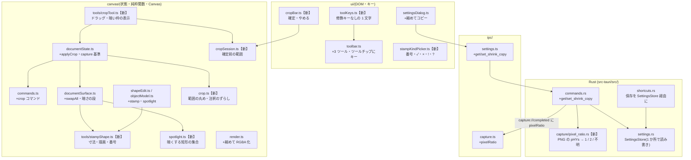

# アーキテクチャ: 小さな編集機能(番号・記号スタンプ / トリミング / スポットライト / 縮めてコピー / ツールの 1 キー切替)

> 生成元: `output/prd/PRD_quick-edits.md`(Approved 2026-10-10)
> 生成日: 2026-10-10
> ステータス: Approved(2026-10-10 ゲート 2 通過。§15 の要確認 4 件は人間が決定済み)
> 関連: `output/design/ARCH_tadcap_mvp.md`(既存アーキテクチャ)・`output/design/ARCH_auto-masking.md`(§17「実装での決定」を含む)。本書は**差分**で、記載のない部分は既存のまま。
> FR / NFR の番号は本 PRD のもの。既存 PRD の番号は「MVP FR-006」「自動マスキング FR-012」のように書く。
> 本書の根拠は 2026-10-10 時点のコード(`c3c0854`)。行番号は `ファイル:行` で示す

## 1. アーキテクチャ概要

### 1.1 設計方針

- 新しいレイヤー・依存・権限・IPC イベントは足さない。足すのは **TS のモジュール数個**、**Rust の小さな関数 1 つ(画像の倍率の読み取り)**、**設定の 1 項目と IPC コマンド 2 つ**だけ(NFR-003)
- スタンプ・穴は既存のオブジェクト(`AnnotationObject`、`src/canvas/objectModel.ts:18`)の**新しい種類**として足し、選択・移動・削除・重ね順・取り消し・履歴の退避は既存の仕組みに乗せる(PRD §7.1)
- スポットライトの暗さはオブジェクト 1 つずつの描画ではなく、合成の段を 1 つ足して「穴の和の外側」を 1 回だけ塗る。塗る領域は**互いに重ならない矩形の集合**を純粋関数で求め、1 本のパスで塗る(暗さが 1 段階・重なりで濃くならない・Vitest で検証できる)
- トリミングは **ベースの大きさを変える新しいコマンド `crop`** を 1 つ足し、注釈のずらし(`update`)・範囲外の削除(`remove`)と一緒に `group` で 1 手にする(PRD §7.2 の A 案と B 案の中間。既存の `group` の逆順取り消しをそのまま使う)
- 「画像の大きさが変わらない」という既存の暗黙の前提を、トリミングで崩れる箇所ごとに直す(§7.3 の影響表)。特に **注釈の大きさ・モザイクの粗さの基準**を画像の今の大きさから切り離す(§15 #1)
- 画面の倍率は **Rust が撮った PNG の解像度の情報(pHYs チャンク)を読み**、`CaptureResult` に載せる。倍率は撮影の情報なので撮影の側(`capture/`)が持つ(将来の別の撮影方式への差し替え口 `CaptureProvider` とも合う)
- 縮めてコピーは、クリップボードへ渡す RGBA を取り出す所(`src/canvas/render.ts:63` `getCanvasImageData()`)で縮める。表示・編集・履歴は元の解像度のまま(FR-012)
- 過剰設計を避ける: 穴は矩形だけ、記号は固定 4 種、キーの割り当ては固定、暗さは定数 1 つ

### 1.2 システム構成図



### 1.3 主要な設計判断

| # | 判断事項 | 決定内容 | 理由 |
| - | -------- | -------- | ---- |
| 1 | トリミングの取り消し(PRD §7.2) | 新しいコマンド `{ type: "crop"; rect; image }` を足し、`group[crop, update…, remove…]` で 1 手にする。`image` は「反対側のベース全体」で、取り消し・やり直しのたびに今のベース全体と入れ替える(既存の `pixels` と同じ入れ替え方式。`src/canvas/commands.ts:6-10`) | ベースの大きさを変えられるのは新しい種類だけ(既存の `pixels` は同じ大きさの矩形の差し替え)。注釈のずらしと削除は既存の `update` / `remove` を再利用でき、`group` の逆順取り消し(`commands.ts:120-130`)で順序が保たれる。全注釈を丸ごと退避する A 案より取り消しの単位が既存と揃い、テストも既存の偽の `PixelStore` で書ける |
| 2 | 入れ替えの手段 | `PixelStore` に `swapAll(image): ImageDataLike` を足す(ベースと表示 canvas を `image` の大きさにして書き、前のベース全体を返す) | 表示 canvas とベースの大きさが違うと合成を描かない作り(`documentSurface.ts:159`)のため、両方を同時に変える口が要る。既存の `load()`(履歴の復元)と同じ作法 |
| 3 | 注釈の大きさの基準(PRD FR-006【仮定】) | **推奨: 注釈ごとに基準を持てるようにする**。トリミングを確定した時点で残る注釈に「切り詰める前の画像の大きさ」を記録し、以後その注釈はその基準で太さ・文字の大きさを決める。トリミング後に新しく描く注釈は今の画像の大きさで決める(§15 #1) | 今の太さ・文字の大きさはすべて「表示中の画像の対角線」から毎回計算している(`arrowTool.ts:122-125`・`textLayout.ts:61-68`・`rectangleTool.ts:72-75`)。何もしないとトリミングで描いた注釈が細く・小さく変わる。逆に基準を画像全体で固定すると、5K の全画面を 1200×800 に切った後に描く矢印が 72px(上限)になり、最初からその範囲を撮った場合(19px)と大きく違う |
| 4 | モザイクの粗さの基準 | ドキュメントごとに**撮影時の画像の大きさ(`captureSize`)**を持ち、モザイクの粗さ(`mosaicBlockSize()`)は常にそれで決める。トリミングでは変えない | 画面上の文字の画素数はトリミングで変わらない。今の画像で決めると 5K の全画面(ブロック 47px)を 1200×800 に切った後のモザイクが 12px になり、読めてしまうおそれがある(隠す目的に反する。`mosaicTool.ts:89-99` の設計判断と同じ理由) |
| 5 | 範囲外へ完全に出た注釈(PRD §10 #5 A) | 確定と同じ `group` に `remove` を積む。完全に出たかは各注釈の描画範囲(`shapeUndoRect()`、線の太さ・影込み)とトリミング範囲の重なりで判定する | 見た目と一致する判定にする(線の端が範囲に少し掛かっている矢印は残る) |
| 6 | 「置いた順」の持ち方(PRD §5 の注記) | **新しい項目を持たない**。オブジェクトの `id` はドキュメント内で単調に増え(`documentState.ts:124-126`)、取り消し・やり直し・重ね順の変更・トリミングでも変わらないため、`id` の昇順を置いた順とする | 重ね順(配列順)と置いた順は既に別の値で持てている。項目を増やさない |
| 7 | 50 個の上限と番号スタンプ(PRD §10 #9) | **推奨: 番号スタンプも穴と同じく焼き込みの対象から外す**(§15 #2)。焼き込める注釈が無いときは新しい注釈を足さない(§15 #3) | 上限の焼き込みは「重ね順の一番奥」(`documentState.ts:130`)から行うため、⌘⇧B で奥へ送った新しい番号が先に焼き込まれうる。焼き込んだ数字を固定したまま途中の番号を消すと、同じ番号が 2 つ出るのを防ぐために番号の飛びと焼き込みの台帳が要る(§15 #2 の A 案) |
| 8 | 暗くする領域の求め方 | 穴の端の座標で縦横に区切り、どの穴にも入らないマスを横につないだ**互いに重ならない矩形の集合**を返す純粋関数 `spotlightShadeRects(holes, w, h)`。描画はその矩形を 1 本のパスにして 1 回だけ塗る | `evenodd` / `nonzero` の 1 本のパスでは、穴同士が重なった所が再び塗られてしまう。矩形を別々に塗ると、端数の座標の境目に二重の半透明の線が出る。穴は最大 50 個で、マスは最大 (2×50+1)² ≈ 1 万と小さい |
| 9 | 暗さを塗る段(PRD §10 #7 A) | 合成の順を「ベース → 暗さ → 穴以外の注釈(重ね順)→ 下書き」にする。穴は合成では何も描かない(選択の枠・ハンドルはオーバーレイだけ) | 注釈は穴の外でも明るいまま。自動マスキングはベース(暗さを含まない)を読むので FR-010 の「影響を受けない」は構造で満たせる |
| 10 | 画面の倍率の取得(PRD §10 #10 A・§7.2) | Rust の `capture::read_pixel_ratio(path)` が PNG の pHYs チャンク(IDAT より前にある)を読み、72dpi 相当なら 1、144dpi 相当なら 2、それ以外・無し・壊れていれば `None`。撮影の共通処理 `run_capture()`(ボタン・トレイ・ショートカットの 3 経路が共有。`commands.rs:102-124`)が `CaptureResult.pixelRatio` に載せる | 撮った画像だけで決まり、複数の画面が混ざっても撮った画面に合う。撮影の情報なので撮影の側に置く(将来の別の撮影方式は倍率を直接返せる)。フロントで PNG を解析すると、撮影方式ごとの差を UI 側が知ることになる。依存なし(標準ライブラリで 40 行程度)。【仮定】`screencapture` が pHYs を書く — 実装の最初に実機で確かめる(§10.3、外れた場合は §16) |
| 11 | 倍率の持ち方 | `CanvasImage.pixelRatio`(表示中の画像の倍率。不明は 1)と `HistoryItem.pixelRatio` の 2 か所 | 履歴から開き直すと `CanvasImage.capture` は `null`(`canvasState.ts:26-29`)なので、履歴の項目にも持たせる。トリミングでは変わらない |
| 12 | 縮める場所と方法 | `getCanvasImageData(canvas, ratio)` に縮める倍率を渡し、`ratio > 1` のときだけ縮めた canvas(`imageSmoothingQuality = "high"`)へ描いて RGBA を取り出す。大きさは純粋関数 `shrunkSize(w, h, ratio)`(四捨五入・最小 1px) | クリップボードの主経路・予備経路はどちらも RGBA を渡す作り(`src/ipc/clipboard.ts` のモジュール doc)。PRD §7.1 の「`documentSurface.ts` の PNG 書き出しで縮める」は今のコードと違うため、ここで訂正する。Rust 側で縮める B 案は画像処理の依存が要る |
| 13 | 設定ファイルの書き方 | Rust に `SettingsStore`(パス + 今の設定を `Mutex` で持つ)を作り、ショートカットの変更と縮めてコピーの切替の両方が**今の設定を読んで 1 項目だけ変えて書く** | 今のショートカットの保存は `AppSettings { capture_shortcut }` で**ファイル全体を書き換える**(`shortcuts.rs:338-340`)。項目を足すと、キーを変えた瞬間に縮めてコピーの設定が消える |
| 14 | 1 キー切替の判定 | `event.code`(物理キー)で判定する純粋関数 `toolKeyTarget(event, context)`。押せるかどうかはツールボタンと同じ `toolButtonState()`(`toolbar.ts:104-110`)で決める | 日本語入力がオンでも同じキーで動く(FR-013)。既存の `shortcutFormat.ts` も `event.code` で読む。ボタンとキーの可否が食い違わない |

### 1.4 PRD の記述と今のコードの違い(設計で吸収する点)

| PRD の記述 | 今のコード | 本書での扱い |
| ---------- | ---------- | ------------ |
| §7.1「縮めてコピーは `documentSurface.ts` の PNG 書き出しで縮める」 | コピーは `render.ts::getCanvasImageData()` の RGBA を渡す(`main.ts:228-236`) | 判断 #12 |
| §5「置いた順を重ね順とは別に持つ必要がある」 | オブジェクトの `id` が置いた順を表している | 判断 #6(項目は増やさない) |
| §5「設定に 1 項目追加。既定値のときはキーを書かない」 | 保存がファイル全体の書き換えで、他の項目を消す | 判断 #13(読んでから書く) |
| FR-006「大きさは前後で変わらない【仮定】」 | 大きさは描くたびに画像の今の大きさから計算している | 判断 #3・#4、§15 #1 |
| (記載なし) | オブジェクトは常に画像の内側にある前提で、移動の範囲を `[-左端, 幅-右端]` に絞る(`shapeEdit.ts` `moveShape()`)。トリミング後は一部がはみ出した注釈ができ、この範囲が逆転する | §5.3 で移動の範囲を「はみ出しを増やさない」に直す |

## 2. 技術スタック

既存(ARCH_tadcap_mvp §2・ARCH_auto-masking §2)から**追加なし**(NFR-003)。使うものだけ記す。

| カテゴリ | 技術 | バージョン | 選定理由 |
| -------- | ---- | ---------- | -------- |
| 描画 | Canvas 2D(`fillText`・`arc`・`fill` のパス・`drawImage` の縮小・`imageSmoothingQuality`) | 既存(webview 標準) | スタンプ・暗さ・トリミングの表示・縮小がすべて既存の Canvas で足りる |
| PNG の解像度の読み取り | Rust 標準ライブラリ(`std::fs::File` + `Read` / `Seek`) | 既存 | pHYs はチャンクの長さ・種類・9 バイトの中身を読むだけ。画像の展開は要らない |
| 設定の保存 | `serde` / `serde_json`(既存) | 既存 | `settings.rs` の作法のまま項目を 1 つ足す |
| テスト | Vitest / Playwright / `cargo test`(既存) | 既存 | 追加のツールなし |

- `package.json`・`Cargo.toml`・`Cargo.lock`・`tauri.conf.json`・`capabilities/default.json` は**変更しない**(NFR-002・NFR-003)

## 3. レイヤー構成

### 3.1 レイヤー定義

既存のレイヤー表(ARCH_tadcap_mvp §3.1、ARCH_auto-masking §3.1)に次を加える。レイヤー自体は増やさない。

| レイヤー | 責務 | 依存可能な対象 |
| -------- | ---- | -------------- |
| Rust capture 層(`capture/`)【改訂】 | `pixel_ratio.rs` を追加: PNG の pHYs から倍率を返す純粋な関数(バイト列版)と、ファイルから読む薄い関数 | 標準ライブラリ |
| Rust 設定(`settings.rs`)【改訂】 | `SettingsStore`(読み込み・今の設定の取得・1 項目の更新と保存)。`AppSettings` に `shrink_copy` | 既存どおり |
| Rust コマンド層(`commands.rs`)【改訂】 | `get_shrink_copy`・`set_shrink_copy` を追加。`run_capture()` が `pixel_ratio` を埋める | 既存 + `settings::SettingsStore` |
| フロント Canvas 層(`src/canvas/`)【改訂】 | スタンプ・穴の種類、`crop` コマンド、暗さの段、トリミングの状態と結線、縮めた RGBA の取り出し | 既存どおり(`ui/`・`ipc/` に依存しない。`canvasState.ts` の `CaptureResult` 型の参照は既存のまま) |
| フロント IPC 層(`src/ipc/`)【改訂】 | `capture.ts` の型に `pixelRatio`、`settings.ts` に縮めてコピーの取得・変更 | Tauri API のみ |
| フロント UI 層(`src/ui/`)【改訂】 | 1 キー切替、スタンプの種類の選択、トリミングの確定・やめるの帯、設定画面の 1 項目 | 既存どおり |

### 3.2 依存方向ルール

既存のルールはすべて維持する。追加分:

- `src/canvas/spotlight.ts`・`crop.ts`・`tools/stampShape.ts`・`stampNumbers()` は純粋関数のみ(DOM・状態ストアに依存しない)。`crop.ts` → `documentState.ts`: **禁止**(`documentState.ts` が `crop.ts` を使う一方向)
- `src/canvas/cropSession.ts` → `ui/`・`ipc/`: **禁止**(`maskSession.ts` と同じ作法の薄いストア)
- `src/canvas/` → `src/ui/`: 禁止(既存)。トリミングの確定ボタンの帯は `ui/cropBar.ts` が `cropSession` を購読し、`documentState.applyCrop()` を呼ぶ
- `src/canvas/` → `src/ipc/settings.ts`: **禁止**。縮めてコピーの設定は `main.ts` が持ち、`getCanvasImageData()` へ倍率として渡す
- `capture/pixel_ratio.rs` → `masking/`: **禁止**(`masking/png.rs` と処理が似ていても共有しない。`masking` は `pub(crate)` で外へ出すものを絞っている。ARCH_auto-masking §3.3)
- `#[tauri::command]` は `commands.rs` にだけ置く(既存)
- 設定ファイルへの書き込みは `settings::SettingsStore` だけが行う(`shortcuts.rs` から `save_settings()` を直接呼ばない)

### 3.3 検証方法

- 依存方向の検出コマンドは未導入(`project-config.md` §3)のため、既存どおりコードレビュー(`/code-review`)で確認する
- 確認コマンド(レビュー時): `rg -n 'from "\.\./ui|from "\.\./ipc' src/canvas` が既存の 1 件(`canvasState.ts` の `CaptureResult` 型)以外 0 件、`rg -n 'save_settings' src-tauri/src` が `settings.rs` の中だけ

## 4. ディレクトリ構成

既存からの差分。`【新設】`・`【改訂】` の付いていないものは変更なし。

```text
tadcap/
├── src/
│   ├── main.ts                       # 【改訂】縮めてコピーの設定の読み込みと保持、CanvasImage・HistoryItem に pixelRatio、bindToolKeys()・initCropBar()・initStampKindPicker() の呼び出し、画像の差し替え前に cancelCrop()
│   ├── canvas/
│   │   ├── canvasState.ts            # 【改訂】ToolId に "stamp" | "spotlight" | "crop"、CanvasImage.pixelRatio
│   │   ├── commands.ts               # 【改訂】DocumentCommand に crop、PixelStore に swapAll
│   │   ├── documentState.ts          # 【改訂】applyCrop()、captureSize(モザイクの基準)、上限の焼き込みの対象の選び方、選択中のスタンプの文字サイズの変更
│   │   ├── documentSurface.ts        # 【改訂】swapAll()、合成に暗さの段、スタンプの描画(番号を渡す)
│   │   ├── objectModel.ts            # 【改訂】スタンプ・穴の当たり判定、焼き込める注釈の選び方 pickBurnTarget()
│   │   ├── shapeEdit.ts              # 【改訂】EditableShape に StampShape・SpotlightShape、styleBasis、ツールごとに掴める注釈、移動の範囲(はみ出し対応)
│   │   ├── styleBasis.ts             # 【新設】注釈の大きさの基準(対角線)を決める純粋関数 shapeStyleDiagonal()
│   │   ├── spotlight.ts              # 【新設】spotlightShadeRects()(暗くする互いに重ならない矩形)と暗さの定数
│   │   ├── crop.ts                   # 【新設】範囲の整数化・何もしない判定・注釈のずらしと範囲外の判定(planCrop)
│   │   ├── cropSession.ts            # 【新設】確定前のトリミング範囲(メモリのみ。購読できる薄いストア)
│   │   ├── copyScale.ts              # 【新設】shrunkSize(w, h, ratio)、copyRatio(設定, 倍率)
│   │   ├── render.ts                 # 【改訂】getCanvasImageData(canvas, ratio) で縮めた RGBA を返せる
│   │   ├── toolSettings.ts           # 【改訂】stampKind(これから置くスタンプの種類。取り消し対象外・非永続)
│   │   └── tools/
│   │       ├── stampShape.ts         # 【新設】スタンプの直径・文字の大きさ・記号の描画・番号の付け方 stampNumbers()
│   │       ├── cropTool.ts           # 【新設】トリミングのドラッグ・ハンドル・範囲外を暗くするオーバーレイ・Enter / Esc
│   │       ├── shapeTools.ts         # 【改訂】スタンプのクリックで置く、穴のドラッグ、スタンプ・穴の選択の表示
│   │       ├── mosaicTool.ts         # 【改訂】粗さを captureSize で決める
│   │       ├── textTool.ts           # 【改訂】文字の大きさを今の画像で決める(styleBasis が無い新しいテキスト)
│   │       └── (arrowTool / rectangleTool / ellipseTool / textLayout)  # 【改訂】太さ・文字の大きさの関数が対角線を受け取る
│   ├── history/
│   │   ├── historyStore.ts           # 【改訂】HistoryItem.pixelRatio
│   │   └── documentArchive.ts        # 【改訂】commandPixelBytes() が crop の image を数える
│   ├── ipc/
│   │   ├── capture.ts                # 【改訂】CaptureResult.pixelRatio(1 | 2 | null)の型と検証
│   │   └── settings.ts               # 【改訂】getShrinkCopy()・setShrinkCopy()
│   ├── ui/
│   │   ├── toolKeys.ts               # 【新設】キーとツールの対応表・判定の純粋関数・window への結線
│   │   ├── stampKindPicker.ts        # 【新設】スタンプの種類(番号・✓・×・!・?)の選択
│   │   ├── cropBar.ts                # 【新設】確定・やめるのボタンの帯(cropSession を購読)
│   │   ├── toolbar.ts                # 【改訂】3 ツールの追加、ツールチップと aria-keyshortcuts にキー
│   │   ├── undoButton.ts             # 【改訂】トリミング範囲の指定中の ⌘Z はトリミングをやめるだけ(§15 #4)
│   │   ├── autoMask.ts               # 【改訂】画像の大きさが変わったら候補を捨てる(防御)
│   │   └── settingsDialog.ts         # 【改訂】「コピーを等倍に縮める」のチェック
│   └── styles.css                    # 【改訂】新しいボタン・帯・種類の選択
├── src-tauri/src/
│   ├── capture/
│   │   ├── mod.rs                    # 【改訂】CaptureResult.pixel_ratio、read_pixel_ratio の公開
│   │   └── pixel_ratio.rs            # 【新設】PNG の pHYs → Some(1) / Some(2) / None
│   ├── settings.rs                   # 【改訂】SettingsStore、AppSettings.shrink_copy
│   ├── shortcuts.rs                  # 【改訂】設定の読み込み・保存を SettingsStore 経由に
│   ├── commands.rs                   # 【改訂】get_shrink_copy・set_shrink_copy、run_capture で pixel_ratio
│   └── lib.rs                        # 【改訂】SettingsStore の manage、invoke_handler に 2 コマンド
└── e2e/
    ├── stamp.spec.ts                 # 【新設】
    ├── crop.spec.ts                  # 【新設】
    ├── spotlight.spec.ts             # 【新設】
    ├── shrink-copy.spec.ts           # 【新設】
    ├── tool-keys.spec.ts             # 【新設】
    ├── fixtures/tauriMock.ts         # 【改訂】pixelRatio 付きの撮影結果、pHYs 付きの PNG、get/set_shrink_copy
    └── screenshots/quickEdits.visual.ts  # 【新設】スタンプ・穴・トリミング範囲の見た目
```

## 5. モジュール設計

### 5.1 機能モジュール一覧

| モジュール | 責務 | 主要コンポーネント | 依存ストア |
| ---------- | ---- | ------------------ | ---------- |
| `canvas/shapeEdit.ts`(改訂) | `StampShape`・`SpotlightShape` を `EditableShape` に足す。ハンドル(スタンプは無し、穴は四隅)・当たり判定・移動・リサイズ・`shapeUndoRect()` を種類ごとに足す。ツールごとに掴める注釈を `decidePointerDown()` で絞る(§5.3) | `EditableShape`, `decidePointerDown()`, `moveShape()` | — |
| `canvas/styleBasis.ts`(新設) | 注釈の大きさを決める対角線: `shape.styleBasis ?? hypot(今の幅, 今の高さ)` | `shapeStyleDiagonal(shape, w, h)` | — |
| `canvas/tools/stampShape.ts`(新設) | スタンプの直径(文字サイズの段階 × 対角線から決定論的に)、数字・記号の描画、当たり判定(円の内側)、番号の付け方 | `stampDiameter()`, `drawStamp(ctx, shape, label, w, h)`, `stampNumbers(objects)` | — |
| `canvas/spotlight.ts`(新設) | 穴の和の外側を、互いに重ならない矩形の集合で返す。暗さの色(定数 1 つ) | `spotlightShadeRects(holes, w, h): Rect[]`, `SPOTLIGHT_SHADE` | — |
| `canvas/crop.ts`(新設) | 範囲の整数化(各辺を四捨五入し画像内に収める)、何もしない判定(幅・高さ 0 / 画像全体と同じ)、注釈ごとに「ずらす / 消す」の決定と、ずらした形(`styleBasis` の記録を含む) | `normalizeCropRect()`, `planCrop(objects, rect, w, h): CropPlan` | — |
| `canvas/commands.ts`(改訂) | `crop` コマンドの取り消し・やり直し(`pixels.swapAll()` で入れ替え) | `undoCommand()`, `redoCommand()` | — |
| `canvas/documentState.ts`(改訂) | `applyCrop(rect)`: `planCrop` → ベース全体の入れ替え → `group` を積む → 選択の整理。`captureSize` の保持(新規キャプチャ・履歴の復元で設定、退避に含める)。上限の焼き込みは `pickBurnTarget()` で選び、選べなければ追加しない | `applyCrop()`, `addShapeObject()`(戻り値 `null` あり), `setSelectedFontSize()`(スタンプ対応) | documentState, undoStack |
| `canvas/documentSurface.ts`(改訂) | `swapAll(image)`(ベース・表示 canvas の大きさを変えて書き、前のベース全体を返す)。合成: ベース → 暗さ → 穴以外の注釈 → 下書き。スタンプには番号を渡す | `swapAll()`, `render(objects, draft)` | — |
| `canvas/cropSession.ts`(新設) | 確定前の範囲(画像のピクセル座標)と購読。やめる条件(§7.1 手順 C-6)で `null` に戻す | `beginCrop()`, `updateCropRect()`, `cancelCrop()`, `getCropSession()`, `subscribeCropSession()` | cropSession |
| `canvas/tools/cropTool.ts`(新設) | トリミングツールのポインタ結線(範囲のドラッグ・ハンドルでのリサイズ・内側の移動)、範囲外を暗くしてハンドルを描くオーバーレイ(`pointer-events: none`。合成には描かない)、Enter で確定・Esc でやめる | `bindCropTool(canvas)` | cropSession, canvasState, documentState |
| `canvas/copyScale.ts`(新設) | 縮めた大きさ(四捨五入・最小 1px)、設定と倍率から使う倍率(オフ・倍率 1・不明は 1) | `shrunkSize()`, `copyRatio(enabled, pixelRatio)` | — |
| `canvas/render.ts`(改訂) | `getCanvasImageData(canvas, ratio = 1)`: `ratio > 1` なら縮めた canvas に描いてから読む | `getCanvasImageData()` | — |
| `ui/toolKeys.ts`(新設) | キーとツールの対応(1 か所の表)、判定(§7.1 手順 K)、`window` の keydown への結線 | `TOOL_KEYS`, `toolKeyTarget()`, `bindToolKeys()` | canvasState, maskSession |
| `ui/stampKindPicker.ts`(新設) | 番号・✓・×・!・? の選択(既存の文字サイズの 3 ボタンと同じ作法。取り消し対象外) | `initStampKindPicker(mount)` | toolSettings |
| `ui/cropBar.ts`(新設) | 範囲の指定中だけ「確定」「やめる」を出す。押せる条件 = 範囲が何もしない範囲でない | `initCropBar(mount)` | cropSession |
| `ui/settingsDialog.ts`(改訂) | 「コピーを等倍に縮める」のチェック。切り替えたらすぐ保存し、失敗したらチェックを戻してエラーを出す(保存ボタンは置かない) | `initSettingsDialog(mount, deps)` | — |
| `ipc/settings.ts`(改訂) | `getShrinkCopy(): Promise<boolean>`(コマンドが無い環境は `false`)、`setShrinkCopy(enabled): Promise<boolean>` | — | — |
| `ipc/capture.ts`(改訂) | `CaptureResult.pixelRatio: 1 \| 2 \| null` | — | — |
| `capture/pixel_ratio.rs`(新設) | PNG の署名を確かめ、IDAT の前までチャンクを順に読み、pHYs(単位がメートル・縦横が同じ)を倍率にする | `pixel_ratio_from_png(bytes) -> Option<u8>`, `read_pixel_ratio(path) -> Option<u8>` | — |
| `settings.rs`(改訂) | `SettingsStore { path, settings: Mutex<AppSettings> }`。`update(f)` は今の設定に `f` を当てて保存し、失敗したらメモリの値を戻す | `SettingsStore::load()`, `get()`, `update()` | — |
| `commands.rs`(改訂) | `get_shrink_copy`・`set_shrink_copy`(保存の失敗は既存の `settings_save_failed`)、`run_capture()` が既存の `spawn_blocking`(`capture::run` を包む所)の中で `read_pixel_ratio(&source_path)` を読む | — | SettingsStore |

### 5.2 モジュール間連携

- **スタンプ・穴は既存のオブジェクトの経路に乗る**: 作成 → `addShapeObject()`、移動・リサイズ・色・文字サイズ → `commitShapeEdit()`、削除 → `removeShapeObject()`、重ね順 → `arrangeSelected()`、退避 → `snapshotDocument()`。新しい経路は作らない
- **番号は描くときに求める**: `documentSurface.render()` が `stampNumbers(objects)`(番号スタンプを `id` の昇順に並べた順位)を 1 回求め、番号スタンプを描くときに渡す。下書き中の新しいスタンプは「今の番号スタンプの数 + 1」
- **トリミングの組み立ては `documentState.applyCrop()` に閉じる**: `cropTool.ts`(Enter)と `ui/cropBar.ts`(確定ボタン)はどちらも `applyCrop(getCropSession().rect)` → `cancelCrop()` を呼ぶだけ
- **画像の大きさの変化の通知**: トリミングとその取り消し・やり直しでは `CanvasImage` の参照は変わらない(表示中の画像は同じ)。大きさの変化は `documentState` の購読で伝わり、オーバーレイ(選択のハンドル・候補の印・テキストの入力欄)は既存の `ResizeObserver` で位置を合わせ直す
- **縮めてコピーは `main.ts` で結ぶ**: `main.ts` が起動時に `getShrinkCopy()` を読んで持ち、設定画面の変更で更新する。`getClipboardPayload()` が `copyRatio(shrinkCopy, image.pixelRatio)` を `getCanvasImageData()` に渡す。撮った直後の自動コピー(`copyAfterCapture`)も同じ `getClipboardPayload()` を通るので、経路ごとの差は出ない(FR-012)

### 5.3 オブジェクトの種類の追加(`EditableShape`)

| 種類 | フィールド | ハンドル | 未選択時の掴める所 | 色 | 文字サイズ | 上限の焼き込み |
| ---- | ---------- | -------- | ------------------ | -- | ---------- | -------------- |
| `stamp`【新】 | `center: Point`, `glyph: "number" \| "check" \| "cross" \| "exclamation" \| "question"`, `color`, `fontSize`, `styleBasis?` | 無し(FR-003) | 円の内側 | あり(FR-003) | あり。中心を保って直径が変わる | 記号は対象。番号は §15 #2 |
| `spotlight`【新】 | `rect: Rect` | 四隅(既存の矩形と同じ) | 枠の付近(矩形と同じ。内側では掴まない) | 無し(FR-008) | 無し | 対象外(PRD §10 #8 A) |
| 既存(`arrow` / `rectangle` / `ellipse` / `text`) | 既存 + `styleBasis?` | 既存 | 既存 | 既存 | 既存(テキストのみ) | 対象 |

- `styleBasis?: number` は「この注釈の大きさを決める対角線(px)」。普段は付けず(今の画像の大きさで決まる)、トリミングの確定で残った注釈にだけ「切り詰める前の対角線」を付ける。2 回目のトリミングでは、既に付いている値は変えない(§15 #1 の推奨案)
- 穴は色を持たないため、`setSelectedColor()`・色見本の操作は穴を選んでいるとき何もしない(ツールの色だけ変わる)
- **ツールごとに掴める注釈**(`decidePointerDown()`。テキストツールが文字だけを掴む既存の作法を広げる):

| 選択中のツール | 掴める注釈 | 空白をクリック / ドラッグ |
| -------------- | ---------- | ------------------------- |
| 矢印・矩形・円 | 穴以外のすべて | 新しい図形を描く |
| テキスト | テキストだけ(既存) | 入力欄を開く(既存) |
| スタンプ | スタンプだけ(FR-001) | クリック位置にスタンプを置く(押した位置に下書きを出し、離した位置で 1 手として確定) |
| スポットライト | 穴だけ | 新しい穴を描く |
| モザイク・トリミング | 無し | 各ツールの操作 |
| 無し | すべて(穴は枠の付近だけ) | 選択を外す |

- **はみ出した注釈の移動**: `moveShape()` の移動の範囲を `[min(0, -左端), max(0, 幅 - 右端)]` に変える。画像の内側にある注釈は今と同じ範囲になり、トリミングで一部がはみ出した注釈は「はみ出しを増やさない方向」には動かせる(範囲が逆転して勝手に跳ばない)
- **はみ出した注釈のリサイズ**: 既存どおり新しい形を画像の範囲に切り詰める(はみ出したハンドルは画面外で掴めない。掴める角で縮めると内側に収まる)

### 5.4 取り消しのコマンド

| 種類 | 形 | 取り消し | やり直し | 退避のバイト数 |
| ---- | -- | -------- | -------- | -------------- |
| `crop`【新】 | `{ type: "crop"; rect: Rect; image: ImageDataLike }`。`rect` は切り詰める前の座標でのトリミング範囲(参照用)、`image` は反対側のベース全体 | `image = pixels.swapAll(image)`(切り詰めたベースを持ち替え、元の大きさのベースに戻す) | 同じ入れ替えで切り詰めたベースに戻す | `image.data.byteLength` |

トリミング 1 回で積む `group` の中身と順番(`documentState.applyCrop()`):

1. `{ type: "crop" }`(ベースの入れ替え。ここで表示 canvas の大きさも変わる)
2. 残る注釈ごとに `{ type: "update"; before: 元の形; after: ずらした形(+ styleBasis) }`(配列順)
3. 範囲外へ完全に出た注釈ごとに `{ type: "remove"; index }`(配列の先頭から順に消し、`index` は消した時点の位置)

`group` は取り消しで逆順(remove の取り消し → update の取り消し → crop の取り消し)、やり直しで順に適用される(`commands.ts:120-130`)。`update` / `remove` は `id` で対象を探すため、ベースの大きさと独立に正しく戻る。

### 5.5 IPC コマンド

| コマンド | 引数 | 戻り値 | エラー | 備考 |
| -------- | ---- | ------ | ------ | ---- |
| `capture_screen`(改訂。トレイ・ショートカット起点の `capture://completed` も同じ) | 既存 | `CaptureResult` に `pixelRatio: 1 \| 2 \| null` を追加(`capture://completed` の payload も同じ) | 既存 | 倍率の読み取りに失敗しても撮影は成功のまま(`null`)。読むのはファイル先頭のチャンク見出しだけ |
| `get_shrink_copy`【新設】 | なし | `boolean` | なし(設定が読めなければ `false`) | 起動時と設定画面を開いたときに呼ぶ |
| `set_shrink_copy`【新設】 | `{ enabled: boolean }` | `boolean`(保存後の値) | `"settings_save_failed"`(既存の固定文字列) | `SettingsStore::update()` で 1 項目だけ変えて保存 |

### 5.6 要件との対応

| 要件 | 実現箇所 |
| ---- | -------- |
| FR-001 番号スタンプを置く | `shapeEdit.decidePointerDown()`(スタンプツール)、`stampShape.ts`(直径・描画)、`addShapeObject()` |
| FR-002 連番の維持 | `stampShape.stampNumbers()`(`id` の昇順の順位)、取り消しは既存の `add` / `remove` |
| FR-003 スタンプの調整 | 既存の `commitShapeEdit()` / `removeShapeObject()` / `arrangeSelected()` / `setSelectedColor()`、`setSelectedFontSize()` をスタンプに広げる |
| FR-004 記号スタンプ | `toolSettings.stampKind`、`ui/stampKindPicker.ts`、`stampShape.drawStamp()` |
| FR-005 トリミングの範囲指定と確定・中止 | `tools/cropTool.ts`、`cropSession.ts`、`ui/cropBar.ts`、`crop.normalizeCropRect()`、`documentState.applyCrop()` |
| FR-006 注釈の位置合わせ | `crop.planCrop()`(ずらす / 消す・`styleBasis`)、§5.3 の移動の範囲 |
| FR-007 トリミングと他の機能 | §7.3 の影響表 |
| FR-008〜FR-010 スポットライト | `SpotlightShape`、`spotlight.spotlightShadeRects()`、`documentSurface.render()` の暗さの段、`pickBurnTarget()` |
| FR-011 縮めてコピーの設定 | `settings.rs`(`SettingsStore`・`shrink_copy`)、`get/set_shrink_copy`、`ui/settingsDialog.ts` |
| FR-012 縮めてコピーの適用 | `capture/pixel_ratio.rs` → `CanvasImage.pixelRatio` / `HistoryItem.pixelRatio` → `copyScale.copyRatio()` → `render.getCanvasImageData(canvas, ratio)` |
| FR-013 ツールの 1 キー切替 | `ui/toolKeys.ts`、`ui/toolbar.ts`(ツールチップ) |
| NFR-001 実機での成功条件 | §10.3 |
| NFR-002 何も残さない | §12 |
| NFR-003 依存を増やさない | §2 |
| NFR-004 操作の軽さ | §7.1 の描画の量の見積もり、§10.3 の実機確認 |

## 6. 状態管理設計

### 6.1 ストア一覧

| ストア | 責務 | 永続化 | ストレージキー |
| ------ | ---- | ------ | -------------- |
| `cropSession`(`canvas/cropSession.ts`)【新設】 | 確定前のトリミング範囲(`{ rect: Rect } \| null`)。取り消し対象外 | なし | — |
| `documentState`(改訂) | 既存 + `captureSize`(モザイクの粗さの基準。新規キャプチャ・履歴の退避なしの読み込みで画像の大きさ、退避からの復元で退避の値)。退避(`DocumentSnapshot`)にも `captureSize` を入れる | なし | — |
| `toolSettings`(改訂) | 既存 + `stampKind`(既定は番号) | なし | — |
| `canvasState`(改訂) | `ToolId` に 3 ツール、`CanvasImage.pixelRatio`(1 か 2。不明は 1) | なし | — |
| `historyStore`(改訂) | `HistoryItem.pixelRatio` | なし | — |
| `SettingsStore`(Rust、`settings.rs`)【新設】 | 設定ファイルの中身(`captureShortcut`・`shrinkCopy`)のメモリ上の写し。読み書きを 1 か所にまとめる | あり | `settings.json` の `shrinkCopy`(真偽値。`false` のときは書かない) |

### 6.2 永続化方針

- 新たに保存するのは `settings.json` の `shrinkCopy` だけ(NFR-002)。`#[serde(default, skip_serializing_if = "is_false")]` で、既定値(オフ)ではキーを書かず、項目の無い古いファイルはオフとして読む(既存の `captureShortcut` と同じ作法、FR-011)
- スタンプ・穴・トリミングの範囲・倍率・`captureSize`・`styleBasis` はメモリだけ。履歴の退避(`documentArchive`)はメモリ上の `Map` で、アプリの終了で消える(既存)

### 6.3 ストア間の参照ルール

- `cropSession` を書き換えるのは `tools/cropTool.ts`(開始・範囲の変更・Enter / Esc)、`ui/cropBar.ts`(確定・やめる)、`main.ts`(画像の差し替え前)、`ui/undoButton.ts`(範囲の指定中の ⌘Z)だけ。`canvasState` のツールの変化・`maskSession` の開始・`documentState` の大きさの変化を購読して自分で `cancelCrop()` するのは `tools/cropTool.ts`
- `documentState.applyCrop()` を呼ぶのは `tools/cropTool.ts` と `ui/cropBar.ts` だけ
- `maskSession` は `documentState` を購読しない。画像の大きさが変わったら候補を捨てる防御は `ui/autoMask.ts`(既存の `bindMaskSessionToCanvasImage()` の隣)に置く

### 6.4 トリミングのメモリの見積もり

`crop` は取り消し側に切り詰める前のベース全体(RGBA)を持つ。

| 撮った画像 | ベース全体 | 履歴へ退避したとき(上限 8MB、`ARCHIVED_UNDO_BYTES_LIMIT`) |
| ---------- | ---------- | ------------------------------------------------------------ |
| 1920×1080 | 約 8.3MB | 上限(8MiB ≈ 8.39MB)にほぼ届くため、他の手のピクセルと合わせて超えた分は古い手から捨てられる |
| 3024×1964(倍率 2 の 14 型相当の全画面) | 約 23.8MB | 同上 |
| 5120×2880 | 約 59.0MB | 同上 |

- 表示中の画像では 30 手(`UNDO_STACK_LIMIT`)の中に収まり、トリミングを何度かしても数十〜百数十 MB にとどまる(PRD §11 のリスクの範囲)
- 履歴へ切り替えると `trimUndoToBudget()`(`documentArchive.ts:51-65`)が古い手から捨てる。`crop` が捨てられると、それより古い手も一緒に捨てられ(途中だけ抜かない既存の作り)、`crop` より後の手は残る。戻った後はトリミング後の画像で続きの操作・取り消しができる(FR-007 の許容範囲)
- やり直し側に積まれる切り詰めた画像は小さい(範囲の大きさ)

## 7. データフロー

### 7.1 データの流れ

**S. スタンプを置く(FR-001・FR-002)**

1. スタンプツールを選ぶ(ボタン / N)→ `canvasState.activeTool = "stamp"`
2. 画像を押す → `decidePointerDown()`: スタンプに当たれば選んで移動(既存の `edit`)、外れれば `place` のセッションで下書きのスタンプ(中心 = 押した位置、種類 = `stampKind`、色・文字サイズ = `toolSettings`)を出す
3. 離す → 中心を画像の内側に収め(半径の分)`addShapeObject()`。上限を超えたら `pickBurnTarget()` が選んだ注釈を焼き込む `flatten` と 1 つの `group` にする。選べなければ追加せず、短い通知を出す(§15 #3)
4. 合成のたびに `stampNumbers()` が番号スタンプの `id` 昇順の順位を番号として返す。途中を消すと後ろが自動で詰まり、取り消しで戻ると元の並びに戻る

**P. スポットライト(FR-008〜FR-010)**

1. スポットライトツール(S)でドラッグ → 矩形と同じ作り方で `SpotlightShape` の下書き → 離して `addShapeObject()`
2. 合成(`documentSurface.render()`): `drawImage(base)` → 穴(下書きの穴を含む)を集めて `spotlightShadeRects()` → その矩形を 1 本のパスにして `SPOTLIGHT_SHADE` で 1 回塗る → 穴以外の注釈を重ね順に描く → 穴以外の下書き
3. コピー・履歴は表示 canvas を読むため暗さが写る。選択の枠・ハンドルはオーバーレイなので写らない(FR-010)
4. 描画の量: 穴 n 個で塗る矩形は高々 (2n+1)² 個(実際は横につなぐので 2n+1 本の帯 × 数個)。ドラッグ中の 1 フレームは既存の「画像 1 枚の転写 + 注釈 N 個」に 1 回の塗りが足されるだけ(NFR-004)

**C. トリミング(FR-005〜FR-007)**

1. トリミングツール(C)でドラッグ → `beginCrop()` / `updateCropRect()`(画像の内側に収める)。`cropTool.ts` のオーバーレイが範囲外を暗くし、範囲の枠とハンドルを描く(合成には描かない。確定前の ⌘C は切り詰めていない画像になる)
2. ハンドルでリサイズ・内側のドラッグで移動。`ui/cropBar.ts` が「確定」「やめる」を出す
3. Enter / 確定 → `applyCrop(rect)`:
   1. `normalizeCropRect(rect, w, h)`: 左右上下の各辺を四捨五入して `[0, 幅] × [0, 高さ]` に収める。幅・高さが 0、または画像全体と同じなら**何もしない**(取り消しの手も積まない)
   2. `planCrop(objects, rect, w, h)`: 各注釈の描画範囲(`shapeUndoRect()`)が範囲と重ならなければ「消す」、重なれば「範囲の左上の分だけずらし、`styleBasis` が無ければ今の対角線を付ける」
   3. `surface.read(rect)` で残す部分を読み、`surface.swapAll(残す部分)` でベースと表示 canvas を切り詰める(戻り値の元のベース全体を `crop` の `image` にする)
   4. オブジェクトの配列を置き換え、§5.4 の `group` を積む。選んでいた注釈が消えたら選択を外す
   5. 再描画 → 購読者へ通知(オーバーレイが大きさの変化に追従)
4. `cancelCrop()`。Esc / やめる → `cancelCrop()` だけ(画像を変えない)
5. ⌘Z → `group` を逆順に戻す: 消した注釈を元の位置へ戻す → ずらした注釈を元の形へ → `swapAll(元のベース全体)` で元の大きさに戻る。⇧⌘Z で再び切り詰める
6. やめる条件(確定前の範囲を捨てる): ツールの切替(ボタン・キー)、新規キャプチャ・履歴の切替・消去(`main.ts` が差し替え前に `cancelCrop()`)、自動マスキングの開始、ドキュメントの大きさの変化、範囲の指定中の ⌘Z / ⇧⌘Z(§15 #4)

**R. 画面の倍率と縮めてコピー(FR-011・FR-012)**

1. 撮影: `run_capture()` が `screencapture` の完了後、同じ `spawn_blocking` の中で `read_pixel_ratio(&source_path)` → `CaptureResult.pixelRatio`(ボタン・トレイ・ショートカットの 3 経路で同じ)
2. `pixel_ratio_from_png()`: 署名を確かめ、チャンクを順に読む(長さ 4 バイト + 種類 4 バイト。中身は pHYs 以外は読み飛ばす)。`IDAT` に着いたら終わり。pHYs の単位が 1(メートル)で縦横が同じなら `dpi = ppm × 0.0254`。72±2% なら 1、144±2% なら 2、それ以外は `None`
3. フロント: `handleCaptureCompleted` が `setCanvasImage({ …, pixelRatio: result.pixelRatio ?? 1 })`、`addHistoryItem({ …, pixelRatio })`。履歴から開き直すときは `item.pixelRatio` を `CanvasImage` に入れる
4. コピー(⌘C・ボタン・撮った直後の自動コピー): `getClipboardPayload()` → `ratio = copyRatio(shrinkCopy, image.pixelRatio)` → `getCanvasImageData(canvas, ratio)`。`ratio > 1` なら `shrunkSize()` の大きさの canvas に `drawImage`(高品質の縮小)して RGBA を読む
5. 履歴の画像・サムネイルの更新(`captureHistoryAssets()`)は表示 canvas をそのまま読むので、元の解像度のまま

**K. ツールの 1 キー切替(FR-013)**

1. `window` の keydown → `toolKeyTarget(event, context)`:
   - `defaultPrevented`・`repeat`・⌘ / ⇧ / ⌥ / ⌃ のどれか・IME の変換中(`isComposing` または keyCode 229)・入力欄(`isEditableTarget()`)なら `null`
   - `event.code` を `TOOL_KEYS`(`KeyA`→矢印、`KeyR`→矩形、`KeyO`→円、`KeyT`→テキスト、`KeyM`→モザイク、`KeyN`→スタンプ、`KeyS`→スポットライト、`KeyC`→トリミング)で引く
   - `toolButtonState(id, context).disabled`(描画中・自動マスキングの処理中/確認中)なら `null`
2. ツールが返れば `preventDefault()` → `toggleActiveTool(id)`(ボタンと同じ。同じキーをもう一度押すと選択が外れる)
3. 設定画面はモーダルの中の keydown を外へ伝えない作り(`settingsDialog.ts:195-196`)なので、開いている間・キーの記録中は届かない

### 7.2 バリデーション戦略

- **トリミング範囲**: 確定時に `normalizeCropRect()` で整数化・画像内に収める。ドラッグ中は `clientToCanvasPoint()` が既に画像内に収めている(`coords.ts:67-92`)
- **倍率**: Rust は 1 / 2 / `None` しか返さない。`ipc/capture.ts` は `1 | 2 | null` 以外を `null` として扱う(壊れた値で縮めない)
- **縮めた大きさ**: `shrunkSize()` は `ratio` が 1 未満・有限でない値なら縮めない。幅・高さは最小 1px
- **設定**: Rust の `set_shrink_copy` は真偽値だけを受ける(serde の型で弾く)。保存に失敗したらメモリの値を戻して `settings_save_failed`
- **スタンプの位置**: 置くとき・移動のときは中心を半径の分だけ内側に収める(トリミング後のはみ出しは §5.3)

### 7.3 トリミングの影響(座標・大きさを持つ機能ごと)

| 機能 | トリミングで起きること | 設計 |
| ---- | ---------------------- | ---- |
| 注釈の座標 | 切り詰めた画像の左上が原点になる | `update` で範囲の左上の分だけずらす(FR-006)。完全に出たものは `remove`(PRD §10 #5 A) |
| 注釈の大きさ | 太さ・文字の大きさは画像の対角線から毎回計算しているため、何もしないと変わる | `styleBasis` を記録(§15 #1)。新しい注釈は今の大きさで決める |
| テキストの寸法(`metrics`) | 作成時の文字の大きさで測った値を持っている | `styleBasis` で文字の大きさが変わらないため測り直し不要 |
| モザイクの粗さ | 画像の対角線で決まるため、何もしないと細かくなり読めるおそれ | `captureSize` で決める(判断 #4)。自動マスキングの一括モザイク(`pixelateRect()` の呼び出し)も同じ |
| 取り消し(`pixels` / `flatten` の矩形) | トリミングより前の手は元の大きさの座標を持つ | `crop` の取り消しで元の大きさに戻ってから適用されるので、そのまま正しい(FR-007) |
| 履歴の退避 | `crop` は大きなピクセルを持つ | §6.4。上限を超えたら古い手から捨てる |
| 履歴の画像・サムネイル | — | コピー成功時・切替時に表示 canvas を読むので切り詰め後になる(FR-007) |
| 自動マスキング | 候補はベースの座標。処理中・確認中はツールが押せず、トリミングは始められない(既存の確認モード) | 加えて、ドキュメントの大きさが変わったら候補を捨てる防御を `ui/autoMask.ts` に置く(FR-007) |
| 50 個の上限 | 範囲外の注釈が消えて枠が空く。はみ出した注釈を焼き込むときは描画範囲を画像に切り詰めて読む(既存の `shapeUndoRect()`) | 変更なし |
| 番号スタンプ | 範囲外で消えた番号の分、後ろが詰まる(PRD §10 #5 の影響範囲) | 番号は `id` の順位から求めるので自動で詰まる。取り消しで戻る |
| 表示の倍率・オーバーレイ | 表示 canvas の大きさが変わる | 選択のハンドル・候補の印・入力欄は既存の `ResizeObserver` と表示倍率の換算で追従。新しいオーバーレイ(トリミング)も同じ作りにする |
| 移動の範囲 | はみ出した注釈ができる | §5.3 の移動の範囲 |
| 縮めてコピー | — | 倍率は画像ごとの値で、切り詰め後の大きさにも同じ倍率で効く(FR-007) |

## 8. ルーティング設計

| パス | ページ | 機能 |
| ---- | ------ | ---- |
| `/`(`index.html` 単一) | メインエディタ画面 | 既存の機能に、スタンプ・スポットライト・トリミングのツール、スタンプの種類の選択、トリミングの確定の帯を足す。設定画面(`<dialog>`)に 1 項目足す。新しい画面は作らない(PRD §6) |

## 9. UI設計方針

### 9.1 コンポーネント設計

- 既存の規約(DOM を作る関数とストアをつなぐ関数を分ける。判定は純粋関数に切り出してユニットテスト)に従う
- **ツールバー**: `TOOLS` に 3 ツールを足す。ツールチップ(`title`)は「矢印 (A)」の形にし、`aria-keyshortcuts` にキーを入れる。キーの表は `ui/toolKeys.ts` の `TOOL_KEYS` 1 か所から読む(ボタンとキーの表示が食い違わない)。並び・グループ分け・窓を狭めたときの振る舞いは `/ui-ux-design` で決める(PRD §10 #11)
- **スタンプの種類**: 文字サイズの 3 ボタン(`ui/fontSizePicker.ts`)と同じ作法のトグルの組。出す位置・スタンプツール以外のときに隠すかは `/ui-ux-design`
- **トリミングの帯**: 範囲の指定中だけ出す。確定・やめるの 2 つのボタン(自動マスキングの結果の帯と同じ作り)。位置は `/ui-ux-design`
- **スタンプの見た目**: 塗りの円 + 白い文字。数字と「!」「?」は既存のテキストと同じ字体の `fillText`、「✓」「×」は線で描く(字体の有無に左右されない)。2 桁は 1 桁より文字を小さくして円に収める。明るい画面・暗い画面のどちらでも見分けられるよう、テキストと同じ薄い影を付ける【仮定。見た目は `/ui-ux-design`】
- **選択の表示**: スタンプは円の外側に選択の輪(ハンドル無し)、穴は既存の矩形と同じ四隅のハンドル + 破線の枠。どちらもオーバーレイだけに描く

### 9.2 スタイリング方針

- 既存の `src/styles.css` に機能別のセクションとして追加する(CSS フレームワークは入れない)
- 暗さの色 `SPOTLIGHT_SHADE` は `canvas/spotlight.ts` の定数 1 つ(初期値 `rgba(0, 0, 0, 0.5)`【仮定】。明るい画面・暗い画面のキャプチャで実機確認して 1 つに決める。FR-008)。トリミングの確定前の暗さは表示だけなので、穴の暗さと見分けられる色にしてよい

### 9.3 ダークモード対応

- 既存どおりライトテーマ固定(MVP PRD §6)

### 9.4 アクセシビリティ

- 新しいボタンはすべて `<button>` + `aria-label`。ツールボタンは既存どおり `aria-pressed`、種類の選択も `aria-pressed`
- 1 キー切替がキーボードだけで全ツールを選ぶ手段になる(FR-013)。`aria-keyshortcuts` で読み上げにもキーを伝える

## 10. テスト戦略

### 10.1 テスト構成

| 種別 | ツール | 対象 | 配置 |
| ---- | ------ | ---- | ---- |
| ユニット(TS) | Vitest | 連番(順位・途中を消す・取り消しで戻る・記号を数えない・重ね順を変えても変わらない)、スタンプの直径(段階 × 対角線・決定論的)、`spotlightShadeRects()`(穴 0 個・1 個・重なり・接する・画像の外へはみ出し・塗る矩形が互いに重ならず和が補集合と一致)、`normalizeCropRect()`(四捨五入・画像内・0 と全体で何もしない)、`planCrop()`(ずらし・一部はみ出し・完全に外・`styleBasis` を付ける/既にあれば変えない)、`crop` の取り消し・やり直し(偽の `PixelStore` に `swapAll`。トリミングより前の `pixels` を続けて戻せる)、`pickBurnTarget()`(穴・番号スタンプを飛ばす・選べない)、`moveShape()` のはみ出し、`shrunkSize()`・`copyRatio()`、`toolKeyTarget()`(各キー・修飾キー・入力中・IME・確認中・描画中・`repeat`)、`commandPixelBytes()` の `crop` | `src/**/*.test.ts`(コロケーション) |
| ユニット(Rust) | `cargo test` | `pixel_ratio_from_png()`(72dpi / 144dpi / pHYs 無し / 単位が不明 / 縦横が違う / 署名違い / チャンクが途中で切れている / IDAT より後の pHYs は見ない)、`SettingsStore`(項目の無いファイルをオフとして読む・オフのときキーを書かない・ショートカットの変更で `shrinkCopy` が消えない・逆も同じ・保存失敗でメモリの値を戻す) | `capture/pixel_ratio.rs`・`settings.rs` の `#[cfg(test)]` |
| 結合(E2E) | Playwright(既存の IPC モック) | §10.2 | `e2e/*.spec.ts` |
| 見た目 | Playwright(`*.visual.ts` の作法) | 番号 1・2 桁と記号 4 種(小・中・大、明るい画像・暗い画像)、穴 2 つ(重なりあり)、トリミングの確定前の表示、ツールバー | `e2e/screenshots/quickEdits.visual.ts` |
| 手動確認 | 実機 macOS | §10.3 | `output/reports/` に記録(NFR-001) |

### 10.2 E2E(IPC モック)のシナリオ

- `tauriMock.ts`: 撮影結果に `pixelRatio`、`read_capture_image` に pHYs 付き(144dpi)・無しの PNG、`get_shrink_copy`・`set_shrink_copy`
- `stamp.spec.ts`: 番号を 3 つ置く → 2 番目を消す → 番号が詰まる → ⌘Z で戻る → 色・文字サイズの変更 → 記号に切り替えて置いても番号が増えない
- `crop.spec.ts`: 範囲を囲む → Esc で変わらない → 囲み直して Enter → canvas の大きさと注釈の位置(見た目の画素)が合う → 完全に外の注釈が消える → ⌘Z で大きさ・位置・消えた注釈が戻る → ⇧⌘Z → 確定前の ⌘C は元の大きさ → トリミングより前のモザイクも続けて戻せる → 自動マスキングの確認中はトリミングを始められない
- `spotlight.spec.ts`: 穴を 2 つ(重なり)→ コピーされる画像の画素で、穴の中は元のまま・外は 1 段階だけ暗い・重なりも暗くない・穴の外の矢印は明るい → 移動・削除 → 最後の穴を消すと暗さが消える
- `shrink-copy.spec.ts`: 設定オフ → 元の大きさ / オン → 半分(四捨五入)/ 倍率不明の画像 → 元の大きさ / 撮った直後の自動コピーも半分 / 履歴の画像は元の大きさのまま / 再起動相当(設定の読み直し)で保たれる
- `tool-keys.spec.ts`: 各キーで切り替わる → 同じキーで外れる → ⌘C・⌘Z は奪わない → テキスト入力中は文字が入る → 自動マスキングの確認中は効かない → 設定画面を開いている間は効かない

### 10.3 手動確認(実機)

| 項目 | 方法 | 記録先 |
| ---- | ---- | ------ |
| 【最初に】pHYs の有無(判断 #10 の【仮定】) | 倍率 2 の画面・倍率 1 の画面・両方をつないだ状態で撮り、`read_pixel_ratio` の値を確かめる(範囲の選択と、ウィンドウの選択の両方)。外れたら §16 の代替へ切り替える前に人間へ報告 | `testreport/quick-edits/` |
| NFR-001 成功条件 | 撮る → 番号スタンプ → トリミング・スポットライト → コピー → 他のアプリへ貼る(縮めてコピーのオン/オフ) | `output/reports/` |
| スポットライトの暗さ | 明るい画面・暗い画面のキャプチャで「周りの文字がうっすら読める」かを見て `SPOTLIGHT_SHADE` を決める | 同上 |
| 縮めたモザイク | 倍率 2 の画面の小さい文字にモザイク → 縮めてコピー → 貼った先で読めないこと | 同上 |
| NFR-004 ドラッグの追従 | 倍率 2 の画面の全画面キャプチャで、穴とトリミング範囲のドラッグ中の表示 | 同上 |
| 日本語入力オンの 1 キー切替 | 入力ソースを日本語にした状態で各キー | 同上 |

## 11. エントリーポイントとプロバイダー構成

**Rust 側(`src-tauri/src/lib.rs`)**

1. `setup()` の最初で `SettingsStore::load(app)` を `app.manage()` する(ショートカットの登録より前。`register_capture_shortcut()` はここから保存値を読む)
2. `invoke_handler` に `commands::get_shrink_copy`・`commands::set_shrink_copy` を足す(既存の一覧の末尾)

**フロントエンド側(`src/main.ts`)**

1. 既存の `init*()` に加えて、`initStampKindPicker()`・`bindCropTool(canvasEl)`・`initCropBar()` を呼ぶ。Enter / Esc を先に受けるため、`bindCropTool()` は `bindSelectionKeys()` より前に登録する(自動マスキングの Esc と同じ理由。確認中はトリミングが始まらないので競合しない)
2. `bindToolKeys()` は `bindSelectionKeys()` の後(文字キーだけを扱い、Enter / Esc / Delete は扱わない)
3. `getShrinkCopy()` を読んで `shrinkCopy` に入れる(読み終わるまではオフとして動く【仮定】。起動から最初の撮影までの間に終わる)。設定画面の変更で更新する
4. 既存の差し替え経路(`handleCaptureCompleted`・`reloadHistoryItemIntoCanvas`・`clearEditor`)の、画像を差し替える**前**に `cancelCrop()` を呼ぶ(`discardMaskSession()` の隣)

## 12. セキュリティ設計

- **保存するもの**: 縮めてコピーのオン/オフだけ(NFR-002)。確認: `settings.rs` の差分レビュー、`rg -n 'localStorage|sessionStorage|indexedDB' src` が 0 件のまま
- **設定ファイルの書き方**: 既存の「一時ファイルに書いてから置き換える」(`settings.rs` `save_settings()`)をそのまま使う。書くのは `SettingsStore` だけにし、別々の箇所からの書き込みで項目が消える・混ざることを防ぐ
- **PNG の解析**: 読むのはキャプチャ専用ディレクトリの、撮影が書いたばかりのファイルだけ(パスは Rust 側で作ったもの。フロントから受け取らない)。チャンクの長さは PNG の上限(2³¹−1)とファイルの残りで確かめ、超えたら `None`。読み取るのは先頭のチャンク見出しと pHYs の 9 バイトだけで、画像は展開しない。失敗しても撮影は失敗にしない
- **モザイクを弱めない**: トリミング後もモザイクの粗さを撮影時の大きさで決める(判断 #4)。縮めてコピーでは、ブロック平均した後に縮めるため、ブロックの境界は縮めても残る(実機で確認、§10.3)
- **入力の扱い**: 新しい DOM の文言は固定文字列を `textContent` で入れる。スタンプの記号は固定の 4 種で、利用者の入力を描かない
- **ログ**: 倍率・設定の値をログへ出さない必要は無いが、追加しない(既存の作法)

## 13. 開発環境・ツールチェーン

### 13.1 コマンド一覧

追加のコマンドは無い。既存の確認一式をそのまま使う。

```bash
npm run build && npm run test:run && cargo test --manifest-path src-tauri/Cargo.toml && cargo clippy --manifest-path src-tauri/Cargo.toml -- -D warnings
npm run e2e
npm run e2e:screenshots:after   # 見た目の確認(quickEdits.visual.ts を含む)
```

### 13.2 Git Hooks

- 変更なし(Conventional Commits は `.claude/rules/git-conventions.md`)

### 13.3 CI/CD・配布

- `release.yml`・`scripts/package-mac.sh`・署名・公証: 変更なし(依存・権限・バイナリが増えない)

## 14. ドキュメント体系

| ファイル | 責務 |
| -------- | ---- |
| `output/design/ARCH_quick-edits.md` | 本書。ゲート 2 の承認後、下記の `docs/` へ反映される |
| `docs/docs/project.md` | IPC コマンド表に `get_shrink_copy`・`set_shrink_copy`、`capture_screen` の戻り値の `pixelRatio`、ツールのキーの一覧 |
| `docs/docs/architecture.md` | 新しいモジュール(§4)とテスト一覧 |
| `docs/docs/data-model.md` | `StampShape`・`SpotlightShape`・`styleBasis`、`crop` コマンド、`captureSize`、`CanvasImage.pixelRatio`・`HistoryItem.pixelRatio`・`CaptureResult.pixelRatio`、`settings.json` の `shrinkCopy` |
| `docs/docs/development-patterns.md` | 「注釈の大きさは `shapeStyleDiagonal()` から決める(画像の今の大きさを直接使わない)」「モザイクの粗さは `captureSize`」「設定は `SettingsStore` だけが書く」「暗さは 1 本のパスで 1 回だけ塗る」 |
| `project-config.md` §11 | 落とし穴の候補: 設定の保存がファイル全体の書き換えだった件、大きさの計算が画像の今の大きさに依存していた件(一次更新は `/implementing-features`) |
| `README.md`・紹介ページ | 新しいツールとキー・縮めてコピーの説明(PRD Phase 6) |
| ADR(`/adr`) | 判断 #1・#3(トリミングの取り消しの方式と大きさの基準)を、§15 の決定後に残す |


### 実装での決定: スポットライトの穴がすべてトリミング範囲の外にある場合(2026-10-10、人間の決定)

トリミングの確定で、範囲外に完全に出た穴も他の注釈と同じく消える。穴が 0 個になると暗さは塗らないので、確定前に暗く見えていた画面は確定後に明るく戻る。強調したい所を切り落としたのだから暗くする理由も無くなる、として現状の挙動を仕様とする(⌘Z で戻せる)。QE-T25 のレビュー SHOULD-1 への回答。

## 15. 要確認事項

**決定(2026-10-10、人間)**: 4 件すべて推奨案 — #1 B(切る前に描いた注釈は前の大きさを保ち、切った後は今の画像の大きさで決める)/ #2 B(番号スタンプは 50 個の上限で焼き込まない。PRD §10 #9 を変更)/ #3 A(焼き込める注釈が無ければ 51 個目は追加せず「注釈は 50 個まで」と知らせる)/ #4 A(範囲の指定中の ⌘Z は指定をやめるだけ)。

いずれも PRD の決定・【仮定】を実装に落とすときに出てきた論点。推奨は「見た目と結果を利用者の予想どおりにし、状態を増やさない」方を選んでいる。

| # | 項目 | 選択肢 | 推奨 | 影響範囲 |
| - | ---- | ------ | ---- | -------- |
| 1 | トリミング後の注釈の大きさの基準(PRD FR-006【仮定】「前後で変わらない」の実現方法) | **A**: ドキュメント全体で撮影時の大きさに固定(トリミング後に描く注釈も、切り詰める前の大きさで決まる)/ **B**: 注釈ごと — トリミングの時点で残る注釈は前の大きさを保ち、トリミング後に描く注釈は今の画像の大きさで決まる / **C**: 固定しない(トリミングで描いた注釈が細く・小さくなる。PRD の【仮定】を外す) | **B**。A は 5K の全画面を 1200×800 に切ってから描くと矢印が 72px・文字が 128px になり、その範囲を最初から撮った場合(19px・35px)と大きく違う(「撮る → 切る → 描く」の流れで困る)。C は描いた後に切ると注釈の見た目が変わり、上限で焼き込み済みの注釈とも食い違う。B の欠点は「切る前に描いた注釈と切った後に描いた注釈で太さが違いうる」こと。モザイクの粗さはどの案でも撮影時の大きさで決める(判断 #4、隠す強さを落とさないため) | `shapeEdit.ts`・`styleBasis.ts`・各ツールの太さ・文字の大きさの関数、`crop.planCrop()`、FR-006 |
| 2 | 50 個の上限で番号スタンプを焼き込むか(PRD §10 #9 A「焼き込んだ数字は固定し、残りはその続きから」の実現) | **A**: PRD のとおり焼き込む。焼き込んだ番号を台帳(`id` と番号)で持ち、番号 = 「直前の焼き込み済みの番号 + その後に置いた残りの番号スタンプの順位」とする。焼き込みより前の番号を消すと番号が飛ぶ(例: 1・2・3 で 3 が焼き込まれた後に 1 を消すと 1・3)/ **B**: 番号スタンプも穴と同じく焼き込みの対象から外す(記号スタンプは焼き込む) | **B**。上限の焼き込みは重ね順の一番奥から行うため(`documentState.ts:130`)、奥へ送った新しい番号が先に焼き込まれうる。A は同じ番号が 2 つ出ないよう台帳と番号の飛びが要り、取り消し・退避・コマンドの形が増える。B は番号が常に 1 から詰まって並び、PRD FR-002 の「消すと詰める」が例外なく成り立つ。代わりに番号スタンプと穴だけで 50 個になると #3 の扱いになる(手順 50 個は実用の範囲外と判断) | `objectModel.pickBurnTarget()`、`stampShape.stampNumbers()`、PRD §10 #9 の改訂 |
| 3 | 焼き込める注釈が 1 つも無いのに上限を超えるとき(すべてが穴、または #2 B で穴と番号スタンプだけのとき)の 51 個目 | **A**: 追加しない(短い通知「注釈は 50 個までです」を出す)/ **B**: 穴も焼き込む(暗さが二重になる。PRD §10 #8 の理由に反する)/ **C**: 穴(と番号スタンプ)を上限に数えない | **A**。PRD §10 #8 の「暗さを二重にしない」を守れ、上限の意味(メモリと操作の重さを抑える)も保てる。C は数えない種類が無制限に増やせ、暗さの計算(§7.1 P)も上限が無くなる | `documentState.addShapeObject()`(戻り値 `null`)、`shapeTools.ts` の通知、PRD FR-009 |
| 4 | トリミング範囲の指定中(確定前)に ⌘Z / ⇧⌘Z を押したとき(PRD に定めなし) | **A**: 範囲の指定をやめるだけ(画像は変えない。もう一度押すと通常の取り消し)/ **B**: 範囲の指定をやめて、取り消しも行う | **A**。1 回のキーで起きることを 1 つにし、指定中に過去の手が戻って驚くことを避ける。ドラッグ中の Esc がそのドラッグだけをやめる既存の作法(`shapeTools.ts`)とも合う | `ui/undoButton.ts`、`cropSession.ts` |

- 【仮定】(実装の最初に実機で確かめる。§10.3): `screencapture` が倍率 2 の画面では 144dpi、倍率 1 の画面では 72dpi の pHYs を書く。外れた場合は §16 の代替を人間に諮る
- 【仮定】`SPOTLIGHT_SHADE` の初期値 `rgba(0, 0, 0, 0.5)`(実機で 1 つに決める。FR-008)

## 16. 今後の拡張ポイント

- **pHYs が無かった場合の代替**: 撮影の終わりのマウスの位置がある画面の倍率を OS から取る(既存の `objc2-app-kit` の機能の追加が要る。範囲が画面をまたぐときの基準は「選択を終えた位置の画面」)。`CaptureResult.pixelRatio` を埋める側だけの変更で、フロントは変わらない
- **楕円の穴・暗さの選択**(PRD スコープ外): `SpotlightShape` に形を足し、`spotlightShadeRects()` を「穴の形で切り抜く」描画に替える(矩形の集合で表せなくなるため、そのときは別の画面外 canvas で切り抜く方式にする)
- **縦横比の固定・数値での範囲指定**(PRD スコープ外): `cropSession` の範囲の更新に制約の関数を挟むだけで足せる
- **手順書モード**(別ブレスト): 番号は `stampNumbers()` の純粋関数で求めているため、番号の一覧(番号 → 位置)を別の用途に使いやすい
- **キーの割り当ての変更**(PRD スコープ外): `TOOL_KEYS` を設定の値で上書きする形にする(設定ファイルの項目の追加と `SettingsStore` の更新だけで済む)
- **トリミングの取り消しのメモリを減らす**: 取り消し側のベース全体を `ImageData` ではなく画面外の canvas のまま持つ(コピーを避ける)。5K の全画面を何度も切って困る場合に検討する
