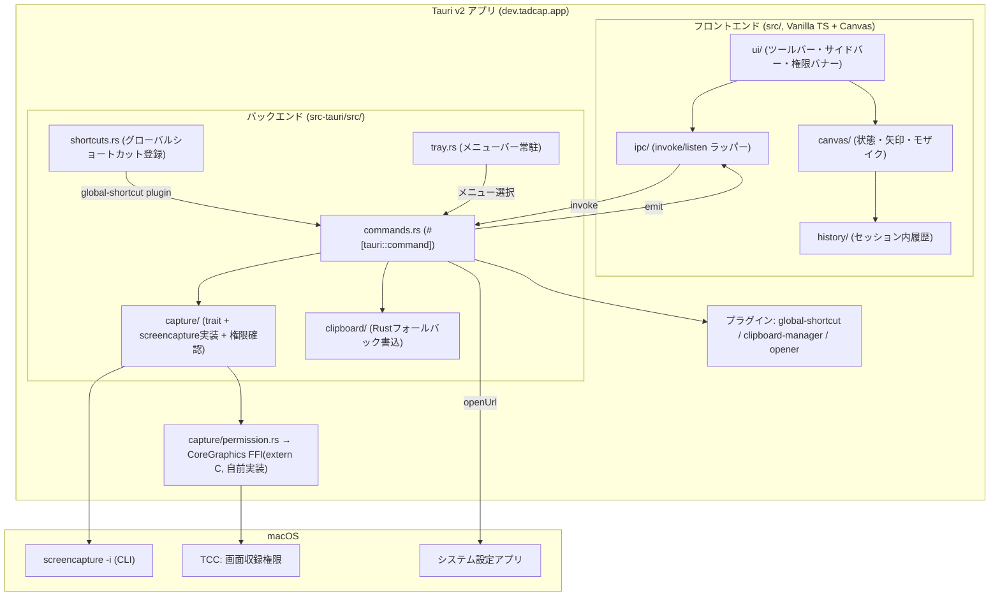

# アーキテクチャ: Tadcap MVP

> 生成元: output/prd/PRD_tadcap_mvp.md
> 生成日: 2026-09-23
> ステータス: 承認済み(ゲート2 通過 2026-09-23)
> **改訂: 2026-09-24**(追加ツール[矩形/円/テキスト]・色の一括指定・取り消し(Undo)の設計を §5・§6・§7 に差分追記。既存の決定事項は変更しない)

## 1. アーキテクチャ概要

### 1.1 設計方針

- macOS 専用の軽量デスクトップアプリ(Tauri v2 + Vanilla TS)。既存スキャフォールド(`src/`, `src-tauri/`)を拡張する形で実装し、新規レイヤーは追加しない
- PRD 決定事項(モザイク Must化、履歴 Must化、グローバルショートカット MVP化、メニューバー常駐追加)をそのまま構成に反映する
- キャプチャ実装は `src-tauri/src/capture/` に閉じ込め、trait 抽象化の背後で `screencapture -i` を呼ぶ。ScreenCaptureKit 等への将来差し替えを見込むが、MVP では有効化しない(PRD §7 決定ログ#2、過剰設計を避ける)
- フロントエンドは React 等のフレームワークを使わず Vanilla TS + Canvas(NFR-003)。状態管理はストアライブラリを導入せず、モジュール単位の薄い状態オブジェクトで足りる規模と判断する
- Rust ↔ フロントエンド間はコマンド(invoke)とイベント(emit/listen)の 2 経路を使い分ける。ユーザーのアプリ内操作起点はコマンド、OS 起点(グローバルショートカット・トレイメニュー)の通知はイベントとする(§7・§11参照)
- 画面収録権限・クリップボード・グローバルショートカット・メニュー常駐はいずれも macOS ネイティブ機能への依存が強い。クリップボード・グローバルショートカット・メニュー常駐は Tauri 公式プラグイン/コア機能を使うが、画面収録権限チェックのみ第三者プラグインを使わず CoreGraphics(`CGPreflightScreenCaptureAccess` / `CGRequestScreenCaptureAccess`)への直接 FFI で自前実装する(ゲート2決定 2026-09-23、§2・§15参照)
- メニューバー常駐時、Dock アイコンは**非表示**とする(人間決定事項、2026-09-23)。macOS の `ActivationPolicy::Accessory` 相当の仕組みで実現する(§11 参照。実現方式は公式ドキュメントで確認済み)

### 1.2 システム構成図



### 1.3 主要な設計判断

| # | 判断事項 | 決定内容 | 理由 |
| - | -------- | -------- | ---- |
| 1 | フロントエンド構成 | Vanilla TS をモジュール分割(ipc / canvas / history / ui)し、状態管理ライブラリは導入しない | NFR-003(軽量性)。画面1つ・ストア3種程度の規模ではライブラリ抜きでも保守できると判断 |
| 2 | キャプチャ抽象化 | `src-tauri/src/capture/` に `CaptureProvider` trait を定義し、MVP は `ScreenCaptureCli` 実装のみ登録する | PRD §7 決定ログ#2(B案)。将来 ScreenCaptureKit 実装を追加する差し替え口を用意しつつ、MVP の実装コストは増やさない |
| 3 | 画像の受け渡し方式 | 撮影直後の画像は「一時ファイルパス + asset protocol」、クリップボードへの最終画像は「Canvasから取得したバイト列」で受け渡す(§7参照) | データモデル(PRD §5)の `Capture.sourcePath` がファイルパス前提。撮影直後は原寸PNGをそのままCanvasに読み込むだけなのでIPC経由のバイト転送は不要と判断。【改訂 2026-09-24 実機不具合②〜⑤】asset URLはwebviewと別オリジンで、``で読むとCanvasが汚染(tainted)され`getImageData()`/`toBlob()`が失敗したため、撮影直後の画像も Rust コマンド `read_capture_image`(キャプチャ専用ディレクトリ直下のPNGのみ、`tauri::ipc::Response` で生バイナリ)→ `Blob` → ObjectURL で受け渡す方式に変更し、asset protocol・`protocol-asset` feature・CSPの`asset:`許可を撤去した |
| 4 | Rust↔TS 通信方式 | ユーザー操作起点はコマンド(invoke)、OS起点(グローバルショートカット・トレイメニュー)はイベント(emit/listen)を使う | グローバルショートカットやトレイメニューはフロントエンドの呼び出しなしにRust側で先に発火するため、結果を一方向通知するイベント構造が自然 |
| 5 | メニューバー常駐時の Dock アイコン | 非表示にする(`ActivationPolicy::Accessory` 相当、§11参照) | 人間による決定事項(2026-09-23、コーディネーター経由共有)。PRD側の表記更新はPJMが別途行うため本ドキュメントはPRDを編集しない |

## 2. 技術スタック

| カテゴリ | 技術 | バージョン | 選定理由 |
| -------- | ---- | ---------- | -------- |
| デスクトップフレームワーク | Tauri | v2(既存 `tauri = "2"`) | PRD §7 指定。既存スキャフォールドが採用済み |
| フロントエンド言語 | TypeScript | 既存 `~6.0.3` | NFR-003。React/Vue 等の重量級フレームワークを使わない方針(PRD §7) |
| ビルドツール | Vite | 既存 `^8.0.16` | Tauri公式テンプレート標準。既存スキャフォールド |
| 画像編集 | HTML5 Canvas(ブラウザ標準API) | — | PRD §7。矢印・モザイクをCanvasピクセルに焼き込む要件(FR-006・FR-008) |
| バックエンド言語 | Rust | 既存(edition 2021) | PRD §7 指定 |
| グローバルショートカット | `tauri-plugin-global-shortcut` + `@tauri-apps/plugin-global-shortcut` | 2.x(Tauri v2系プラグイン) | FR-04 実現の公式プラグイン。`register()`/`Shortcut`/`ShortcutState` を提供(公式ドキュメント確認済み) |
| クリップボード | `tauri-plugin-clipboard-manager` + `@tauri-apps/plugin-clipboard-manager` | 2.x | PRD §7 で名指し指定。`writeImage()` でPNG/バイト列をクリップボードへ書込 |
| クリップボード フォールバック | `arboard`(クレート) | 実装フェーズで確定するバージョン | FR-005 のフォールバック要件。プラグイン実装とは独立した書込経路として採用(ゲート2決定、§15参照) |
| システム設定を開く導線 | `tauri-plugin-opener` + `@tauri-apps/plugin-opener`(既存導入済み) | 2.x(既存) | 既にスキャフォールドに含まれる。`openUrl("x-apple.systempreferences:com.apple.preference.security?Privacy_ScreenCapture")` でプライバシー設定画面を開ける(NFR-002)。【仮定】この URL スキームは Apple 非公式(未文書化)だが、複数の情報源で macOS 14 Sonoma を含む広い範囲での動作が確認されている。将来の macOS バージョンで変更される可能性がある前提で採用する |
| メニューバー常駐 | Tauri コア機能(`tray-icon` feature) | Tauri本体組込(追加プラグイン不要) | 公式ドキュメントで `tauri = { features = ["tray-icon"] }` が案内されている。`TrayIconBuilder`/`Menu`/`MenuItem` を使用 |
| Dockアイコン非表示 | Tauri コア機能(`ActivationPolicy`) | Tauri本体組込(macOS専用API) | `app.set_activation_policy(tauri::ActivationPolicy::Accessory)` で実現(人間決定事項、§1.1・§11参照) |
| 画面収録権限チェック | CoreGraphics FFI(`extern "C"` 宣言のみの最小実装) | macOS標準フレームワーク(追加クレート不要) | コミュニティ製の第三者プラグインは使わず、`CGPreflightScreenCaptureAccess`/`CGRequestScreenCaptureAccess` を直接 FFI 宣言して呼ぶ(ゲート2決定 2026-09-23、§15参照)。CoreGraphicsはmacOS標準リンクのため依存追加が最小限で済む(NFR-003)。`objc2` 等の追加クレートはFFI宣言だけでは不要と見込むが、実装時にリンクで問題が出た場合のみ検討する |
| Rustエラー型 | 候補: `thiserror` | 軽量 | コマンド戻り値のエラーを型付けし、serdeでフロントへ構造化伝達するための定番クレート |
| テスト(Rust) | `cargo test`(標準) | 標準 | 追加依存なし |
| テスト(TSユニット) | 候補: Vitest | 未確定 | Viteネイティブ統合。`project-config.md` §3 未記入のため実装フェーズで確定(この項目はゲート2の決定対象外) |
| テスト(結合/E2E) | Playwright(Tauri IPCはモック) | 実装フェーズで確定するバージョン | ゲート2決定。真のTauri E2E(`tauri-driver`)はmacOS対応が限定的なため範囲を絞り、OSネイティブ導線は§10の手動確認チェックリストで補う |

## 3. レイヤー構成

### 3.1 レイヤー定義

| レイヤー | 責務 | 依存可能な対象 |
| -------- | ---- | -------------- |
| フロントエンド UI 層(`src/ui/`) | DOM構築・イベントバインディング・画面表示の合成 | canvas層, history層, ipc層 |
| フロントエンド Canvas 層(`src/canvas/`) | Canvas状態・矢印/モザイク描画ロジック | ipc層(asset URL変換のみ) |
| フロントエンド 履歴層(`src/history/`) | セッション内 HistoryItem のメモリ管理 | canvas層(編集後画像の取得) |
| フロントエンド IPC 層(`src/ipc/`) | Rustコマンド呼び出し・イベント購読の薄いラッパー | Tauri API(`@tauri-apps/api`, 各プラグイン)のみ |
| Rust コマンド層(`src-tauri/src/commands.rs`) | `#[tauri::command]` 関数の集約、invoke_handlerへの登録 | capture層, clipboard層, tray層, shortcuts層 |
| Rust capture 層(`src-tauri/src/capture/`) | `screencapture -i` 起動、一時ファイル管理、権限事前確認 | 標準ライブラリ、CoreGraphics FFI(`extern "C"`、§15参照) |
| Rust clipboard 層(`src-tauri/src/clipboard/`) | クリップボード書込のRustフォールバック実装 | `arboard` クレート(ゲート2決定、§15参照) |
| Rust tray/shortcuts 層(`tray.rs`/`shortcuts.rs`) | メニューバー常駐・グローバルショートカット登録・アプリライフサイクル制御 | tauriコア, 各プラグイン, commands層 |

### 3.2 依存方向ルール

- フロントエンド → Rust: `invoke` 経由の一方向のみ許可(PRD §7)。Rust → フロントエンド固有ロジックへの依存は禁止
- `src/canvas/` → `src/ui/`: 禁止(Canvasはツール状態のみを持ち、DOM構造を知らない)
- `src/history/` → `src/ui/`: 禁止(履歴層はデータ保持のみ)
- `src/ipc/` → `src/ui/`, `src/canvas/`, `src/history/`: 禁止(IPC層はTauri API以外に依存しない)
- `src-tauri/src/capture/` → フロントエンド固有ロジック: 禁止。システムコマンド実行はフロントエンドから直接行わない(PRD §7)
- `src-tauri/src/commands.rs` 以外の場所から新規に `#[tauri::command]` を追加しない(呼び出し口を一元化する)
- 機能モジュール間の直接依存を禁止し、共有が必要な場合は呼び出し元(`main.ts` / `commands.rs`)を経由する
- 循環依存: 禁止

### 3.3 検証方法

- `project-config.md` §4.4 が未記入のため、依存方向チェックツール(`depcruise` 等)は導入しない。MVP規模ではコードレビュー(`/code-review`)での目視確認で足りると判断する
- Rust側はモジュール可視性(`pub(crate)` 等)で「capture層からフロントエンド固有ロジックへ依存できない」ことを構造的に強制する
- 依存方向の逸脱を発見した場合は `project-config.md` §11(既知の落とし穴)へ記録する

## 4. ディレクトリ構成

```text
tadcap/
├── src/                          # フロントエンド(Vanilla TS + Canvas)
│   ├── main.ts                   # エントリーポイント。DOM初期化・IPCイベント購読・各モジュール起動
│   ├── ipc/                      # Rustコマンド呼び出し・イベント購読の薄いラッパー
│   │   ├── capture.ts            # capture_screen 等の invoke 呼び出し・completed イベント購読
│   │   ├── clipboard.ts          # writeImage() 試行 → 失敗時Rustフォールバックへの切替
│   │   └── permissions.ts        # 画面収録権限の確認・システム設定を開くコマンド呼び出し
│   ├── canvas/                   # Canvas状態・描画ロジック
│   │   ├── canvasState.ts        # 現在の画像・選択中ツール・描画中フラグ等の状態
│   │   ├── render.ts             # 画像描画・getImageData() による RGBA8 抽出(T12 で改訂)
│   │   └── tools/
│   │       ├── arrowTool.ts      # 矢印描画(ドラッグ→確定、既定色 #FF5C8A)
│   │       └── mosaicTool.ts     # モザイク(矩形選択→ピクセル化焼き込み)
│   ├── history/                  # セッション内履歴(非永続)
│   │   └── historyStore.ts       # HistoryItem[] の追加・選択・破棄(アプリ終了で消える)
│   ├── ui/                       # DOM構築・イベントバインディング
│   │   ├── toolbar.ts            # 矢印/モザイクのツール切替UI(FR-006・FR-008共通)
│   │   ├── sidebar.ts            # 履歴一覧のレンダリング・項目クリック処理(FR-010)
│   │   ├── permissionBanner.ts   # 画面収録権限未許可時の案内UI(NFR-002)
│   │   └── captureButton.ts      # キャプチャ開始ボタン・Cmd+Cショートカットのバインド
│   ├── styles.css                # 既存。スタイリング(§9参照)
│   └── assets/                   # 既存(vite/tauri/typescriptロゴ。実装時に不要分を整理)
├── src-tauri/                    # Rustバックエンド
│   ├── src/
│   │   ├── main.rs               # 既存。バイナリエントリーポイント(変更なし)
│   │   ├── lib.rs                # Tauri Builder組み立て・プラグイン登録・setup(§11)
│   │   ├── commands.rs           # 新規。#[tauri::command] 関数を集約(§7 IPC一覧)
│   │   ├── error.rs              # 新規。コマンド共通エラー型
│   │   ├── capture/              # 新規。キャプチャ機能を閉じ込める(PRD §7 必須要件)
│   │   │   ├── mod.rs            # CaptureProvider trait定義・公開関数
│   │   │   ├── screencapture.rs  # `screencapture -i` 実装(MVPで有効化する唯一の実装)
│   │   │   ├── permission.rs     # 画面収録権限の事前確認。CoreGraphicsへの extern "C" FFI宣言(第三者プラグイン不使用、§15参照)
│   │   │   └── tempfile.rs       # 一時ディレクトリ配下への一意なファイル名生成
│   │   ├── clipboard/            # 新規。クリップボード書込のRustフォールバック
│   │   │   └── mod.rs
│   │   ├── tray.rs               # 新規。メニューバー常駐(アイコン・メニュー・イベント)
│   │   └── shortcuts.rs          # 新規。グローバルショートカット登録
│   ├── capabilities/
│   │   └── default.json          # 既存。使用プラグインのpermissionsを追記(§7参照)
│   ├── icons/                    # 既存。トレイアイコンにも流用
│   ├── Cargo.toml                # 既存。新規プラグイン依存(global-shortcut/clipboard-manager)・arboard を追加(§2参照。画面収録権限チェックは追加クレート不要のFFIのみ)
│   └── tauri.conf.json           # 既存。trayIcon設定・assetProtocolスコープ等を追記
├── docs/docs/                     # 既存(スタブ)。実装フェーズで /implementing-features が更新
├── output/design/ARCH_tadcap_mvp.md  # 本ドキュメント
└── project-config.md              # 既存。§2/§3は実装フェーズで確定(本ドキュメントは変更しない)
```

## 5. モジュール設計

### 5.1 機能モジュール一覧

| モジュール | 責務 | 主要コンポーネント | 依存ストア |
| ---------- | ---- | ------------------ | ---------- |
| `src/ipc/capture.ts` | キャプチャ開始コマンド呼び出し・キャプチャ完了イベント購読 | `startCapture()`, `onCaptureCompleted()` | canvasState(結果反映), historyStore(結果追加) |
| `src/ipc/clipboard.ts` | クリップボード書込(プラグイン優先→Rustフォールバック) | `copyToClipboard({ rgba, width, height })`(T12 で改訂) | — |
| `src/ipc/permissions.ts` | 画面収録権限の確認・システム設定を開く | `checkScreenRecordingPermission()`, `openScreenRecordingSettings()` | permissionState |
| `src/canvas/canvasState.ts` | Canvas表示中画像・選択中ツール・描画中フラグの状態 | `canvasState`, `toggleActiveTool()` | canvasState |
| `src/canvas/coords.ts`(【改訂 2026-09-24】) | 表示座標→Canvasピクセル座標変換、および矩形の正規化・クリップ等の共有ジオメトリ純粋関数(`Rect`/`normalizeRect()`/`clipRectToCanvas()`を`mosaicTool.ts`から移設・共通化) | `clientToCanvasPoint()`, `normalizeRect()`, `clipRectToCanvas()` | — |
| `src/canvas/toolSettings.ts`(【新設 2026-09-24】) | 矢印・矩形・円・テキスト共通の現在色、テキストのフォントサイズ段階の状態管理(モザイクは参照しない、FR-013) | `getToolSettings()`, `setColor()`, `setFontSize()`, `subscribeToolSettings()` | toolSettings |
| `src/canvas/undoStack.ts`(【新設 2026-09-24】) | 焼き込み操作ごとの差分(変更矩形+焼き込み前ピクセル)を保持するUndoスタック(FR-014) | `pushUndoStep()`, `popUndo()`, `canUndo()`, `clearUndoStack()` | undoStack |
| `src/canvas/tools/arrowTool.ts`(【改訂 2026-09-24】) | 矢印(テーパー形状+矢じり)の描画 | `computeTaperArrowPolygon()`, `bindArrowTool()` | canvasState, toolSettings, undoStack |
| `src/canvas/tools/rectangleTool.ts`(【新設 2026-09-24】) | 矩形枠の描画(ドラッグ→確定→焼き込み) | `bindRectangleTool()` | canvasState, toolSettings, undoStack |
| `src/canvas/tools/ellipseTool.ts`(【新設 2026-09-24】) | 円(楕円)枠の描画 | `bindEllipseTool()` | canvasState, toolSettings, undoStack |
| `src/canvas/tools/textTool.ts`(【新設 2026-09-24】) | クリック位置へのテキスト入力(DOMオーバーレイ)→確定でCanvas焼き込み | `computeFontSizePx()`, `bindTextTool()` | canvasState, toolSettings, undoStack |
| `src/canvas/tools/mosaicTool.ts`(【改訂 2026-09-24】) | モザイク(矩形選択→ピクセル化焼き込み)。色は参照しない | `bindMosaicTool()` | canvasState, undoStack |
| `src/canvas/shapeEdit.ts`(【新設 2026-09-24 T31】) | 編集中の図形(矢印・矩形・円)の純粋関数: 作成・ハンドル列挙・当たり判定・リサイズ・移動・取り消し用外接矩形・pointerdownの分岐 | `decidePointerDown()`, `hitTestShape()`, `resizeShape()`, `moveShape()` | — |
| `src/canvas/pendingShape.ts`(【新設 2026-09-24 T31】) | 直前に描いた図形1つの保持(図形パラメータ+描く前のベース画像)と確定・破棄 | `beginPendingShape()`, `commitPendingShape()`, `discardPendingShape()` | undoStack |
| `src/canvas/tools/shapeTools.ts`(【新設 2026-09-24 T31】) | 矢印・矩形・円の共通ポインタ結線(旧`bindArrowTool()`/`bindRectangleTool()`/`bindEllipseTool()`を統合)、ハンドル用オーバーレイの描画 | `bindShapeTools()` | canvasState, toolSettings, pendingShape |
| `src/ui/pendingShapeKeys.ts`(【新設 2026-09-24 T31】) | 編集中の図形のEnter(確定)/Esc(破棄) | `bindPendingShapeKeys()` | pendingShape |
| `src/history/` | セッション内履歴の保持 | `historyStore` | historyStore |
| `src/ui/toolbar.ts`(【改訂 2026-09-24】) | 矢印/矩形/円/テキスト/モザイクのツール切替(3ツール追加) | `initToolbar()` | canvasState |
| `src/ui/colorPicker.ts`(【新設 2026-09-24】) | プリセット色見本＋ネイティブカラーピッカーのUI、`toolSettings`への反映 | `initColorPicker()` | toolSettings |
| `src/ui/fontSizePicker.ts`(【新設 2026-09-24】) | フォントサイズ(小/中/大)切替UI | `initFontSizePicker()` | toolSettings |
| `src/ui/undoButton.ts`(【新設 2026-09-24】) | 取り消し(Undo)ボタン + `Cmd+Z` のキー結線 | `initUndoButton()` | canvasState(isDrawing判定), undoStack |
| `src/ui/shortcutGuards.ts`(【新設 2026-09-24】) | 編集可能要素(テキスト入力欄等)にフォーカスがある間はショートカットを奪わないための共有判定(`clipboardButton.ts`から抽出) | `isEditableTarget()` | — |
| `src/ui/sidebar.ts` | 履歴一覧表示・再読込 | `renderSidebar()` | historyStore, canvasState |
| `src/ui/permissionBanner.ts` | 権限未許可時の案内UI | `renderPermissionBanner()` | permissionState |
| `src/ui/captureButton.ts` | キャプチャ開始操作(ボタン・Cmd+C) | `bindCaptureButton()` | — |
| `src/ui/clipboardButton.ts`(【改訂 2026-09-24】) | クリップボードコピー操作(ボタン・Cmd+C)。`isEditableTarget()`は`shortcutGuards.ts`から再import(重複排除) | `initClipboardButton()` | canvasState |
| `src-tauri/src/capture/` | `screencapture -i` 起動・一時ファイル管理・権限事前確認 | `CaptureProvider` trait, `ScreenCaptureCli` | — |
| `src-tauri/src/clipboard/` | クリップボード書込のRustフォールバック | `write_image_fallback()` | — |
| `src-tauri/src/tray.rs` | メニューバー常駐・メニューイベント処理 | `build_tray()` | — |
| `src-tauri/src/shortcuts.rs` | グローバルショートカット登録 | `register_capture_shortcut()` | — |
| `src-tauri/src/commands.rs` | IPCコマンドの集約・エラー変換 | 各 `#[tauri::command]` 関数(§7) | — |

### 5.2 モジュール間連携

- キャプチャ開始経路は3つ(アプリ内ボタン / グローバルショートカット / トレイメニュー)あるが、いずれもRust側の同一関数(`capture::run()`)を呼び出し、結果はTauriイベント `capture://completed` でフロントエンドへ一方向通知する(§7参照)
- フロントエンドは `src/ipc/capture.ts` の `onCaptureCompleted()` で購読し、`canvasState` に反映後 `historyStore` へ追加する。ボタン起点かショートカット起点かをフロントエンドは区別しない
- グローバルショートカット・トレイメニュー起点のキャプチャ完了後は、Rust側でメインウィンドウの `show()` + `set_focus()` を呼び、エディタを前面表示する(FR-004, FR-009)
- クリップボードコピーは `src/canvas/render.ts` で生成したPNGバイト列を `src/ipc/clipboard.ts` に渡し、まず `@tauri-apps/plugin-clipboard-manager` の `writeImage()` を試行、例外時のみ `commands.rs` のRustフォールバックコマンドを呼ぶ
- モザイク・矢印はいずれも `canvas/tools/` 内で完結し、Canvasピクセルに直接焼き込む(編集履歴は保持しない。PRD §7)

**【新設 2026-09-24】追加ツール(矩形/円/テキスト)・色・取り消しの連携**:

- 矩形・円ツールは、既存の矢印・モザイクと同じ「`pointerdown`でCanvas全体のImageDataをスナップショット取得 → `pointermove`でスナップショットへ復元しつつプレビューを描く → `pointerup`で最終図形を確定焼き込み」というドラッグパターンをそのまま踏襲する(既存2ツールの実装パターンの拡張。新たな共通化レイヤーは設けず、各ツールファイルが自己完結する既存踏襲を優先する)
- テキストツールのみ例外的にドラッグではなくクリック起点。Canvas上のプレビューではなくDOMオーバーレイ(絶対配置の`<input>`要素)をクリック位置に表示し、`coords.ts`の座標変換の逆算(Canvasピクセル→CSS表示座標)でオーバーレイの表示位置・フォントサイズを合わせる。確定(Enter/blur)時に`ctx.fillText()`で焼き込み、オーバーレイを破棄する(IME変換中はEnterを確定として扱わない、`event.isComposing`で判定)
- テーパー矢印の形状計算(【新設 2026-09-24】`arrowTool.ts`内、`computeTaperArrowPolygon()`): 始点→終点の単位ベクトルと法線ベクトルを求め、(a)始点の左右2点(始点太さ/2だけ法線方向にオフセット)、(b)矢じり基部(終点から`headLength`手前)の左右2点(終点太さ/2だけオフセット)、(c)既存`computeArrowGeometry()`と同じ矢じり3点(tip/left/right)を1つの多角形の頂点として並べ、`ctx.fill()`で単色塗りつぶしする。終点側の太さ・矢じり寸法は既存`arrowLineWidth()`/`arrowHeadLength()`をそのまま使用し(太さ算出基準は変更しない、人間決定#1)、始点側の太さは終点側に対する比率定数(実装時確定)とし常に終点以下になるようクランプする。ストローク(`ctx.lineWidth`)ではなく塗りつぶしポリゴンにする理由は、Canvas 2D APIの`lineWidth`が線全体で単一値しか取れず、区間ごとに太さを変えるテーパー表現を表現できないため
- 矩形・円の枠線の太さは、矢印(`arrowLineWidth()`)と同じ「Canvas対角線を基準にした決定論的算出+クランプ」の考え方を、各ツールファイル内にローカルな定数として個別に持つ(`mosaicBlockSize()`が独立して定義されている既存慣習を踏襲。太さの比率は視覚調整のためツールごとに異なってよく、共通モジュールへ強制的に集約しない)
- `Rect`/`normalizeRect()`/`clipRectToCanvas()`のみは例外的に`coords.ts`へ集約する(【改訂 2026-09-24】従来`mosaicTool.ts`が保持)。これらは純粋な矩形幾何計算で、矩形・円・モザイクの3ツールが完全に同一のロジックを必要とするため、視覚調整の余地がある太さ比率とは異なり重複させる理由がない
- 色(`toolSettings.color`)は矢印・矩形・円・テキストの4ツールが描画直前に読み取る。モザイクは参照しない(FR-013)。既存の`--arrow-color`/`--accent-color` CSSカスタムプロパティは初期値の出所・UIアクセント色として残すが、ユーザーが変更できる「現在の注釈色」はJS側の`toolSettings`が単一の真実源になる(UIのアクセント色自体は注釈色と独立して固定のピンクのまま。過剰な連動はしない)
- Undo: 各ツールの確定処理(`finishDrag`/テキスト確定)は、焼き込み前に「影響範囲の矩形」を算出する。ドラッグ系ツール(矢印/矩形/円/モザイク)は、ドラッグ開始時に取得済みの全体スナップショット(`snapshot`変数、既存実装)から該当矩形分だけを切り出し、追加の`getImageData()`呼び出しなしで`undoStack.pushUndoStep(rect, before)`を呼んでから最終図形を焼き込む。テキストツールは`ctx.measureText()`で確定直前に矩形を算出し、その時点で`getImageData(rect)`を取得してから焼き込む
- `Cmd+Z`(`src/ui/undoButton.ts`)は`undoStack.popUndo()`で取り出した`{rect, before}`を`ctx.putImageData(before, rect.x, rect.y)`で書き戻すだけで、`canvasState`の`image`(assetUrl/capture)自体は変更しない(既存のクリップボードコピー成功時・履歴切替時のフックはそのまま働く。取り消し自体は履歴を更新しない)
- 新規Capture読込時(`main.ts::handleCaptureCompleted`)・セッション内履歴の項目切替時(`reloadHistoryItemIntoCanvas`)は`undoStack.clearUndoStack()`を呼ぶ(取り消し対象は「現在表示中の画像」に限定するため、PRD §5)
- `Cmd+Z`と`Cmd+C`はいずれも`window`への`keydown`リスナー(既存`clipboardButton.ts`と同じパターン)で、共有の`shortcutGuards.ts::isEditableTarget()`によりテキスト入力欄にフォーカスがある間はどちらも発火しない(ネイティブの入力欄編集取り消し・コピーに委ねる)。ドラッグ中(`canvasState.isDrawing === true`)は`Cmd+Z`を無視する(ツールバーの他ボタンと同じ無効化条件)

**【改訂 2026-09-24 T31】編集中の図形(pending shape)**(§5.2の「pointerupで確定焼き込み」を矢印・矩形・円について置き換える):

- 矢印・矩形・円は`pointerup`で焼き込まず、直前に描いた1つだけを`pendingShape.ts`に「図形パラメータ(種類・点または外接矩形・色)+描く前のCanvas全体(base)」として保持する。Canvasには常に base+図形 を描き(`shapeTools.ts`)、ハンドル(矩形・円は四隅、矢印は始点・終点)はCanvasに重ねた`pointer-events: none`の別canvas(`.shape-overlay`)にだけ描く。コピー・履歴保存はCanvasのピクセルを読むため、ハンドルは写らない
- 操作: ハンドルのドラッグでリサイズ(矩形・円は対角固定、Shiftで正方形/正円。矢印は端点を移動)、内側(矢印は胴体)のドラッグで移動(Canvas外へはみ出さないよう移動量をクランプ)。判定・幾何は`shapeEdit.ts`の純粋関数
- 確定(= base から確定時の外接矩形を切り出して`pushUndoStep()`、Canvasは既に base+図形 なので追加描画なし): 次の図形の描き始め/図形外のクリック/Canvas以外のpointerdown/ツール切替(`shapeTools.ts`)、モザイク開始(`mosaicTool.ts`)、Enter(`ui/pendingShapeKeys.ts`)、クリップボードコピー・新規キャプチャ・履歴切替の直前(`main.ts`。差し替え前に確定し履歴保存に含める)。取り消しは確定済みの操作単位
- 破棄(`discardPendingShape()`、Undoへ積まずbaseを書き戻す): Esc。T29の`Cmd+Z`は、編集中の図形があれば`popUndo()`の代わりにこれを呼ぶ
- 確定トリガーを経ずに画像が差し替わった場合は`dropPendingShapeIfImageChanged()`で古いbaseを書き戻さずに捨てる(MUST-1と同じ考え方)。ドラッグ中の差し替えは従来どおり`imageAtDragStart`で検知して中断する

## 6. 状態管理設計

### 6.1 ストア一覧

| ストア | 責務 | 永続化 | ストレージキー |
| ------ | ---- | ------ | -------------- |
| `canvasState`(`src/canvas/canvasState.ts`) | 現在表示中の画像・選択中ツール(矢印/モザイク)・描画中フラグ | なし | — |
| `historyStore`(`src/history/historyStore.ts`) | セッション内 `HistoryItem[]`(編集後画像を保持) | なし(アプリ終了で破棄。PRD §5・FR-010) | — |
| `permissionState`(`src/ipc/permissions.ts` 内) | 画面収録権限の許可状態(未確認/許可/未許可) | なし(起動・キャプチャ試行ごとに再確認) | — |
| `toolSettings`(`src/canvas/toolSettings.ts`、【新設 2026-09-24】) | 矢印・矩形・円・テキスト共通の現在色、テキストのフォントサイズ段階(FR-013) | なし(アプリ起動中のみ。初期値は`#FF5C8A`とfontSize既定値) | — |
| `undoStack`(`src/canvas/undoStack.ts`、【新設 2026-09-24】) | 焼き込み操作の差分(変更矩形+焼き込み前ピクセル)のスタック(FR-014) | なし(新規Capture読込・履歴項目切替でクリア) | — |

### 6.2 永続化方針

- MVPは全ストアがメモリ上のみで、ディスク/DBへの永続化を一切行わない(PRD §5、決定ログ#1)
- `localStorage`/`IndexedDB` 等ブラウザストレージも使用しない(将来ファイル保存機能を追加する際に再設計する)
- 【新設 2026-09-24】`toolSettings`・`undoStack` も同様にメモリ上のみで、ディスク/DBへの永続化・ブラウザストレージのいずれも使用しない

### 6.3 ストア間の参照ルール

- `historyStore` は `canvasState` の現在画像(編集後)を読み取って項目を追加できるが、`canvasState` は `historyStore` を直接参照しない(サイドバー選択時は `ui/sidebar.ts` が仲介して `canvasState` を更新する)
- `permissionState` は他ストアから独立しており、`ui/permissionBanner.ts` と `ipc/capture.ts`(キャプチャ前チェック)からのみ参照される
- ストア間の直接参照は上記のみとし、新規モジュールから既存ストアを直接書き換える場合は `ui/` 層を経由する
- 【新設 2026-09-24】`toolSettings` は `canvas/tools/{arrowTool,rectangleTool,ellipseTool,textTool}.ts` と `ui/colorPicker.ts`・`ui/fontSizePicker.ts` から参照される。`mosaicTool.ts` は参照しない(FR-013)
- 【新設 2026-09-24】`undoStack` は矢印・矩形・円・テキスト・モザイクの5ツール全ての確定処理と `ui/undoButton.ts` から参照される(モザイクの焼き込みも取り消し対象、FR-014)。`ui/toolbar.ts`・`history/` からは参照しない
- 【新設 2026-09-24】新規Capture読込(`main.ts::handleCaptureCompleted`)・履歴項目再読込(`reloadHistoryItemIntoCanvas`)は `undoStack.clearUndoStack()` を呼ぶ

### 6.4 Undo履歴のメモリ方針(【新設 2026-09-24】)

PRD §11のリスク(5K Retina相当の画像はCanvas全体のImageDataで概ね60MB級になる)を踏まえ、取り消しスタックの保持方式を以下の2案から検討した。

| # | 方式 | 概要 | メモリ特性 |
| - | ---- | ---- | ---------- |
| A案 | 全体スナップショット + 件数上限 | 各操作の直前にCanvas全体の`ImageData`を丸ごと保持し、件数(例: 10件)を超えたら古いものから破棄する(`historyStore.ts`の`HISTORY_LIMIT`と同じ考え方) | 実装が単純。ただし1件あたり最大で画像フルサイズ分(5K相当で約60MB)になるため、上限10件でも最大約600MBに達しうる |
| B案(推奨) | 差分(変更矩形)方式 + 件数上限の併用 | 各操作が実際に変更した矩形領域(`rect`)のみの`ImageData`を保持する。矢印・矩形・円・テキストは注釈自体が画像全体よりずっと小さいことがほとんどのため、通常はKB〜数MB程度で済む。ただし全画面へのモザイク等、矩形が画像全体に及ぶ操作も理論上あるため、件数上限(例: 30件)も安全弁として併用する | 典型的な使用(部分的な矢印・枠・テキスト)ではA案より大幅に少ないメモリで済む。最悪ケース(常に全体矩形の操作を上限件数分繰り返す)ではA案と同程度まで悪化しうるが、通常操作でそこまで悪化する可能性は低い |

**B案を推奨する**。理由: (1) 各ツールは既にドラッグ開始時点で取得済みの全体スナップショット(`snapshot`変数、`arrowTool.ts`/`mosaicTool.ts`等に既存)から変更矩形分を切り出すだけで実装でき、追加の`getImageData()`呼び出しが不要(実装コストが低い、§5.2参照)。(2) スクリーンショット注釈の実利用では、1回の焼き込みが画像全体を覆うことは稀(モザイクで全画面を覆う等の極端なケースを除く)であり、典型的なメモリ使用量をA案より大幅に削減できる。(3) 件数上限(30件)を安全弁として併用することで、最悪ケースでも無制限にメモリが膨らむことは防げる。

具体的な上限値・「件数上限」と「合計バイト数上限」のどちらを安全弁の基準にするかは実装フェーズで計測のうえ調整してよい(過剰設計を避け、まずは件数上限30件のシンプルな実装から始める)。

## 7. データフロー

### 7.1 データの流れ

1. ユーザー操作(アプリ内ボタン/グローバルショートカット/トレイメニュー)→ Rust `commands::capture_screen`
2. Rust `capture::run()` が画面収録権限を事前確認 → 未許可なら `PermissionDenied` を返し `screencapture -i` を起動しない(NFR-002)
3. 許可済みなら `screencapture -i <一時ファイルパス>` を起動。Escキャンセル時はファイル未生成を検知し `Cancelled`(エラー扱いしない)を返す
4. 成功時は `{ id, sourcePath, createdAt }` をTauriイベント `capture://completed` でフロントエンドへ送出
5. フロントエンド `ipc/capture.ts` が `convertFileSrc(sourcePath)` で asset URL に変換し、`canvasState` へ反映→Canvasに描画(【改訂 2026-09-24 実機不具合②〜⑤】asset URLはwebviewと別オリジンで、``で読むとCanvasが汚染(tainted)され`getImageData()`/`toBlob()`が失敗したため、撮影直後の画像も Rust コマンド `read_capture_image`(キャプチャ専用ディレクトリ直下のPNGのみ、`tauri::ipc::Response` で生バイナリ)→ `Blob` → ObjectURL で受け渡す方式に変更し、asset protocol・`protocol-asset` feature・CSPの`asset:`許可を撤去した。現在は `readCaptureImage(sourcePath)` → ObjectURL → Canvas)
6. ユーザーが矢印/モザイクツールで編集→ `canvas/tools/*` がCanvasピクセルに直接焼き込む(中間状態は保持しない)
7. 「クリップボードにコピー」操作→ `canvas/render.ts` が `getImageData()` で最終画像の RGBA8 を取得→ `ipc/clipboard.ts` が `Image.new(rgba,w,h)` + `writeImage()` を試行、失敗時は Rust フォールバック(`arboard::set_image`)へ同じ RGBA8 を生ボディ(`InvokeBody::Raw`、幅・高さはヘッダー)で渡す。**改訂理由(2026-09-23、T12)**: arboard は PNG デコードせず RGBA8 のみ受け付け、PNG のまま渡すと追加クレート(image/png)か tauri の `image-png` feature が必要になるため。JSON 配列化による IPC 肥大も回避
8. コピー成功時、`historyStore` に編集後画像を `HistoryItem` として追加(サムネイルも同時生成)
9. サイドバーの履歴項目クリック→ `historyStore` から編集後画像を取得→ `canvasState` に再読込(元画像には戻さない。PRD §5決定ログ#3)
10. 【新設 2026-09-24】矩形/円ツール: `pointerdown`でCanvas全体のImageDataをスナップショット取得 → `pointermove`でスナップショットへ復元しつつ選択矩形(`coords.ts`の`normalizeRect()`/`clipRectToCanvas()`、【改訂】`mosaicTool.ts`から移設)のプレビュー枠線を描画 → `pointerup`でスナップショットから変更矩形分を切り出し`undoStack`へpush → 矩形/楕円の枠線(色は`toolSettings.color`)をCanvasへ焼き込む(矢印・モザイクと同じスナップショット→確定パターンを踏襲、§5.2参照)
11. 【新設 2026-09-24】矢印(改訂): 終点側の太さ・矢じり寸法は既存の`arrowLineWidth()`/`arrowHeadLength()`をそのまま使用し、始点側の太さを終点側に対する比率で算出、始点〜矢じり基部を台形、基部〜先端を三角形とした単一多角形(`computeTaperArrowPolygon()`)を`ctx.fill()`で焼き込む(詳細な算出方針は§5.2参照)
12. 【新設 2026-09-24】テキストツール: Canvasクリック(ドラッグ系ツールと異なりポインタ移動量が閾値未満の単発クリックとして処理) → クリック位置(CSS表示座標)にDOMオーバーレイ(絶対配置`<input>`)を表示 → IME変換に対応した通常のテキスト入力 → Enter(変換中を除く)またはblurで確定 → `ctx.measureText()`で焼き込み矩形を算出し、その領域の`getImageData()`を`undoStack`へpushしてから`ctx.fillText()`で焼き込み、オーバーレイを破棄(Escでキャンセル時は焼き込み・push共になし)
13. 【新設 2026-09-24】色/フォントサイズ変更: `ui/colorPicker.ts`・`ui/fontSizePicker.ts`の操作は`toolSettings`を更新するのみで、Canvasへの即時反映はない(次に矢印/矩形/円/テキストのいずれかを描画したときにその時点の`toolSettings`の値が使われる。焼き込み済みの既存注釈は不変、PRD FR-013決定)
14. 【新設 2026-09-24】取り消し(`Cmd+Z`/取り消しボタン): `undoStack.popUndo()` → 取り出した`{rect, before}`を`ctx.putImageData(before, rect.x, rect.y)`で書き戻す → `canvasState`の`image`(assetUrl/capture)自体は変更しないため、クリップボードコピー・履歴反映は従来どおり「コピー成功時」「履歴項目切替直前」にのみ行われる(取り消し自体は履歴を更新しない)
15. 【新設 2026-09-24】Capture新規読込・履歴項目の再読込(手順5・9)の直後に`undoStack.clearUndoStack()`を呼び、取り消し対象を常に「現在表示中の画像」に限定する
16. 【改訂 2026-09-24 T31】矢印・矩形・円(手順10・11の置き換え): `pointerup`で図形を`pendingShape`に保持(編集中、ハンドルはオーバーレイ)→ リサイズ・移動のたびに base+図形 を再描画 → 確定トリガー(§5.2末尾)で`pushUndoStep()`して編集状態を解除。手順7(コピー)・手順5/9(差し替え)の前には必ず確定する。Escは破棄してbaseへ戻す

### 7.2 バリデーション戦略

- Rust側: `capture::tempfile` が生成するパスは必ずOS一時ディレクトリ配下であることを保証してから `screencapture` に渡す(固定パス上書きの防止。PRD FR-001)
- Rust側: 画面収録権限が未許可の場合は `screencapture -i` を起動せず早期リターンする(NFR-002のガード)
- フロントエンド側: ユーザーからの自由入力フィールドはMVPに存在しない(ファイル名入力・保存パス指定等は無し)ため、フォームバリデーションの対象は無し
- asset protocolのスコープは一時キャプチャディレクトリのみに限定し、任意ファイル読み取りを防ぐ(§12参照)(【改訂 2026-09-24】asset protocolは撤去。`read_capture_image` がパスを正規化し一時キャプチャディレクトリ直下のPNGのみ読む)
- 【新設 2026-09-24】テキスト入力: `contenteditable`/`<input>`への`innerHTML`代入は行わず、焼き込みは`ctx.fillText()`(文字列として描画)のみで行うため、注入されたHTML/スクリプトがDOMに解釈される経路はない(XSS対策、§12と整合)
- 【新設 2026-09-24】取り消しスタックの`rect`はいずれのツールでも算出後にCanvas範囲へクランプ済みの値のみを積む(`coords.ts`のクランプ処理を再利用し、範囲外座標での`getImageData()`/`putImageData()`呼び出しを防ぐ)

## 8. ルーティング設計

| パス | ページ | 機能 |
| ---- | ------ | ---- |
| `/`(`index.html` 単一) | メインエディタ画面 | キャプチャ起点・Canvas表示/編集(矢印・モザイク)・クリップボードコピー・履歴サイドバー(FR-001〜FR-010 全機能を単一画面に集約) |

補足: クライアントサイドルーターは導入しない(PRD §6「ルーティングなし」)。メニューバー(トレイ)はウィンドウではなくメニュー項目であり、ルーティング対象に含めない。

## 9. UI設計方針

### 9.1 コンポーネント設計

- フレームワーク非使用のため、React的なContainer/Presentationalの厳密な分離ではなく、「DOMを構築するだけの関数(Presentational相当)」と「ストアを読み書きしてイベントを束ねる関数(Container相当)」を同一ファイル内でエクスポート分離する規約とする
- 例: `ui/sidebar.ts` は `renderSidebarView(items)`(Presentational: DOM生成のみ)と `initSidebar()`(Container: `historyStore` 購読・クリックイベント登録)を分けてエクスポートする
- 各 `ui/*.ts` はストアを直接importしてよいが、`canvas/`・`history/`・`ipc/` は `ui/` をimportしない(§3.2依存方向ルール)

### 9.2 スタイリング方針

- 既存 `src/styles.css` をベースにプレーンCSSで実装する(CSSフレームワーク非導入。NFR-003)
- 矢印の既定色 `#FF5C8A`(PRD FR-006)や余白・フォントサイズ等の値はCSSカスタムプロパティ(`:root { --arrow-color: #FF5C8A; ... }`)として定義し、TS側からも参照できるようにする
- コンポーネント単位のCSS分割(CSS Modules等)は導入せず、単一 `styles.css` に機能別セクションコメントで区切る(画面規模が小さいため)

### 9.3 ダークモード対応

- ライトテーマ固定(PRD §6、決定ログ#8)。OSのダークモード設定に追従する実装は行わない
- 将来対応する場合は `prefers-color-scheme` メディアクエリの追加で拡張可能な構成としておく(現時点では実装しない。§16参照)

## 10. テスト戦略

### 10.1 テスト構成

| 種別 | ツール | 対象 | 配置 |
| ---- | ------ | ---- | ---- |
| ユニット(Rust) | `cargo test`(標準) | `capture/` の一時ファイル命名の一意性・Escキャンセル分岐・権限未許可時の早期リターン・`clipboard/` フォールバック分岐 | 各 `src-tauri/src/**/*.rs` 内 `#[cfg(test)] mod tests` |
| ユニット(TS) | 候補: Vitest | 矢印の座標計算、モザイクのピクセル焼き込みロジック(Canvas依存を最小化した純粋関数として抽出)、`historyStore` の追加/選択ロジック | `src/**/*.test.ts`(コロケーション) |
| 結合(限定的E2E) | Playwright(`window.__TAURI__` をモック) | ツール切替→矢印/モザイク付与→クリップボードボタン押下までのUIフロー(Rust実行は伴わない) | `e2e/`(新設、Vite dev server相手) |
| 手動確認チェックリスト | 実機macOS | キャプチャ実行(F-01/F-02)、グローバルショートカット(FR-004)の衝突確認・押下→前面表示、トレイメニュー3項目(キャプチャ/エディタを開く/終了)・ウィンドウを閉じてもプロセス継続(FR-009)、画面収録権限未許可からの案内フロー(NFR-002)、NFR-001計測(10回試行中央値)、実クリップボード貼付 | `testreport/` に記録(PRD §8に準拠) |

### 10.2 テスト方針

- Tauriアプリ全体を自動操作する厳密なE2E(`tauri-driver` + WebDriver)は、macOSでのサポートが限定的でありMVPの規模に対して導入コストが見合わないと判断する(ゲート2決定)。フロントエンドのみVite dev server上で動かし、Tauriの `invoke`/`listen` をスタブに差し替えてUIフローを検証する「結合テスト」をPlaywrightで実装する
- **OSネイティブな導線(キャプチャの実起動、グローバルショートカット、トレイメニュー、画面収録権限ダイアログ)はPlaywrightの結合テストでは検証できないため自動化対象にせず、§10.1の「手動確認チェックリスト」で必ず実機確認する**(ゲート2決定、PRD §8の手動確認項目をそのまま踏襲)
- Rust側は `CaptureProvider` traitをモック実装に差し替えられるため、`screencapture` プロセスを実際に起動せずに `capture::run()` の分岐(成功/キャンセル/権限未許可)を単体テストできる
- カバレッジ目標は `project-config.md` §6が未記入のため設定しない(実装フェーズで `/implementing-features` が確定)

## 11. エントリーポイントとプロバイダー構成

**Rust側(`src-tauri/src/main.rs` → `lib.rs::run()`)**

1. `tauri::Builder::default()`
2. `.plugin(tauri_plugin_opener::init())`(既存)
3. `.plugin(tauri_plugin_clipboard_manager::init())`(新規)
4. `.plugin(tauri_plugin_global_shortcut::Builder::new().with_handler(...).build())`(新規、`#[cfg(desktop)]` ガード)
5. 画面収録権限チェック用のプラグイン登録は行わない(ゲート2決定。`capture/permission.rs` 内の `extern "C"` FFI 宣言で CoreGraphics を直接呼ぶ自前実装のため、`Builder` へのプラグイン追加は不要)
6. `.setup(|app| { ... })` 内で:
   - (a) `#[cfg(target_os = "macos")] app.set_activation_policy(tauri::ActivationPolicy::Accessory)` — Dockアイコン非表示(人間決定事項、§1.1参照)
   - (b) `tray::build_tray(app)?` — メニューバーアイコン・メニュー構築(「キャプチャ」「エディタを開く」「終了」の3項目、FR-009)
   - (c) `shortcuts::register_capture_shortcut(app)?` — グローバルショートカット登録(FR-004)
7. `.on_window_event(|window, event| if let CloseRequested { api, .. } = event { window.hide().ok(); api.prevent_close(); })` — メインウィンドウを閉じてもプロセス継続(FR-009)
8. `.invoke_handler(tauri::generate_handler![commands::capture_screen, commands::check_screen_recording_permission, commands::open_screen_recording_settings, commands::write_image_fallback])`
9. `.run(tauri::generate_context!())`

プラグイン登録は「基盤プラグイン(権限・クリップボード等)→ setup内でのトレイ/ショートカット構築」の順とし、setup内の処理はトレイ→ショートカットの順(トレイの「キャプチャ」メニューがショートカットと同じ内部関数 `capture::run()` を呼ぶため、先にコマンド一式が使える状態にしておく)。

**フロントエンド側(`src/main.ts`)**

1. `DOMContentLoaded` で `ui/toolbar.ts`, `ui/sidebar.ts`, `ui/permissionBanner.ts`, `ui/captureButton.ts` の `init*()` を呼び出しDOMを構築
2. `ipc/capture.ts` の `onCaptureCompleted()` を購読開始(グローバルショートカット・トレイ起点のキャプチャ結果を受信するため、起動直後から購読が必要)
3. `ipc/permissions.ts` で起動時に画面収録権限の状態を一度確認し、未許可なら `permissionBanner` を表示
4. `document` レベルで `Cmd+C` のキーバインドを登録(クリップボードコピー、FR-005)

React等のプロバイダーツリーは存在しないため、「プロバイダー構成」に相当するのは上記の初期化順序のみである。

## 12. セキュリティ設計

- **Capabilities最小化**: `src-tauri/capabilities/default.json` には使用するコマンド・プラグイン権限のみを列挙する(§2で選定したプラグインの `global-shortcut:allow-register`/`allow-unregister`/`allow-is-registered`、`clipboard-manager:allow-write-image` 等、必要最小限)。`core:default` 以外は用途ごとに明示的に許可する
- **asset protocolのスコープ限定**: `tauri.conf.json` の `app.security.assetProtocol.scope` は一時キャプチャディレクトリ(`capture::tempfile` が使うサブディレクトリ)のみに限定し、任意ファイルパスの読み取りを許可しない(【改訂 2026-09-24 実機不具合②〜⑤】asset protocolは撤去。代わりに `read_capture_image` が要求パスと一時キャプチャディレクトリの両方を `canonicalize` し、ディレクトリ直下の `.png` 通常ファイルのみ読む(シンボリックリンク・`..`・サブディレクトリは拒否)。CSPは `img-src 'self' blob:` に縮小)
- **CSP**: 既存 `tauri.conf.json` の `app.security.csp` は `null`(無効)。外部ネットワークリソースを読み込まないMVPの特性上リスクは低いが、`default-src 'self'; img-src 'self' asset: data:` 程度の最小CSPを設定してハードニングすることを推奨する(軽微な項目のため要確認には含めない)
- **XSS対策**: フロントエンドはユーザーの自由テキスト入力を持たない(MVPに保存名・ラベル入力等なし)。DOM生成は `textContent`/`createElement` を用い、`innerHTML` へ外部由来文字列を渡さない
- **システム設定を開く導線の安全性**: `opener` プラグインの `openUrl()` に渡すURLは固定文字列 `x-apple.systempreferences:com.apple.preference.security?Privacy_ScreenCapture` のみとし、ユーザー入力や外部由来の値を渡さない。`capabilities/default.json` の `opener:allow-open-url` スコープもこの固定URLパターンに限定する。【仮定】このURLスキームは Apple 非公式(未文書化)のため、将来の macOS バージョンで動作しなくなるリスクを許容した上で採用する(§2参照)
- **CoreGraphics FFI の安全性**: `capture/permission.rs` の `extern "C"` 宣言は `unsafe` ブロックに限定し、呼び出し関数を2つ(`CGPreflightScreenCaptureAccess`/`CGRequestScreenCaptureAccess`)に絞ってサーフェスを最小化する。第三者プラグインを使わない代わりに、この自前FFIコードはコードレビュー(`/code-review`)で重点的に確認する
- **一時ファイルの取り扱い**: キャプチャ画像はOS一時ディレクトリに書き出されるため、アプリ終了時や次回起動時に残存する可能性がある。**【改訂 2026-09-24 人間決定】アプリ起動時と終了時に `tadcap-captures/` 配下のキャプチャ画像を自動削除する**(Phase 5 の security MEDIUM / legal WARNING を受けて当初の「MVP では自動クリーンアップしない」を変更。表示中の画像と履歴はメモリ上に保持するため UI への影響はない)
- **クリップボードフォールバックの権限**: Rustフォールバック実装(`arboard`)はプラグインの権限モデルの外で動作するため、書き込み対象を「Canvasが生成したPNGバイト列」のみに限定し、任意パスやシステムクリップボードの読み取りには使わない(書込専用)

## 13. 開発環境・ツールチェーン

### 13.1 コマンド一覧

```bash
npm install                # 依存インストール(既存)
npm run dev                # Vite開発サーバー(既存)
npm run build              # tsc + vite build(既存)
npm run preview            # ビルド済みプレビュー(既存)
npm run tauri dev          # Tauri開発起動(既存tauri CLI経由)
npm run tauri build        # Tauri本番ビルド(既存)
cargo test                 # Rustユニットテスト(src-tauri/配下、新規)
# npm run test              # TSユニットテスト(Vitest候補。project-config.md §3確定後に追加)
# npm run e2e                # 結合テスト(Playwright、ゲート2決定。導入は実装フェーズで追加)
```

`project-config.md` §3(コマンド)は未記入のため、テスト・リント関連コマンドは実装フェーズ(`/implementing-features`)で確定・追記する。

### 13.2 Git Hooks

- `project-config.md` §9(Gitポリシー)は未記入。現時点でpre-commit/pre-pushフックは未導入(`package.json` にhusky等の記載なし)
- `.claude/rules/git-conventions.md` のConventional Commits規約はGit Hooksと無関係に常時適用される

### 13.3 CI/CD

- `.github/workflows/` には `claude-review.yml.template` 等のテンプレートのみが存在し、有効化されたワークフロー(`.yml`)はまだ無い
- ビルド・テストの自動化(CI)は本アーキテクチャ設計のスコープ外とし、導入判断は実装フェーズ以降に委ねる

## 14. ドキュメント体系

| ファイル | 責務 |
| -------- | ---- |
| `docs/docs/project.md` | 技術スタック・コマンド・ルーティング・ストア一覧(実装フェーズで `/implementing-features` が更新) |
| `docs/docs/architecture.md` | ディレクトリ構成・テスト一覧(本設計の採用後、実装フェーズで反映) |
| `docs/docs/data-model.md` | スキーマ定義・バリデーション(`Capture`/`HistoryItem` 等) |
| `docs/docs/development-patterns.md` | コード規約・落とし穴・アンチパターン |
| `output/design/ARCH_tadcap_mvp.md` | 本ドキュメント。ゲート2承認後に上記 `docs/` へ反映される |

注記: 本リポジトリでは `CLAUDE.md`/`AGENTS.md` 上は `docs/project.md` 等のパスで言及されるが、実ファイルは `docs/docs/*.md` に配置されている(パス不一致)。本タスクは `output/design/` への出力のみを行い、`docs/` 配下は変更しない。

## 15. 要確認事項(決定済み)

> ゲート2(2026-09-23、人間決定・コーディネーター経由共有)によりすべて決定済み。未解決の項目はない。

| # | 項目 | 選択肢 | 決定(2026-09-23) | 影響範囲 |
| - | ---- | ------ | ----------------- | -------- |
| 1 | 画面収録権限チェックの実装方式 | A案: コミュニティ製の第三者プラグイン(tauri-apps公式ではない)を採用する / B案: CoreGraphicsの `CGPreflightScreenCaptureAccess`/`CGRequestScreenCaptureAccess` を `extern "C"` 宣言の最小FFIで自前実装する | **B案採用**。第三者プラグインは使わず、`src-tauri/src/capture/permission.rs` で `extern "C"` 宣言のみの最小FFI実装とする。追加クレート(`objc2`等)は実装時にリンクで問題が出た場合のみ検討する。「システム設定を開く」は既存の `opener` プラグインで `x-apple.systempreferences:com.apple.preference.security?Privacy_ScreenCapture` を開く(【仮定】このURLはApple非公式・未文書化だが広範な動作実績があるため採用) | `src-tauri/src/capture/permission.rs`, `Cargo.toml`(追加クレートなし), `capabilities/default.json`(`opener:allow-open-url` スコープ限定), §1.1, §2, §11, §12 |
| 2 | `Capture.kind`(`"range"` \| `"window"`)の判定方法 | A案: `screencapture -i` はユーザーがスペースキーで切り替えた結果を呼び出し元に通知しないため、常に `"range"` として記録する / B案: キャプチャ開始の入口を「範囲」「ウィンドウ」で分けて用意し、ユーザーの選択起点を記録する | **A案採用**。常に `"range"` として記録する(実運用上は表示用の分類に留め、入口は分割しない) | `src-tauri/src/capture/mod.rs` の `CaptureResult.kind`, `src/canvas/canvasState.ts` |
| 3 | クリップボード書込のRustフォールバック実装 | A案: `arboard` クレート(クロスプラットフォーム対応のクリップボードライブラリ)を追加する / B案: macOS標準の `NSPasteboard` を `objc2-app-kit` 等で直接呼び出す | **A案採用**。`arboard` を採用する | `src-tauri/src/clipboard/mod.rs`, `Cargo.toml` |
| 4 | 結合/E2Eテストツールの採用可否 | A案: Playwright をVite dev server相手に使い `window.__TAURI__` をモックする結合テストのみ導入する / B案: `tauri-driver` + WebDriverIO で実アプリを自動操作する(macOSサポートは限定的) | **A案採用**。Playwright + IPCモックを導入する。キャプチャ実行・グローバルショートカット・トレイメニュー・画面収録権限フロー等のOSネイティブ導線はPlaywrightでは検証できないため、§10.1の手動確認チェックリストで実機補完する | `package.json` devDependencies, `e2e/` ディレクトリ新設, §10 |

## 16. 今後の拡張ポイント

- ScreenCaptureKitへの移行(Phase 4でNFR-001実測値が未達の場合。`CaptureProvider` traitに新実装を追加するのみで `commands.rs` 以降は変更不要な設計にしてある)
- ファイル保存機能(「名前を付けて保存」)。追加時は `HistoryItem` のフィールド拡張とファイルダイアログ用プラグイン(`@tauri-apps/plugin-dialog`)の導入を検討する
- 全画面キャプチャ(F-03)。`canvas/tools/` に新規ツールを追加するだけで拡張できる構成にしてある(【改訂 2026-09-24】枠/テキスト注釈(F-06b)はMVPへ昇格し矩形枠・円枠・テキストとして§5に実装設計済みのため、本欄の対象から除外した)
- 【新設 2026-09-24】やり直し(Redo、`Cmd+Shift+Z`)。PRD §10要確認#9でB案(実装)を推奨しているが未回答のため、実装しない場合に備え拡張ポイントとして残す。`undoStack`に対称のRedoスタックを追加し、新規描画操作でクリアする設計になる見込み
- ショートカットキーの変更UI。`shortcuts.rs` の登録処理を設定値化(現状はコード内定数)すれば対応可能
- ダークモード対応。§9.3のCSSカスタムプロパティ構成をそのまま流用できる
