# Project Configuration

> **人間が記入するプロジェクトパラメータファイル。**
> 技術選定・品質基準・ポリシーなど「人間が決定すべき事項」をここに集約する。
>
> **AI が管理する領域（このファイルに含めない）:**
> - ルーティング定義 → `docs/project.md` にAIが自動生成・更新
> - ストア一覧 → `docs/project.md` にAIが自動生成・更新
> - データモデル/スキーマ → `docs/data-model.md` にAIが自動生成・更新
>
> **AI によるメンテナンス:**
> 各スキル（`/implementing-features`, `/plan` 等）は設計・実装の進行に伴い、
> このファイルのセクション11（既知の落とし穴）やセクション2（技術スタック）を
> 必要に応じて更新し、`docs/` 配下との整合性を保つ。

---

## セクション別の導入ガイド

**すべてを一度に記入する必要はない。** 使いたいスキルに応じて段階的に記入する。

```mermaid
flowchart LR
    subgraph MINIMAL["ミニマル（§1+§2+§3）"]
        S1["§1 基本情報"]
        S2["§2 技術スタック"]
        S3["§3 コマンド"]
    end

    subgraph RECOMMEND["推奨（+§4）"]
        S4["§4 アーキテクチャ"]
    end

    subgraph FULL["フル（+残り）"]
        S5["§5 データ永続化"]
        S6["§6 品質基準"]
        S7["§7 デザインシステム"]
        S8["§8 E2Eテスト環境"]
        S9["§9 Gitポリシー"]
        S10["§10 セキュリティ"]
        S11["§11 注意事項"]
        S12["§12 プラグイン"]
        S13["§13 モデル・マルチ LLM"]
    end

    MINIMAL -- "+§4を追記" --> RECOMMEND
    RECOMMEND -- "必要に応じて" --> FULL
```



| 段階 | 記入セクション | 利用可能になるスキル・機能 |
| --- | --- | --- |
| **ミニマル** | §1 + §2 + §3 | `/prd`, `/plan`, `/code-review` — 設計・分析・レビュー |
| **推奨** | + §4 | `/architecture`, `/implementing-features`, `/refactoring`, 全チーム — 実装・リファクタリング |
| **フル** | 必要なセクションを追記 | `/security-scan`(§10), `/legal-check`, `/e2e-testing`(§8), `/performance` 等 |

> **§6（品質基準）** はTDD・カバレッジ目標・品質ゲートの有効化に使用する。スキルの前提条件ではないため空欄でも動作するが、記入すると品質管理が自動化される。
>
> **未記入のセクション** はスキル実行時にスキップされる。エラーにはならない。
>
> **注意**: 上記の「ミニマル/推奨/フル」は *project-config.md のどのセクションを記入するか* という軸。
> `.claude/` 配下にどの skill/agent/hook/team を物理的に同梱するかは `setup.sh --profile minimal|standard|full` という
> **別の独立した軸**で制御する。両者は名前が似ているが対応関係はない
> (例: `setup.sh --profile minimal` で導入しても project-config.md はフルまで記入して構わない)。

---

## 1. プロジェクト基本情報 <!-- 必須 -->

| 項目           | 値                                   |
| -------------- | ------------------------------------ |
| プロジェクト名 | <!-- プロジェクト名を記入 -->        |
| 概要           | <!-- プロジェクトの概要を記入 -->    |
| 対応言語       | ja                                   |
| Node.js要件    | <!-- 例: 20以上 -->                  |

---

## 2. 技術スタック <!-- 必須 -->

<!-- プロジェクトで使用する技術を記入。AIが開発中にバージョン変更を追記する。 -->

| カテゴリ         | 技術                                          |
| ---------------- | --------------------------------------------- |
| フレームワーク   | <!-- 例: React 19, TypeScript 5.x, Vite 7 --> |
| スタイリング     | <!-- 例: Tailwind CSS 4, shadcn/ui -->         |
| 状態管理         | ライブラリ導入なし。`src/canvas/canvasState.ts` 等モジュール単位の薄い状態オブジェクト + 購読関数(ARCH §1.3 決定#1、T07 で `canvasState` を追加) |
| バリデーション   | <!-- 例: Zod 3.x -->                           |
| ルーティング     | <!-- 例: React Router DOM 7 -->                |
| アイコン         | <!-- 例: lucide-react -->                      |
| コード品質       | <!-- 例: Biome 2.x / ESLint 9 -->              |
| 依存方向チェック | <!-- 例: dependency-cruiser 17 / なし -->       |
| Git Hooks        | <!-- 例: husky 9, lint-staged 16 / なし -->     |
| テスト           | Vitest 5.0.1（TS ユニット、T01 で追加）。E2E は `@playwright/test` 1.63.x（T13 で追加、ブラウザは chromium のみ）。Tauri ランタイムは起動せず Vite dev server 上のページを開き、`e2e/fixtures/tauriMock.ts` が `page.addInitScript()` で `window.__TAURI_INTERNALS__`(`invoke`/`transformCallback` 等)を注入して IPC・イベント(`capture://completed` 等)をモックする(ARCH §10 決定#4「Playwright + IPC モック、OS ネイティブ導線は対象外」）。公式の `@tauri-apps/api/mocks`(`mockIPC`/`mockWindows`)はESM importを前提とするため `addInitScript` にそのまま渡せず、同モジュールと同一ロジックをバンドルなしでインライン化した（理由の詳細は `tauriMock.ts` のモジュールdoc参照）。画像は `read_capture_image` モックでfixture PNG(`e2e/fixtures/sampleCapturePng.ts`、依存追加なしで生成)のバイト列を返す。`convertFileSrc()` は実機と同じく別オリジン(`http://asset.localhost/...`)を返し、asset protocolと同じCORSヘッダー付きで配信する(実機不具合②〜⑤の再発防止。以前の同一オリジン相対パス方式では実機のCanvas汚染を検出できなかった) |
| エラーハンドリング | thiserror 2.0.20（Rust コマンド共通エラー型、T02 で追加。`AppError` は `serde::Serialize` を手動実装しフロントへ構造化伝達） |
| 画面収録権限チェック | CoreGraphics FFI（macOS標準フレームワーク、追加クレートなし、T04で追加。`src-tauri/src/capture/permission.rs` で `CGPreflightScreenCaptureAccess`/`CGRequestScreenCaptureAccess` を `extern "C"` 宣言のみで直接呼ぶ。第三者プラグイン不使用、ARCH §15 決定#1）。T08で `CGRequestScreenCaptureAccess`(`request_screen_recording_access()`)を実使用開始（`capture::ensure_screen_recording_access()` が未許可時のみ1回呼ぶ。呼ばないとシステム設定「画面収録」一覧にアプリが現れずユーザーが許可できない恐れがあるため、PJM決定 2026-09-23） |
| システム設定を開く導線 | `tauri-plugin-opener` 2.x（既存導入済み、追加クレートなし、T08で使用開始）。`commands::open_screen_recording_settings` が固定URL文字列 `x-apple.systempreferences:com.apple.preference.security?Privacy_ScreenCapture` のみを `OpenerExt::opener().open_url()` で開く（フロントエンドからURLを渡さない、ARCH §12）。`capabilities/default.json` に `opener:allow-open-url` をこのURLのみに限定したスコープで追加（【仮定】このURLスキームはApple非公式・未文書化、ARCH §15要確認#1決定） |
| 画像描画 | HTML5 Canvas(ブラウザ標準API、T07で追加)。`src/canvas/render.ts` が画像を読み込み Canvas に原寸描画する。画像は Rust コマンド `read_capture_image`(キャプチャ専用ディレクトリ直下のPNGのみ、`tauri::ipc::Response` で生バイナリ)→ `Blob` → ObjectURL で受け取る(実機不具合②〜⑤の修正で asset protocol・`protocol-asset` feature・CSPの `asset:` 許可を撤去)。T09で `src/canvas/tools/arrowTool.ts`(矢印描画、既定色は `styles.css` の `--arrow-color` 単一箇所で定義)・`src/canvas/coords.ts`(CSS表示座標→Canvasピクセル座標の変換)・`src/ui/toolbar.ts`(ツール切替UI、モザイクはT10で追加)を追加 |
| メニューバー常駐(トレイ) | Tauri コア機能(`tray-icon` feature、追加クレートなし、T15で追加)。`src-tauri/src/tray.rs` が `TrayIconBuilder`/`Menu`/`MenuItem` で「キャプチャ/エディタを開く/終了」3項目メニューを構築する。Dockアイコン非表示は `AppHandle::set_activation_policy(tauri::ActivationPolicy::Accessory)`(macOS専用、`#[cfg(target_os = "macos")]`)で実現。フロント向けの `capabilities/default.json` 権限追加は不要(トレイ構築はRust側`setup()`内で完結し、JS側から`@tauri-apps/api/tray`を呼ばないため)。エディタ前面化に `objc2` 0.6 / `objc2-app-kit` 0.3(macOSのみ、tao が既に依存する版・機能の範囲で直接参照、新規クレートなし)を使い `NSApplication::activate` + `NSWindow::orderFrontRegardless` を呼ぶ(実機不具合①) |
| グローバルショートカット | `tauri-plugin-global-shortcut` 2.x（Rust側クレートのみ、T16で追加）。`src-tauri/src/shortcuts.rs` が既定キー `Cmd+Shift+2`（`Cmd+Shift+3/4/5` はmacOS標準のスクリーンショット機能で予約済み、Apple公式サポート文書で確認済み）を登録し、押下時（`ShortcutState::Pressed` のみ処理）に `tray::run_capture_and_show_editor()`（T15と共通処理）を呼ぶ。JS側パッケージ（`@tauri-apps/plugin-global-shortcut`）とフロント向け `capabilities/default.json` 権限追加はいずれも不要と判断（フロントから `invoke()` で呼ばず、Rustネイティブ呼び出し(`app.global_shortcut().register()`)はTauriのcapabilities(IPC層のACL)の対象外。公式ドキュメント<https://v2.tauri.app/reference/config/#capability>で確認、T15のトレイと同じ判断）。他アプリとのキー競合で登録に失敗してもアプリ起動は継続する（ログ出力のみ、PJM指摘対応） |
| Rustコマンドの非同期化 | `commands::capture_screen` を `async fn` 化し、実際のブロッキング処理(`screencapture -i` 起動)は `tauri::async_runtime::spawn_blocking` に退避（T16、PJM指摘対応）。非asyncコマンド・トレイ/ショートカットのイベントハンドラは既定でメインスレッド実行されるため（Tauri公式ドキュメント<https://v2.tauri.app/develop/calling-rust/#async-commands>で確認）、ブロッキング処理を直接呼ぶとUI/イベントループが固まる。3起点(ボタン/トレイ/ショートカット)共有の実行中排他フラグ(`commands::CAPTURE_IN_PROGRESS`、`AtomicBool`)で多重起動も防止する。T08で `commands::check_screen_recording_permission` にも同じ方針(`async fn` + `spawn_blocking`)を適用。`commands::open_screen_recording_settings` は内部で呼ぶ `open::that_detached`(`tauri-plugin-opener` 内部実装)がプロセス起動のみでブロッキングしないため同期のまま実装した |
| クリップボード | `tauri-plugin-clipboard-manager` 2.x(JS/Rust両方、T12) + `arboard` 3.x(Rustフォールバックのみ、T12)。`src/ipc/clipboard.ts::copyToClipboard()` がまず `@tauri-apps/api/image::Image.new(rgba, width, height)` + `@tauri-apps/plugin-clipboard-manager::writeImage()`(主経路)を試行し、失敗時のみRustコマンド `commands::write_image_fallback`(`src-tauri/src/clipboard/mod.rs::write_image_fallback()` が `arboard::Clipboard::set_image()` を呼ぶ)へ切り替える。主経路・フォールバックとも Canvas の `getImageData()` 由来の生RGBA8ピクセル列を共通ペイロードにした(ARCH §5.2は `copyToClipboard(pngBytes)` のPNGバイト列を想定していたが、`arboard`がPNGデコードを行わずデコード用クレート追加はARCH承認範囲外になるため実装時に変更。加えて `writeImage()` へPNGバイト列を直接渡すには `tauri` クレートの `image-png` Cargo feature追加が必要になる一方、`Image.new()`(生RGBA8)は追加feature不要と公式ドキュメントに明記されているため、追加依存を増やさない選択をした。詳細はdocs/docs/development-patterns.md §10.3参照)。フォールバックへの転送は `invoke()` の生ボディ渡し(`tauri::ipc::Request`/`InvokeBody::Raw`、公式ドキュメント<https://v2.tauri.app/develop/calling-rust/#accessing-raw-request>)を使い、`Vec<u8>` のJSON配列化によるペイロード膨張(要素ごとにカンマ区切り10進数文字列化され数倍に膨らむ)を避けた。`width`/`height` は `invoke()` の `headers` オプションで渡す(docs/docs/development-patterns.md §9.6参照)。`capabilities/default.json` には `clipboard-manager:allow-write-image` のみ追加(読み取り権限(`allow-read-image`/`allow-read-text`)は付与しない、T12指示) |
| NFR-001中間計測(T11) | 追加クレート・npmパッケージなし。`src-tauri/src/capture/mod.rs` に計測ログ整形の純粋関数(`format_latency_log`/`duration_to_ms`、cargo testで検証)を追加し、`CaptureProvider::capture` に `on_spawn: &mut dyn FnMut()` 引数を追加(`screencapture` プロセスの `spawn()` 完了直後に1回呼ぶ契約、`screencapture.rs` で `status()` を `spawn()` + `wait()` に分割)。`commands.rs`/`tray.rs`/`shortcuts.rs` の3起点(button/tray/shortcut)で `Instant::now()` を記録し `capture::run(origin, start)` へ渡す。集計は `scripts/latency-summary.mjs`(Node標準機能のみ、`src/test/latencySummary.test.ts` でVitestテスト)。手順は `testreport/nfr-001/README.md` 参照 |
| セッション内履歴(T14) | 追加パッケージなし。`src/history/historyStore.ts`(純粋関数 + `canvasState`と同じ作法の薄いストア)が`HistoryItem[]`を非永続(メモリのみ)で保持する。`HistoryItem.image`(編集後画像)・`thumbnail`(縮小画像)はいずれも`Blob` + `URL.createObjectURL()`のObjectURL文字列で保持する(【仮定】。dataURLに対するBase64オーバーヘッド(約1.33倍)を避けるため。理由の詳細は`historyStore.ts`モジュールdoc参照)。上限件数`HISTORY_LIMIT`(50件、【仮定】、PRDに記載なし)超過時・上書き時の旧ObjectURLは`historyStore.ts`が内部で`URL.revokeObjectURL()`する。Canvasからの抽出(`canvas.toBlob()`)は`src/canvas/render.ts::captureHistoryAssets()`が担う(DOM/Canvas依存のため自動テスト対象外)。`capture://completed`受信時に追加・選択、履歴切替直前・クリップボードコピー成功時に選択中項目を上書き(PJM決定 2026-09-23) |

---

## 3. コマンド <!-- 必須 -->

<!-- プロジェクトの開発・テスト・ビルドコマンドを記入 -->
<!-- `<pm>` をプロジェクトのパッケージマネージャーに置き換えること -->

**パッケージマネージャー参考:**

| ツール | 実行コマンド | インストール | 備考 |
| --- | --- | --- | --- |
| npm | `npm run` | `npm install` | Node.js 標準 |
| yarn | `yarn` | `yarn` | yarn は `run` 省略可 |
| pnpm | `pnpm run` | `pnpm install` | ディスク効率が高い |
| bun | `bun run` | `bun install` | 高速な代替ランタイム |

```bash
npm install                # 依存インストール
npm run dev                # Vite 開発サーバー
npm run build              # tsc && vite build（本番ビルド）
npm run preview            # ビルド済みプレビュー
npm run tauri              # Tauri CLI（dev/build 等）
npm run test               # Vitest（watch、T01 で追加）
npm run test:run           # Vitest 一回実行（T01 で追加）
npm run latency:summary -- <ログファイル>  # NFR-001計測ログ(標準エラー)を集計（T11 で追加、依存追加なし）
npm run dist:mac           # 配布物 release/Tadcap-<版>-arm64.dmg / .zip を作る（scripts/package-mac.sh、アドホック署名・公証なし。リリースは v<版> タグの push で .github/workflows/release.yml が作る）
cargo test --manifest-path src-tauri/Cargo.toml               # Rust ユニットテスト（T01 で確定）
cargo clippy --manifest-path src-tauri/Cargo.toml -- -D warnings  # Rust 静的解析（T01 で確定、警告があればビルド扱いでエラー）
npx playwright install chromium  # E2E用ブラウザの初回インストール（T13 で追加）
npm run e2e                # Playwright E2E（chromiumのみ、T13 で追加）
npx playwright show-report testreport/e2e  # E2Eレポート表示（HTML、T13 で追加）
# lint（TS）/ test:coverage / depcruise は未導入（NFR-003 に基づき MVP では見送り。導入時に追記）
```

**スモークテストコマンド(全タスク共通・ゲート3 決定、T01 で導入)**:

```bash
npm run build && npm run test:run && cargo test --manifest-path src-tauri/Cargo.toml && cargo clippy --manifest-path src-tauri/Cargo.toml -- -D warnings
```

---

## 4. アーキテクチャ <!-- 推奨 -->

### 4.1 パターン

<!-- プロジェクト規模に合わせてパターンを選定する。以下のガイドを参考に記入。 -->

**パターン選定ガイド:**

| 規模 | チーム | 推奨パターン | 特徴 |
| --- | --- | --- | --- |
| MVP・小規模 | 1-2名 | シンプル構成 | フラットで学習コスト低。素早く立ち上げ可能 |
| 中規模 | 2-5名 | モジュラー/Feature-Based | 機能単位で分離。FSDほど厳格でなく柔軟 |
| 大規模・長期運用 | 5名以上 | FSD（Feature-Sliced Design） | 厳格なレイヤー制約。大規模チームの秩序を維持 |
| Next.js / Nuxt | — | Pages-Based | ファイルシステムルーティングに準拠 |

選定パターン: <!-- 例: シンプル構成 / モジュラー / FSD / Pages-Based -->

### 4.2 パスエイリアス

<!-- 例: `@/` → `src/` -->

### 4.3 ディレクトリ構成（概要）

<!-- ソースコードのディレクトリ構成を記入。詳細は docs/architecture.md にAIが生成する。 -->
<!-- §4.1で選定したパターンに合わせて記入する。下の折りたたみにパターン別の具体例あり。 -->

```text
src/
├── <!-- プロジェクトのディレクトリ構成を記入 -->
```

### 4.4 依存方向ルール

<!-- プロジェクトの依存方向ルールを記入。検出コマンドも記載する。 -->
<!-- §4.1で選定したパターンに合わせて記入する。下の折りたたみにパターン別の具体例あり。 -->

- <!-- 依存方向ルールを記入 -->
- 循環依存: 禁止
- 検出コマンド: <!-- 例: `npx depcruise src --config` / なし -->

---

<details>
<summary>📁 パターン別ディレクトリ構成・依存方向ルールの具体例（クリックで展開）</summary>

#### A. シンプル構成 — MVP・小規模向け

フラットに `components/hooks/utils` を配置。機能が増えたらモジュラーへ移行。

```text
src/
├── main.tsx               # エントリーポイント
├── App.tsx                # ルーティング定義
├── components/            # UIコンポーネント
├── hooks/                 # カスタムフック
├── utils/                 # ユーティリティ関数
├── types/                 # 型定義
├── stores/                # 状態管理
└── test/                  # テストセットアップ
```

依存方向ルール例:
- `utils` → `components`: 禁止（utils は純粋関数のみ）
- `stores` → `components`: 禁止
- 循環依存: 禁止

#### B. モジュラー/Feature-Based — 中規模向け

機能（feature）単位で自己完結するモジュール構成。FSDほど厳格でなく柔軟。

```text
src/
├── main.tsx               # エントリーポイント
├── App.tsx                # ルーティング定義
├── features/              # 機能モジュール（各featureが自己完結）
│   ├── auth/              #   認証（components, hooks, utils, types）
│   ├── dashboard/         #   ダッシュボード
│   └── settings/          #   設定
├── shared/                # 機能横断の共有コード
│   ├── components/        #   共有UIコンポーネント
│   ├── hooks/             #   共有フック
│   └── utils/             #   共有ユーティリティ
├── stores/                # グローバル状態管理
└── test/                  # テストセットアップ
```

依存方向ルール例:
- `features/X` → `features/Y` の直接依存: 禁止（shared経由で連携）
- `shared` → `features`: 禁止
- `stores` → `features`: 禁止
- 循環依存: 禁止

#### C. FSD（Feature-Sliced Design） — 大規模・長期運用向け

厳格なレイヤー制約と依存方向制御。大規模チームでの秩序維持に適する。

```text
src/
├── main.tsx               # エントリーポイント
├── App.tsx                # ルーティング定義
├── features/              # 機能モジュール
├── shared/                # 共有レイヤー
├── infrastructure/        # インフラ層（API通信・外部サービス）
├── stores/                # 状態管理
├── test/                  # テストセットアップ
└── lib/                   # 汎用ユーティリティ
```

依存方向ルール例:
- `features/X` → `features/Y` の直接依存: 禁止（shared経由で連携）
- `shared` → `features`: 禁止
- `infrastructure` → `features`: 禁止
- `stores` → `features`: 禁止
- 循環依存: 禁止
- 検出コマンド: `npx depcruise src --config`

#### D. Pages-Based — Next.js App Router / Nuxt 向け

ファイルシステムがルーティングを担う構成。フレームワーク規約に準拠。

```text
src/  # または app/（Next.js App Router）
├── app/                   # ルーティング（App Router）
│   ├── layout.tsx         #   ルートレイアウト
│   ├── page.tsx           #   トップページ
│   ├── dashboard/         #   /dashboard
│   └── settings/          #   /settings
├── components/            # UIコンポーネント
├── hooks/                 # カスタムフック（use-client）
├── lib/                   # ユーティリティ・API関数
├── stores/                # クライアント状態管理
└── types/                 # 型定義
```

依存方向ルール例:
- Server Components → Client Components: 可（逆は禁止）
- `lib` → `components`: 禁止
- `stores` → `components`: 禁止
- 循環依存: 禁止

</details>

---

## 5. データ永続化 <!-- 任意 -->

| 項目               | 値                                             |
| ------------------ | ---------------------------------------------- |
| 戦略               | <!-- 例: localStorage / IndexedDB / REST API -->|
| ストレージキー     | <!-- 例: `app-data`（業務データ）-->            |
| マイグレーション方針 | <!-- 例: optional + デフォルト値で後方互換 --> |

---

## 6. 品質基準 <!-- 推奨 -->

| 項目                 | 値         |
| -------------------- | ---------- |
| テストカバレッジ目標 | <!-- 例: 80% --> |
| TDD                  | <!-- yes / no --> |
| 品質ゲート           | <!-- yes / no --> |
| ツール出力先         | `testreport/` |
| サマリー出力先       | `output/reports/` |

### 6.1 レポート出力構成

レポートは用途に応じて2つのディレクトリに分離する:

- `testreport/` — ツールが生成する生データ（HTML/JSON/LCOV等）。`.gitignore`に追加すること
- `output/reports/` — 人間がレビューするMarkdownサマリー。Gitで管理する

```text
testreport/                    ← ツール直接出力（.gitignore対象）
├── coverage/              # ユニットテストカバレッジ（HTML/LCOV）
├── e2e/                   # Playwright E2Eテストレポート・トレース
└── security/              # セキュリティスキャンレポート（JSON/HTML）

output/reports/                ← 人間向けサマリー（Git管理）
├── review/                # コードレビュー結果
├── test/                  # テスト結果サマリー
├── security/              # セキュリティスキャンサマリー
└── legal/                 # 法務チェック結果
```

---

## 7. デザインシステム <!-- 推奨 -->

| 項目                       | 値                                         |
| -------------------------- | ------------------------------------------ |
| 参照するデザインシステム   | <!-- URL or 「なし」 -->                   |
| UIコンポーネントライブラリ | <!-- 例: shadcn/ui（Radix UI）-->          |
| アイコンライブラリ         | <!-- 例: Lucide Icons -->                  |
| アクセシビリティ基準       | <!-- 例: WCAG 2.1 AA -->                   |
| カラートークン定義ファイル | <!-- 例: src/index.css -->                 |

---

## 8. E2E テスト環境 <!-- 任意 -->

| 項目                 | 値                              |
| -------------------- | ------------------------------- |
| ブラウザ             | <!-- 例: Chromium -->           |
| ベースURL            | <!-- 例: http://localhost:5173 -->|
| テストファイル配置   | <!-- 例: e2e/ -->               |
| テストデータ注入方式 | <!-- 例: localStorage直接注入 -->|

---

## 9. Git ポリシー <!-- 任意 -->

| 項目           | 値                                           |
| -------------- | -------------------------------------------- |
| pre-commit     | <!-- 例: lint-staged（Biome check）-->       |
| pre-push       | <!-- 例: lint + 型チェック + テスト -->       |
| `--no-verify`  | 禁止                                         |
| `--force`      | 原則禁止                                     |

---

## 10. セキュリティポリシー <!-- 任意 -->

<!-- プロジェクトのセキュリティポリシーを記入 -->

- ユーザー入力は必ずバリデーション
- 依存パッケージの脆弱性は定期確認
- <!-- その他プロジェクト固有のポリシーを追記 -->

### ハーネス側の安全機構(本テンプレート提供)

- **3 層防御**: フック(Layer 1) → deny ルール(Layer 2) → allow ルール(Layer 3)。詳細は `.claude/guardrails.md`
- **Self-SAST**: `scan-harness.sh`(PreToolUse: Skill)が secret 混入 / constitution 改竄 / settings.local の deny 弱体化を検出
- **不変原則**: `@constitution.md` の 7 原則が `.claude/.constitution.sha256` で hash 監視される
- **Hook profile**: `BLUEPRINT_HOOK_PROFILE=minimal|standard|strict` で検査の厳しさを切替可能
- **高リスク skill 抑止**: `deploy*` 系 skill は `scan-harness.sh` で常時ブロック(profile=minimal でのみ通過)
- **3 階層 permission 運用**: allowlist / auto / sandbox の使い分けは `.claude/permissions-guide.md` 参照

---

## 11. プロジェクト固有の注意事項 <!-- 推奨 -->

> このセクションはAIが開発中に発見した問題を追記・更新する。
> 人間が初期値を記入してもよい。

### 既知の落とし穴

<!-- 開発中に発見された問題・注意点をAIが追記する。初期値として既知の問題があれば記入。 -->

| 問題 | 原因 | 対策 |
| ---- | ---- | ---- |
| <!-- 問題の概要 --> | <!-- 根本原因 --> | <!-- 対策 --> |
| rustup で Rust を導入した直後や非ログインシェル(AI エージェントの Bash 等)では `cargo` が PATH に無く `command not found` になる(T01 で発生、2026-09-23 に rustup 導入で解消) | rustup は `~/.cargo/bin` をシェル初期化ファイル経由で PATH に追加するため、既存シェルには反映されない | コマンド実行前に `. "$HOME/.cargo/env"` を実行する(スモークテストも同様)。`cargo --version` で導入を確認してから Rust 側の検証を行う |
| `thiserror::Error` を derive しただけのエラー enum は、実際に production コードから構築されるまで `cargo clippy -D warnings` の `dead_code` に引っかかる(T02 で発生。`commands::greet` はエラーを返さない雛形段階だったため) | `#[cfg(test)]` 内でのみ値を構築していても、非テストビルドでは construction が無いため dead code とみなされる | 雛形段階では該当バリアントに `#[allow(dead_code)]` + 理由コメントを付ける。実際に失敗しうるコマンド(T05以降)が変種を使い始めた時点で `allow` を外す |
| 骨組みだけ先に作る新規モジュール(trait・型・生成関数)は、呼び出し元(コマンド層)が未実装の間、`pub fn`/`pub trait`/`pub struct`/`pub use` すべてが `dead_code`/`unused_imports` に引っかかる(T03、`capture/` で発生)。`cargo test` はテスト内呼び出しがあるため通るが、`cargo clippy`(既定ターゲットはテスト非対象)は別に警告を出す | `cargo clippy` の既定ターゲットは `#[cfg(test)]` を含まないため、非テストコードから未参照の項目はすべて検出対象になる | 個々の型/関数に理由コメント付きで `#[allow(dead_code)]`。サブモジュール丸ごと未使用なら `mod foo;` 宣言側に付けると配下全体に伝播する。再エクスポート(`pub use`)には別途 `#[allow(unused_imports)]` が要る。実装が追いつくタスクで `allow` を外す |
| macOSフレームワークのC関数(CoreGraphicsの`CGPreflightScreenCaptureAccess`等)は戻り値がC `Boolean`(`unsigned char`)であり、Rustの`bool`とFFI境界での表現が異なる(T04で発生) | `Boolean`は0=false/非0=trueの`unsigned char`。Rustの`bool`はFFI越しに直接バインドすると未定義動作のリスクがある | `extern "C"`宣言の戻り値型は`c_uchar`(`std::ffi::c_uchar`)で受け、0/非0を判定する純粋関数(`to_permission`)に変換ロジックを切り出してユニットテストする |
| macOSフレームワークへ`#[link(name = ..., kind = "framework")]`でリンクする`extern "C"`ブロックを無条件に書くと、将来非macOS環境でビルドした場合にリンクエラーになりうる(T04で発生) | フレームワークリンクはOS依存であり、他OSには存在しない | `extern "C"`ブロックと、それを呼ぶ安全なラッパー関数の両方に`#[cfg(target_os = "macos")]`を付ける(本プロジェクトは`screencapture`CLI前提のためmacOS専用) |
| 一時キャプチャファイル(`capture::generate_capture_path` が生成するPNG)は起動時(`setup`)と終了時(`RunEvent::Exit`)に自動削除される(2026-09-24 人間決定で T05 時点の「削除しない」を改訂。ARCH §12) | スクリーンショットは機微情報を含みうるため(Phase 5 security MEDIUM / legal WARNING) | `capture::cleanup_capture_files()` が `tadcap-captures/` 直下の `*.png` のみ削除(非再帰・シンボリックリンクは辿らない・失敗はログのみ)。ファイルがセッションを跨いで残る前提のコードを書かない |
| `write_image_fallback` の入力には上限がある(各辺 16384px = `MAX_IMAGE_DIMENSION`、総バイト 256MiB = `MAX_IMAGE_BYTES`、`clipboard/mod.rs` で 1 か所定義) | release ビルドは overflow-checks 無効のため `width*height*4` がラップして長さ検証をすり抜けうる(Phase 5 security HIGH) | 乗算は `checked_mul`、上限は定数を参照し重複定義しない |
| PRD §5 は `Capture.createdAt` を `string(ISO8601)` と定義しているが、NFR-003(軽量性)により `chrono` 等の日付クレートを追加したくない(T06で発生) | 日付クレートは便利だが、ISO8601文字列の生成だけのために依存を1つ増やすのは過剰(この用途では標準ライブラリの `SystemTime`/`Duration` だけで実装可能) | `SystemTime::now().duration_since(UNIX_EPOCH)` でミリ秒を取得し、Howard Hinnant の `civil_from_days` アルゴリズム(整数演算のみ、うるう年・月末日数を正しく扱える公開アルゴリズム)を移植して年月日を求める(`commands.rs::iso8601_utc_from_unix_millis`)。既知のUNIXタイムスタンプ(1970-01-01=0、2000-01-01=946684800、2024-01-01=1704067200、2020-02-29=1582934400)でユニットテストして正しさを担保する |
| `AppError` は文字列としてシリアライズされる設計(T02決定、§2参照)のため、フロントエンドがエラーの種類(例: 権限未許可)を構造的に判別する手段が無い(T06で発生。`capture_screen` が `PermissionDenied` を返す必要があった) | `serde::Serialize` を手動実装し `serializer.serialize_str(&self.to_string())` としているため、シリアライズ結果は常に単なるJSON文字列であり `{"kind": ...}` のようなオブジェクト構造を持たない | 判別が必要なバリアントは `#[error("固定文字列")]` のように `Display` の出力をメッセージではなく固定の識別子文字列にする(例: `AppError::PermissionDenied` → `"permission_denied"`)。フロントエンドはこの固定文字列と完全一致するかで分岐する。動的なメッセージを持つ `Internal(String)` と衝突しないよう、固定識別子は他のメッセージと紛れない値にする |
| `tauri.conf.json` の `app.security.assetProtocol` を `{ "enable": true, "scope": [...] }` に設定しても、`src-tauri/Cargo.toml` の `tauri` 依存に `protocol-asset` featureが無いと `cargo build`/`cargo test` がビルドスクリプトの段階で失敗する(T07で発生。「tauri dependency features does not match the allowlist」エラー) | Tauri v2は `tauri.conf.json` の機能フラグとCargoのfeatureフラグの一致をビルドスクリプトで検証するため、設定ファイル側だけの変更では不十分 | `convertFileSrc()` でasset URLを使う場合は `Cargo.toml` に `tauri = { version = "2", features = ["protocol-asset"] }` を追加する。`scope` はOS一時ディレクトリの専用サブディレクトリのみに限定するglob(`$TEMP/tadcap-captures/*`)にし、広いスコープにしない(ARCH §12)。**実機不具合②〜⑤の修正でasset protocol自体を撤去済み** |
| Vitestの既定 `environment` は `node` であり、`document`/`Image`/`HTMLCanvasElement` 等のDOM APIが存在しない(T07で確認) | jsdom/happy-dom 等の追加依存を入れていない(NFR-003) | DOM/Canvas APIに直接依存するコード(`src/canvas/render.ts` 等)はVitestで自動テストせず、手動確認チェックリストへ回す。ロジックをDOM非依存の純粋関数に切り出せる部分だけをテスト対象にする |
| Dockアイコンを非表示にする `set_activation_policy` はTauri v2では `App<R>` ではなく `AppHandle<R>` に実装されているため、`app.set_activation_policy(...)`(ARCHの記述例)は呼べず `app.handle().set_activation_policy(...)` が必要(T15で確認。公式ドキュメント`docs.rs`のクレートソースで確認) | `App::set_activation_policy` という名前のメソッドは存在せず、`App::handle()` が返す `&AppHandle<R>` 側にのみ定義されている | `.setup(\|app\| { ... })` 内では `app.handle().set_activation_policy(tauri::ActivationPolicy::Accessory)?;` の形で呼ぶ(`#[cfg(target_os = "macos")]` ガード必須)。ARCH文書中の擬似コードはAPI呼び出し経路を簡略化したものと理解し、実装時は公式ドキュメント/クレートソースで実際のメソッドの所属型を確認する |
| トレイ・グローバルショートカット等OS起点のキャプチャ失敗(画面収録権限未許可 等)は、コマンドの戻り値と違いフロントへ返す経路が無い(T15で発生。ARCHはイベント方式を使うと決めているが失敗時のイベント名までは規定していない) | ARCH §1.3決定#4は成功時の`capture://completed`のみ具体化しており、失敗系イベントは未定義(要確認事項にも含まれていない) | `capture://` 名前空間に揃えた `capture://error`(ペイロードは`AppError`の`Display`文字列)を最小追加した(`src-tauri/src/tray.rs::CAPTURE_ERROR_EVENT`)。T16(グローバルショートカット)も同じイベントを再利用する。フロント側のリスナー実装・案内UIはT08/T09以降が担当 |
| Tauri v2では `async` を付けない `#[tauri::command]`、およびトレイの `on_menu_event`・グローバルショートカットの `with_handler` は既定でメインスレッド(UI・イベントループと同じスレッド)上で同期的に実行される(T16でPJMが指摘、Tauri公式ドキュメント<https://v2.tauri.app/develop/calling-rust/#async-commands>で確認)。`screencapture -i` はユーザーの範囲選択が終わるまで戻らないブロッキング呼び出しのため、そのまま呼ぶとアプリ全体(UI含む)が固まる | Tauriの非同期コマンドは `tauri::async_runtime::spawn` で別タスクへ切り出されるが、`async` を付けない限りメインスレッドのまま実行される。トレイ/ショートカットのイベントハンドラも同じメインスレッド上で呼ばれる(OSイベント配送の一部) | `commands::capture_screen` を `async fn` にし、内部の `capture::run()` 呼び出しは `tauri::async_runtime::spawn_blocking`(公式ドキュメント「Runs the provided function on an executor dedicated to blocking operations」)に包む。トレイ・グローバルショートカットのハンドラは `tauri::async_runtime::spawn` でキャプチャ処理を非同期タスクへ逃がし、完了後のウィンドウ`show()`/`set_focus()`だけ `AppHandle::run_on_main_thread`(公式ドキュメント「Runs the given closure on the main thread.」)でメインスレッドへ戻す(`emit()` はスレッドを問わず呼べる)。3起点(ボタン/トレイ/ショートカット)共有の `AtomicBool`(`commands::CAPTURE_IN_PROGRESS`)で多重起動も防止する |
| `tauri-plugin-opener` の Rustネイティブ拡張トレイト経由の呼び出し(`AppHandle::opener().open_url()`、`OpenerExt`)は、`capabilities/default.json` のスコープ設定(`opener:allow-open-url` 等)を経由しない(T08で確認、`tauri-plugin-opener` 2.5.5 のソースで検証) | スコープチェック(`Scope::is_url_allowed`)は、プラグインが生成する `#[tauri::command] open_url` ハンドラ(JS側 `invoke()`/`openUrl()` 経由の呼び出し専用)の内部にのみ実装されている。Rustコード内から直接呼ぶ `Opener::open_url()` はこのハンドラを経由しないため、スコープの影響を受けない | フロントエンドではなくRust側のコマンド(`commands::open_screen_recording_settings`)で固定URL文字列の定数(`SCREEN_RECORDING_SETTINGS_URL`)のみを渡す設計にし、ユーザー入力・外部由来の値がこの経路に到達しないようにする。`capabilities/default.json` のスコープ追加は、将来フロントエンドが `@tauri-apps/plugin-opener` の `openUrl()` を直接呼ぶ経路を追加した場合の多層防御として維持する(現時点の実装経路では効果を持たないが、ARCH §12の設計意図どおり残す) |
| macOSの画面収録権限は、システム設定で許可した直後にアプリへ即座に反映されず、アプリの再起動が必要になる場合があることが広く知られているが、Apple公式ドキュメントで一次情報を確認できなかった(T08) | TCC(Transparency, Consent, and Control)は権限状態をプロセス起動時にキャッシュする実装のOSバージョンが存在するとされる(サードパーティ記事での言及はあるが、Apple公式の一次情報は未確認) | 【仮定】案内バナーの文言(`src/ui/permissionBanner.ts::permissionBannerMessage()`)に「許可しても反映されない場合はアプリを再起動してください」を含めた。実機での要否確認は手動確認チェックリスト#2で行う |
| `#capture-canvas` は `max-width: 100%; max-height: 100%;`(styles.css)でCSS表示サイズが縮小されうるため、矢印ドラッグの `PointerEvent.clientX/Y`(表示座標系)をそのままCanvasの `width`/`height`(ピクセルバッファ=画像の実ピクセル、`render.ts` が `naturalWidth`/`naturalHeight` を採用)に描画するとズレる(T09で発見。ARCHに座標変換方式の明示的な規定は無い) | `getBoundingClientRect()` が返す表示サイズと、`canvas.width`/`height` が異なりうる。`window.devicePixelRatio` はこの差分の原因ではない(Canvasピクセルバッファは`screencapture`が出力した画像の実ピクセル数で既に固定されており、ブラウザの表示側デバイスピクセル比とは無関係) | `src/canvas/coords.ts::clientToCanvasPoint()` で `canvasサイズ ÷ 表示サイズ` のスケール変換をDOM非依存の純粋関数として実装しユニットテストする。矢印の線幅・矢じりサイズ(`arrowTool.ts::arrowLineWidth()`)も同じ理由で `window.devicePixelRatio` ではなくCanvasピクセルバッファの対角線から決定論的に算出する |
| `Uint8ClampedArray` を返す純粋関数(モザイクのピクセル化処理)を素朴に `new Uint8ClampedArray(data)`(他のTypedArrayからのコピー構築)で作ると、`new ImageData(data, sw, sh)` が要求する `Uint8ClampedArray<ArrayBuffer>`(`ImageDataArray`)に対して型エラーになる(T10で発生。`tsc` 型検査で `SharedArrayBuffer is not assignable to ArrayBuffer` 系のエラー) | TypeScriptの組み込みTypedArray型が `ArrayBufferLike` を汎用パラメータに持つようになっており、コピー構築(`new Uint8ClampedArray(otherArray)`)は入力側の型パラメータを引き継いでしまい `ArrayBuffer` に確定しない。関数の戻り値型注釈を単に `Uint8ClampedArray` とすると、その広い型のまま呼び出し元へ伝播する | 新しい配列を返す場合は `new Uint8ClampedArray(length)` + `.set(source)` の形(`length` 版コンストラクタは常に `ArrayBuffer` 裏付け)で確保し、戻り値型注釈も明示的に `Uint8ClampedArray<ArrayBuffer>` にする(`src/canvas/tools/mosaicTool.ts::pixelateImageData`) |
| NFR-001の起点→終点計測は、`Command::status()`(spawn+wait を1呼び出しに包む)のままでは「プロセスの起動完了」と「ユーザーの選択操作が終わり`screencapture`が終了するまで」を区別できない(T11で発生) | `status()` は内部で `spawn()` の直後に `wait()` を呼ぶため、両者の間の時刻を外から取得できない | `screencapture.rs::ScreenCaptureCli::capture` を `spawn()` → コールバック呼び出し → `wait()` に分割し、`CaptureProvider::capture` trait メソッドへ `on_spawn: &mut dyn FnMut()` を追加した(spawn完了直後に1回呼ぶ契約)。将来 ScreenCaptureKit 実装を追加する場合も同じ契約(起動完了相当のタイミングで1回呼ぶ)を守ること |
| `@tauri-apps/plugin-clipboard-manager` の `writeImage()` に `Uint8Array`/`ArrayBuffer`/`number[]` を直接渡すと「PNG/ICOの生バイト列」として解釈され、デコードに `tauri` クレートの `image-png`/`image-ico` Cargo feature追加が必要になる(T12で発見。`@tauri-apps/api/image` のdoc comment(GitHub)で確認)。一方 `arboard::Clipboard::set_image`(Rustフォールバック)はPNGデコードを行わず生のRGBA8のみを受け付ける | ARCH §5.2は `copyToClipboard(pngBytes)`(PNGバイト列)を想定していたが、主経路(PNGデコードに追加Cargo feature要)とフォールバック(PNGを受け付けずRGBA8必須)の両方を満たすには、PNGエンコード/デコードの往復かデコード用クレートの追加が必要になり、いずれもARCH §2・§15決定#3の追加依存範囲(`arboard`のみ)を超える | `@tauri-apps/api/image::Image.new(rgba, width, height)`(生RGBA8、追加Cargo feature不要と公式ドキュメントに明記)を主経路の入力にし、Canvasの`getImageData()`由来のRGBA8を主経路・フォールバック共通のペイロードにした(`src/ipc/clipboard.ts`)。ARCH §5.2の関数名・PNG想定からの意図的な変更として記録する(docs/docs/data-model.md・development-patterns.md §10.3参照) |
| `Vec<u8>` 等のバイナリ引数を通常の(JSONシリアライズされる)`#[tauri::command]` 引数として渡すと、要素ごとにカンマ区切りの10進数文字列(数値配列)へ展開され、数MB〜数十MBの画像では数倍のペイロードに膨らむ(T12で対応。5K Retina全画面相当のRGBA8は数千万バイトになりうる) | Tauri v2のIPCは既定でコマンド引数をJSONシリアライズするため、バイト列も要素ごとの数値としてテキスト化される | `tauri::ipc::Request<'_>` を引数型にし、フロント側は `invoke(cmd, uint8Array, { headers: {...} })` のように payload 引数へ `Uint8Array`/`ArrayBuffer` を直接渡す「生ボディ」(公式ドキュメント<https://v2.tauri.app/develop/calling-rust/#accessing-raw-request>)を使う。付随する数値(`width`/`height`)は `headers` オプションで渡す(`commands.rs::write_image_fallback`)。詳細はdocs/docs/development-patterns.md §9.6参照 |
| `Blob`・`URL.createObjectURL()`/`revokeObjectURL()`はVitestの既定`environment`(`node`)でもグローバルに存在し、jsdom等の追加依存なしに呼び出せる(T14で確認、Node 24で検証。`document`/`Image`/`HTMLCanvasElement`等の真のDOM APIが無い点はT07確認の既存の落とし穴と同じだが、`Blob`/`URL`はNode標準APIとして別途提供されている)。`URL.revokeObjectURL()`は未登録の(テスト用フィクスチャ文字列等の)URLに対しても例外を投げず無視する | Node.jsはWHATWG `Blob`/`URL`を`node:buffer`/`node:url`由来のグローバルとして実装しており、ブラウザ実装とは別経路で提供されている。`revokeObjectURL`は仕様上「対象が見つからなければ何もしない」ため未登録URLでも安全 | `src/history/historyStore.ts`の`addHistoryItem()`/`updateSelectedItemImage()`(上限超過時・上書き時に旧ObjectURLをrevokeする箇所)はDOM非依存のためVitestで直接テストできる。ただし実際のBlob生成(`canvas.toBlob()`、`src/canvas/render.ts::captureHistoryAssets()`)はCanvas APIに依存するため引き続き自動テスト対象外(手動確認チェックリストへ) |
| `.permission-banner`(`src/styles.css:57-66`、T08)は`hidden`属性(`src/ui/permissionBanner.ts::initPermissionBanner()`の初期状態・`PermissionBannerController.hide()`が設定)を付与しても常に可視状態のまま(T13のE2Eで発見。`e2e/capture-flow.spec.ts`の権限バナーのシナリオが実機Chromiumで再現・確認済み。`getComputedStyle()`で`display:"flex"`を確認) | `.permission-banner { display: flex; ... }`という著者(author)スタイルシートのルールが、ブラウザ既定のUAスタイルシートのルール`[hidden] { display: none }`を上書きする。CSSのカスケードは詳細度が同じでも著者オリジンがUAオリジンより常に優先されるため、`hidden`属性の有無に関わらず`display:flex`が適用され続ける | 【T19で修正済み】`src/styles.css`に `[hidden] { display: none !important; }` を追加した(個別セレクタの`:not([hidden])`化ではなく、`!important`により詳細度に関わらず`[hidden]`を常に優先させる一元的な対策。同種の不具合を他要素にも作らないための恒久対応)。`e2e/capture-flow.spec.ts`の該当行(`await expect(banner).toBeHidden()`)がpassすることを確認済み(`npm run e2e`: 2 passed) |
| Dock非表示(Accessory)アプリは、macOS 14+の協調的activationにより別アプリが前面のとき(`screencapture -i`終了直後等)にactivate / set_focusが拒否されうる(B2) | tao 0.35.3の`set_focus`実装・AppKitの`orderFrontRegardless`のドキュメント上の非対称性・`screencapture`終了直後のOSの再アクティブ化との競合が重なるため | 前面化は`src-tauri/src/window_front.rs`で行う: 一時的にNSFloatingWindowLevelへ上げる→最後に`orderFrontRegardless`を呼ぶ→150ms/350ms後に再試行→約1秒後に通常レベルへ戻す。`set_always_on_top`は非同期実行(tao内部の`DispatchQueue::main().exec_async`)で順序が崩れるため使わない。診断ログは`[tadcap:front]` |
| `tauri.conf.json`の静的`assetProtocol.scope`(`$TEMP/tadcap-captures/*`)は、macOSでは実際のリクエストパスと一致しないおそれがある(T17で発見・修正。公式ソース`crates/tauri/src/scope/fs.rs`で確認、このマシンで実機再現: `readlink /var` → `private/var`) | `$TEMP`(`std::env::temp_dir()`)はmacOSでは`/var/folders/...`(`$TMPDIR`)を返すがcanonicalizeしない。一方`Scope::is_allowed()`はwebviewからの実リクエストパスを`std::fs::canonicalize`してから静的スコープと照合するため、`/private/var/folders/...`に解決された実パスが、非canonicalizeのまま登録された`/var/folders/...`パターンと一致しない | `lib.rs::run()`の`setup()`内で、起動時にキャプチャ用ディレクトリを作成のうえ`canonicalize()`し、`app.asset_protocol_scope().allow_directory(&canonical, false)`(`tauri::Manager`、`protocol-asset` feature)で実体パスを動的に追加登録した。静的スコープ(`tauri.conf.json`)は非シンボリックリンク環境向けに残す。回帰確認として`capture/tempfile.rs::capture_dirは作成すればcanonicalizeできる`を追加した。**asset protocol撤去に伴い動的登録も撤去済み**(`read_capture_image` のパス検証は同じ理由で両辺を`canonicalize`して比較) |
| `capabilities/default.json`の`opener:default`(T08で追加)は、`allow-open-url`だけでなく`allow-reveal-item-in-dir`・スコープ制限の無い`allow-default-urls`(https/http/mailto/tel全許可)も含むが、フロントエンドは`@tauri-apps/plugin-opener`のJS APIを一切呼ばない(`open_screen_recording_settings`コマンドがRust側`OpenerExt::open_url()`で完結、IPCを経由しない)ため実質未使用のまま攻撃面だけを広げていた(T17で発見・削除) | T08は「将来フロントエンドが`openUrl()`を直接呼ぶ経路を追加した場合の多層防御」として`opener:default`を意図的に残す判断をしていたが、AGENTS.mdのYAGNI原則(将来のための抽象化・許可は作らない)に照らすと、使われていない広い許可を先取りで残すことは最小化の趣旨に反する | `opener:default`を削除し、固定URL1件にスコープ限定した`opener:allow-open-url`のみを残した(このエントリ自体は`allow-open-url`という独立した permission であり`default`が無くても`open_url`コマンドの許可として自己完結するため、削除しても機能低下なし)。将来フロントエンドが`openUrl()`等を直接呼ぶ実装を追加する場合は、その時点で必要な最小権限を個別に追加する |
| asset URL(`convertFileSrc()`)を``で読んでCanvasへ描画すると、矢印・モザイク・コピー・履歴がすべて`SecurityError`(`The canvas has been tainted by cross-origin data`)で失敗し「画像の表示に失敗しました。」が出る(実機不具合②〜⑤。E2Eが同一オリジンの相対パスで画像を配信していたため検出できなかった) | asset URLはwebviewのオリジンと別オリジン。asset protocolは`Access-Control-Allow-Origin: <webviewのオリジン>`を返すが(tauri 2.11.6 `src/protocol/asset.rs`)、`crossOrigin`無しの``はno-corsで読むため汚染される | 画像はRustコマンド`read_capture_image`のバイト列→`Blob`→ObjectURL(同一オリジン扱い)で読む。E2Eはasset URLを別オリジンで配信し、`pageerror`/`console.error`・失敗表示が無いことを検証する |
| Dock非表示(`ActivationPolicy::Accessory`)アプリで、グローバルショートカット起点の撮影後に`show()`+`set_focus()`してもエディタが前面に来ない(実機不具合①。トレイ「エディタを開く」では出る) | taoの`set_focus`は`activateIgnoringOtherApps:`を呼ぶが、macOS 14+のactivateは協調的でOSが拒否しうる(`NSApplication::activate`のドキュメント「does not guarantee that the app will be activated at all」)。非アクティブアプリの`makeKeyAndOrderFront`は他アプリのウィンドウより前に出ない | `tray.rs::BRING_TO_FRONT_STEPS`(最小化解除→`show()`→`NSApplication::activate`→`NSWindow::orderFrontRegardless`→`set_focus()`)で全起点共通に前面化する。activateが拒否された場合でもウィンドウは最前面に並ぶが、キーボードフォーカスは移らない可能性がある(その場合はクリックで移る) |
| 矢印・モザイクなど`pointerdown`時点のImageDataスナップショットを`pointermove`/`pointerup`まで保持するドラッグ系ツールは、ドラッグ中に非同期のCanvas差し替え(新規キャプチャ完了・履歴再読込)が起きると、古いスナップショットを新しい画像の上に焼き込んでしまいデータが破損する(コードレビュー2026-09-24 MUST-1で発見。再現には`pointerdown`〜`pointerup`の間にマウスと独立した起点(グローバルショートカット・キーボード操作)からの差し替えが必要) | `bindArrowTool`/`bindMosaicTool`は`pointerdown`時点でのみ`canvasState.image`を確認し、以降は自分のローカル変数だけを見て動作するため、`main.ts`側の非同期差し替えと一切同期していなかった | `canvasState.ts::isSameCanvasImage()`(参照比較の純粋関数)を追加し、ドラッグ開始時点の`canvasState.image`を保持しておく。`pointermove`/`pointerup`/`pointercancel`の冒頭で現在の画像と比較し、差し替えを検知したらスナップショットを破棄してドラッグを中断(確定描画しない)。新しいツール(矩形・円・テキスト等)を追加する場合も、同じ判定を`pointerdown`/`pointermove`/`finishDrag`相当の箇所で呼ぶだけでよい(ツールごとに再実装しない) |
| 履歴サイドバーのサムネイルボタンは`() => { void handleItemClick(item, callbacks); }`を素朴にバインドするだけで、連続クリック(高速な連打)で複数の非同期呼び出しが並行に走ると`state.selectedId`のTOCTOUにより無関係な項目へ誤った画像が上書きされる(コードレビュー2026-09-24 MUST-2で発見) | `handleItemClick`は`await`を挟んで`selectedId`を読み書きするが、呼び出しごとの排他制御が無かったため、2件目の呼び出しが1件目の状態変更前の古い`selectedId`を見てしまう | `src/ui/sidebar.ts`に呼び出しを1本のPromiseチェーンへ直列化するキュー(`clickQueue`)を追加し、前の呼び出しが完全に完了する(再読込まで終わる)まで次を開始しないようにした。`handleItemClick`をエクスポートし、`sidebar.test.ts`で高速連打を`await`せずに再現する回帰テストを追加した |
| メニューバー(トレイ)アイコンはmacOSの`@2x`ファイル名規約による自動解像度切り替えが効かない。`tauri::image::Image::from_bytes`は単一PNGをデコードするだけで、渡した1枚のビットマップが常に18pt高へ強制スケールされる(2026-09-24、トレイアイコンをモノクロ化した際に`tray-icon` 0.24.2ソースで確認。同日中にオタマジャクシ案→四隅のファインダー記号+矢印案へ変更したが、この落とし穴自体はアイコンの絵柄に依存しないため引き続き有効) | `tray-icon` crate(Tauri 2.11.6が内部依存)の`set_icon_for_ns_status_item_button`(`src/platform_impl/macos/mod.rs`)が`icon_height`を18.0ptに固定し、アスペクト比を保ったまま`NSImage::setSize()`で18pt高へスケールする実装になっている。NSImageの複数解像度representation登録(`@2x`ファイルの自動選択)は行われない | Retinaで滲まないよう、`.icon()`へ渡すPNGは表示予定の18ptより高解像度(本プロジェクトは@2x相当36x36px)のものを1枚だけ埋め込む(`src-tauri/src/tray.rs::build_tray`、`include_bytes!("../icons/tray/viewfinder-arrow@2x.png")`)。1x版PNG・SVGソースは`src-tauri/icons/tray/`に参考用として残すがRustコードからは埋め込まない。テンプレート画像化(ライト/ダーク自動反転)は`TrayIconBuilder::icon_as_template(true)`を使う |
| ARCH §5.2は`undoStack.popUndo()`で取り出した`{rect, before}`をそのまま`putImageData()`すると記述していたが、これはRedo追加(PRD §10決定#9)前の記述で、Redo方向の「焼き込み後ピクセル」をどう得るかが未記載だった(T23で発見) | `pushUndoStep(rect, before)`が呼ばれる時点(焼き込み前、ARCH §5.2)では焼き込み後のピクセルがまだ存在しない。差分方式(ARCH §6.4)でRedoも成立させるには、Undo実行時点でCanvasに残っている「取り消し直前のピクセル」を別途確保してRedoスタックへ積む必要がある | `src/canvas/undoStack.ts`はCanvas APIに依存しない設計を保つため、`popUndo(currentImage)`/`popRedo(currentImage)`が「書き戻す直前に呼び出し側がCanvasから読み取った現在のピクセル」を引数に取り、取り出したエントリと対になる新しいエントリを組み立てて逆側のスタックへ積む設計にした。呼び出し側(`ui/undoButton.ts`、T29)は、popする前に`getUndoStackState().undo.at(-1)?.rect`(Redoは`.redo`)で対象矩形を確認し、その矩形分だけ`ctx.getImageData()`してから`popUndo()`/`popRedo()`に渡す(詳細は`undoStack.ts`モジュールdoc参照) |
| T24でPJMから「`undoStack.ts`独自定義の`Rect`/`ImageDataLike`を`coords.ts`(`Rect`)と`mosaicTool.ts`の既存型に統一」という指示があったが、`mosaicTool.ts`は`ImageData`相当の値を単一の型として持たず`pixelateImageData(data, width, height, blockSize)`のように分解した引数で扱っており、`ImageDataLike`と同形の既存型はコードベース中に存在しなかった(T24で調査・確認) | 指示の前提(mosaicToolに統一先の型がある)が、実際のコードとは一致していなかった | `Rect`のみ`coords.ts`から再importする形に統一し(`mosaicTool.ts`が既にそうしているのと同じ)、`ImageDataLike`は統一先が実在しないため`undoStack.ts`の独自定義のまま残した。指示の前提が崩れている場合は、指示どおりに実装したと偽装せず、実際のコードを確認したうえで判断根拠を報告する |
| 矢印の描画色は`--arrow-color`(`styles.css`)、テーパー矢印用のUndo「before」ピクセル切り出しは`toolSettings.ts::DEFAULT_COLOR`とは別に、色の一括指定(FR-013、T21)導入後は`toolSettings.getToolSettings().color`が矢印等の実際の描画色の単一の真実源になった。CSS変数`--arrow-color`とストア既定値`toolSettings.DEFAULT_COLOR`は同じ`#FF5C8A`だが、2箇所に独立して定義されており、どちらかだけを変更すると値がズレる(T24で発見。§7.2のカラートークン表は元々「CSS変数を単一の情報源とする」方針だったが、色の一括指定機能の追加によりこの前提が崩れた) | `--arrow-color`はUI全体のアクセント色の出所として残す設計判断(ARCH §5.2「UIのアクセント色自体は注釈色と独立して固定のピンクのまま」)がされた一方、実際の注釈描画色は`toolSettings`ストアへ移った。2つの定義元を1つに統合する変更(例: `toolSettings.ts`が起動時に`--arrow-color`を読み取って初期値にする等)はT24のスコープ外(タスク指示の「小さな配線」を超える) | 既定色`#FF5C8A`を変更する場合は`src/styles.css`の`--arrow-color`と`src/canvas/toolSettings.ts::DEFAULT_COLOR`の両方を変更する(docs/docs/development-patterns.md §7.2に記載)。将来この2箇所を1つの情報源に統合するかはPJM判断とする |
| `cropSnapshotRect(data, width, height, rect)`のような純粋関数で、`width`/`height`のうち片方しか計算に使わない実装にすると(例: 行ストライドの算出に`width`だけを使い、走査行数の上限チェックを省略すると`height`が未使用になる)、`tsc`の`noUnusedParameters`(有効化済み)が`TS6133`エラーでビルドを止める(T24の`npm run build`で発生) | 関数シグネチャを呼び出し側の対称性(`data, width, height`のセット)に合わせて用意すると、実装がその全部を要求するとは限らない | 未使用に見えるパラメータは、実際に防御的な境界チェック(例: `Math.min(cropWidth, width - x)`で切り出し範囲がスナップショットの範囲外にはみ出さないようクランプする)に使うと、警告を消しつつ堅牢性も上がることが多い。単に`_height`へリネームして黙らせるより、まず「このパラメータで防げるバグは無いか」を検討する |
| T25のタスク定義(`output/tasks/TASK_tadcap_mvp.md`)の「変更ファイル」一覧に`src/canvas/canvasState.ts`が挙がっていなかったが、新規ツール(`"rectangle"`)を`canvasState.activeTool`で排他制御するには`ToolId`型自体の更新が必須だった(T25で発見。T26(円)も同じ構造で`"ellipse"`を追加する必要があり、タスク定義に同じ抜けがある) | タスク分解時、`ToolId`のような「複数ツールが共有する型」への追記は特定ツールの新規ファイル群に埋もれやすく、変更ファイル一覧から漏れやすい | 新規ツール追加タスクでは、タスク定義に`canvasState.ts`が挙がっていなくても`ToolId`ユニオン型の更新が必要かどうかを都度確認する(T26以降も同様) |
| T25完了後、PJM経由で人間から「テーパー矢印(`arrowTool.ts`)の終点側の太さが細すぎる。もっとインパクトのある太さにしたい」という追加フィードバックを受けた(2026-09-24。このリポジトリでは第三者製品名を書かない方針のため、人間が挙げた比較対象アプリ名はここにも記載しない) | `arrowLineWidth()`の比率(旧0.0035、典型サイズ2000x1000で8px)・矢じり寸法(開き角30°の三角関数で間接的に決まる幅)は、視認性より「細く上品」な見た目を優先した初期設計だった | 終点側太さの比率を0.009(典型サイズで20px前後)・下限6px/上限48pxへ、矢じり長さ比率を4→3・幅比率(新設)2.4へ、始点比率を0.25→0.15へ改訂し、半透明ドロップシャドウ(`arrowShadowParams()`、ぼかし=胴×0.3・下方向オフセット=胴×0.25)を追加した。定数は`arrowTool.ts`冒頭1箇所に集約し根拠をコメントで残した。仕様変更が実装フェーズで発生した場合、コード内コメントとproject-config.md §11の双方に「何を・なぜ変えたか」を残す(のちのタスクが旧値を参照して混乱しないため) |
| Claude Codeのauto modeクラシファイアが、Bashでの`npm run build`/`npm run test:run`/`git status`等の実行に対して「Modify Shared Resources」理由で一時的に拒否することがある(T25追補で発生。npm/cargo系コマンドだけでなく最終的には引数なしの`git status`まで拒否され、その後しばらくして復帰した。原因は特定できず、同一作業ディレクトリでの他プロセスとの競合が疑われる) | 許可システム自体の拒否であり、エージェントメッセージ由来の承認とは別レイヤー。拒否メッセージ自体が「回避策を探さず、他の作業を進めるか、未検証の変更を戻して報告せよ」と明示している | 拒否された場合は同じ出力を得る別手段(Read/Grep等での代替、コマンド分割等)を試みない。検証できていないコード変更を「完了」扱いにせず、直前の検証済み状態へ(gitが使えないときはWriteツールで手元の確定内容を書き戻すなどして)復元し、拒否されたコマンド・理由をそのまま報告する。しばらく待って(または他の作業を挟んで)再試行すると解消することがある |
| 矢印・矩形・円は描いた直後に確定せず「編集中」(T31)のため、Canvasのピクセルを直接読む処理(コピー・履歴保存)や画像差し替えの前に確定しないと、Undoに積まれないまま保存されたり、差し替え後に古いbaseを書き戻してしまう | 編集中の図形は「描く前のbase+図形パラメータ」で保持し、確定時に初めて`pushUndoStep()`する設計のため | Canvasを読む/差し替える新しい経路を足すときは先頭で`pendingShape.ts::commitPendingShape()`を呼ぶ(既存: コピー・新規キャプチャ・履歴切替・モザイク開始・ツール切替)。ハンドルは`.shape-overlay`にだけ描き、Canvasへ描かない。T29の`Cmd+Z`は編集中の図形があれば`discardPendingShape()`を先に呼ぶ(`popUndo()`しない) |
| テキストツール(T27)の入力欄で、IMEの変換確定のEnterで文字が焼き込まれてしまう/他アプリへ切り替えただけで入力が確定してしまう | WebKit系は変換確定のEnterを`compositionend`の後に`isComposing=false`・`keyCode 229`のkeydownとして送る。また要素の`blur`はウィンドウ自体がフォーカスを失ったときにも発火する | 確定判定は`textTool.ts::textKeyAction()`で`isComposing`・`compositionstart`〜`compositionend`の自前フラグ・`keyCode 229`の3つを見る。blurでの確定は`document.hasFocus()`が真のとき(アプリ内でフォーカスが移ったとき)だけにする。IMEの実挙動はE2E(chromium)で再現できないため実機確認に含める |
| ツールバーのカラーピッカー(`<input type="color">`、T28)で色を選んだ後はフォーカスがINPUTに残るため、`isEditableTarget()`がtagNameだけで判定すると以後のCmd+C/Cmd+Zが効かなくなる | `shortcutGuards.ts::isEditableTarget()`は`type`が`color`等の文字入力でないINPUTをfalseにする(T28)。新しいINPUTをツールバーに足すときも同じ判定を通る |
| 編集中の図形(T31)があるときの取り消しボタンは、`shapeTools.ts`の「Canvas外のpointerdownで確定」が先に走ると確定→取り消しになり、キー(破棄)とボタンで挙動が食い違う | 取り消し・やり直しボタンに`data-preserve-pending-shape`属性を付け、`shapeTools.ts`の確定対象から除外する(T29)。同じ扱いが必要なボタンを増やすときは属性を付ける |
| ローカルの `npm run tauri build`(dmg)が失敗し `src-tauri/target/release/bundle/dmg/rw.*.dmg` が残る(2026-09-24、リリース作業で確認) | Tauri の `bundle_dmg.sh` は環境変数 `CI` が `true` でないとき、DMG の窓の配置を `osascript` で Finder に指示する。実行元(ターミナル・エージェント)に Finder の自動操作の許可が無いと失敗する。`CI=true` なら bundler が `--skip-jenkins` を渡してこの手順を飛ばす(tauri-bundler `bundle/macos/dmg/mod.rs`) | 配布物は `npm run dist:mac`(`CI=true` で実行)で作る。GitHub Actions は既定で `CI=true`。窓のアイコン配置は既定のまま(App と Applications へのリンク) |
| 配布版はアドホック署名(`bundle.macOS.signingIdentity: "-"`)で Team ID が無いため、更新するたびに画面収録の許可が外れることがある | TCC が記録する要件がビルドごとのコードハッシュに結び付く | README・紹介ページの FAQ と `install.sh` の最後の案内で、許可のオフ→オンまたは削除→追加を案内する。解消には Developer ID 署名が要る |
| `npm run tauri icon <png>` は macOS 用以外に `icons/android/`・`icons/ios/`・`icons/64x64.png` も生成する | CLI が全プラットフォーム分を作る | macOS 専用なので生成後に削除し、コミットしない。元画像は `src-tauri/icons/app-icon.svg`(1024px PNG に書き出して `app-icon.png`) |

### フレームワーク固有パターン

<!-- 使用するフレームワーク・ライブラリ固有の注意点を記入。AIも追記する。 -->

---

## 12. Claude Code プラグイン設定 <!-- 任意 -->

<!-- 使用するプラグインを記入。不要なものは削除する。 -->

| プラグイン        | 有効 | 用途                                       |
| ----------------- | ---- | ------------------------------------------ |
| context7          | yes  | ライブラリドキュメント参照                 |
| playwright        | yes  | E2Eテスト実行・デバッグ                    |
| draw.io           | yes  | アーキテクチャ図・フロー図作成             |
| pr-review-toolkit | yes  | GitHub PR連携                              |
| sentry            | no   | 本番エラー調査（必要に応じて有効化）       |

---

## 13. モデル選定戦略 <!-- 推奨 -->

> Claude Opus / Sonnet / Haiku のどれを、どのスキル・チーム・エージェントで使うか。
> コスト・品質・速度のトレードオフを明示する。未記入時はセッション既定モデルにフォールバック。
> Claude Code 以外のエージェント(Codex / Cursor / Copilot / Gemini CLI 等)との併用は §13.7。

### 13.1 Tier 定義

| Tier | エイリアス | 固定 ID | 用途 | コスト感 |
| ---- | ---------- | ------- | ---- | -------- |
| **Critical** | `opus` | `claude-opus-5` | アーキテクチャ判断・セキュリティ監査・複雑なリファクタリング | 高 |
| **Complex** | `sonnet` | `claude-sonnet-5` | 設計・実装・コードレビュー・E2E 作成 | 中（推奨） |
| **Operational** | `haiku` | `claude-haiku-4-5-20251001` | 探索・ドキュメント同期・軽量な繰り返し作業 | 低 |

> **エイリアスを既定にする**: `.claude/agents/*.md` の `model:` にはエイリアス（`opus` / `sonnet` / `haiku`）を書く。
> モデル世代が上がっても追随でき、ID の陳腐化でエージェントが起動しなくなる事故を防げる。
> バージョンを固定したい本番運用でのみ固定 ID を使う。最新・正確な ID は
> [Anthropic Console の Models 一覧](https://console.anthropic.com/settings/models) で確認。

旧モデル（`claude-opus-4`, `claude-sonnet-3-5`, `claude-haiku-3-5` 等）は本テンプレートでは非推奨。

### 13.1b effort（推論深度）の軸

モデル選択とは独立に **effort** で推論の深さを制御できる（`low` / `medium` / `high` / `xhigh` / `max`）。
同じモデルでもコスト・品質のダイヤルとして機能するため、**Pro 契約など Opus 枠が限られる環境では
モデルを上げるより effort を上げる方が費用対効果が高い**。

| 設定箇所 | フィールド | 例 |
| -------- | ---------- | -- |
| skill | `effort:` | `/security-scan`・`/code-review`・`/architecture`・`/refactoring`・`/harness-refine` = `high`、`/adr` = `low` |
| subagent | `effort:` | `security-reviewer`・`planner`・`performance-analyst` = `high`、`explorer` = `low` |
| セッション全体 | `/effort <level>` または `settings.json` の `effortLevel` | — |

> 本テンプレートの skill / agent は **`model:` を固定せず `effort:` のみ指定**している。
> どのモデルで走らせるかはセッション側（`/model`）の判断に委ね、本節はその指針として使う。

### 13.2 スキル × モデル推奨マッピング

| スキル | 推奨 Tier | 根拠 |
| ------ | --------- | ---- |
| `/prd` | Complex | 要件構造化。推論量は中程度 |
| `/architecture` | Critical | システム設計の判断ミスが後工程に波及 |
| `/plan` | Complex | タスク分解・依存関係把握 |
| `/implementing-features` | Complex | TDD 実装の主力 |
| `/ui-ux-design` | Complex | デザインシステム準拠判断 |
| `/hig-compliance` | Complex | 画面間整合性の横断判定 |
| `/design-system-audit` | Complex | 比率・トークン計算 |
| `/code-review` | Critical | 指摘の質が品質を左右 |
| `/security-scan` | Critical | 脆弱性見逃しの影響大 |
| `/legal-check` | Complex | ライセンス・GDPR の条文照合 |
| `/e2e-testing` | Complex | Page Object 設計・安定性 |
| `/performance` | Complex | 計測データ解釈 |
| `/refactoring` | Critical | 構造変更のリスク管理 |
| `/adr` | Operational | 定型フォーマット記録 |
| `/review-fix` | Complex | 指摘の意図を正しく汲む必要あり |

### 13.3 チーム × モデル推奨マッピング

| チーム | PJM | アナリスト | プランナー | 開発者 | レビュアー | テスター |
| ------ | --- | ---------- | ---------- | ------ | ---------- | -------- |
| `TEAM_PJM` | Critical | Complex | Complex | Complex | Critical | Complex |
| `TEAM_FEATURE` | — | — | Complex | Complex | Complex | Complex |
| `TEAM_QA` | — | — | — | — | Critical | Complex |
| `TEAM_PLANNING` | Critical | Complex | Complex | — | — | — |
| `TEAM_DESIGN` | — | Complex | — | Complex | Complex | — |
| `TEAM_REFACTOR` | — | — | Complex | Critical | Complex | Complex |

PJM（リーダー）は判断精度が重要なので Critical を推奨。
レビュアーは監査観点のズレが致命的なので Critical。

### 13.4 サブエージェント × モデル推奨マッピング

| agent | Tier | 理由 |
| ----- | ---- | ---- |
| `explorer` | Operational | Grep/Read の軽量反復 |
| `planner` | Complex | 影響範囲判断 |
| `security-reviewer` | Critical | 脆弱性見逃しの影響大 |
| `performance-analyst` | Complex | 計測データ解釈 |
| `doc-synchronizer` | Operational | 決定論的な差分更新 |
| `test-writer` | Complex | エッジケース網羅 |

### 13.5 コスト最適化の原則

1. **Operational を積極活用**: 探索・同期・定型生成は Haiku で十分。Opus を使う必要はない
2. **並行実行時はTier分散**: `TEAM_PJM --parallel` で全員 Opus にしない。役割に応じて Tier を混在
3. **Subagent は Haiku 優先**: 単発の委譲は軽量運用。必要に応じて Critical に昇格
4. **コスト上限を API キーに設定**: `.claude/pitfalls.md` #6 参照
5. **月次使用量レビュー**: Anthropic Console で確認。想定と乖離したら Tier を見直す

### 13.6 未記入時の挙動

- フロントマター `model:` を省略した skill / agent はセッション既定モデルを継承
- 本セクションの表は**推奨値**であり、プロジェクト要件に応じてオーバーライド可能
- 個人設定で常に Opus を使いたい場合は `~/.claude/settings.json` の `model` で指定

### 13.7 マルチ LLM 併用(Claude Code 以外のエージェント)

> **主系は Claude Code**。skill・team・フック・権限による品質ゲートと安全装置は Claude Code 上でだけ動く。
> 他のエージェントはルートの `AGENTS.md`(共通ルール)を読み、本節で割り当てた役割と書込範囲に従う。
> 本節で `yes` になっていないエージェントは**読取専用**として振る舞う(`AGENTS.md` に明記済み)。

| エージェント | 利用 | 役割 | 書込範囲 | `AGENTS.md` を読ませる方法 |
| ------------ | ---- | ---- | -------- | -------------------------- |
| Claude Code | yes(主系・固定) | 全フェーズ・品質ゲート・成果物の確定 | skill / agent の定義どおり | `CLAUDE.md` の `@AGENTS.md` で取り込む |
| OpenAI Codex CLI | no | 例: レビューのセカンドオピニオン | 例: なし(読取専用) | 既定で読む |
| Cursor | no | 例: エディタ内の小修正 | 例: `src/**` | 既定で読む |
| GitHub Copilot | no | 例: 補完・PR 要約 | 例: なし(読取専用) | VS Code は設定 `chat.useAgentsMdFile: true` が必要 |
| Gemini CLI | no | 例: 大規模コードの横断調査 | 例: なし(読取専用) | 既定は `GEMINI.md`。`.gemini/settings.json` に `{"context": {"fileName": ["AGENTS.md"]}}` を置く |

> 読み込み方法はツールの版で変わる。導入時に各ツールの公式ドキュメントで確認する。

**併用ルール**(既定値。プロジェクトに合わせて変更してよい):

- 書込範囲はエージェント間で重複させない。同じファイルを複数エージェントで同時に編集しない
- 品質ゲートの判定と `output/` の成果物の確定は Claude Code の skill で行う。他エージェントの結果を取り込むときは出典(エージェント名)を明記する
- Claude Code 以外には `.claude/` のフック・deny ルールが効かない。書込を許すエージェントがあるなら、禁止事項(シークレット・`--no-verify`・`--force` 付きの push)を CI や git フックでも強制する
- 他エージェントの API キーや課金設定はそのツール側で管理し、リポジトリにコミットしない(constitution ⑦)
- 他エージェント用の指示ファイル(`GEMINI.md`・`.github/copilot-instructions.md` 等)を作るなら `AGENTS.md` を参照するだけにし、規則を複製しない
